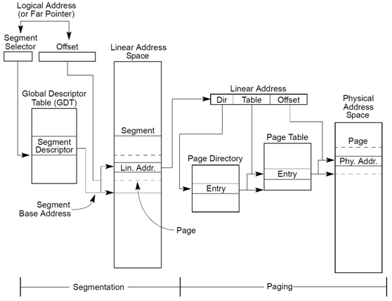

- 

> ==**内核空间与用户空间都是虚拟地址, 如果需要访问的时候会把它们转换成真正的物理地址,这个转换的过程就叫页表映射**==
>
> 

**中英文对应关系：**

- **逻辑地址 --- logical address;**
  - 是由一个段选择符加上一个指定段内相对地址的偏移量(Offset)组成的，表示为 [段选择符：段内偏移量]，例如：[CS：EIP]
- **虚拟地址 --- virtual address;**
  - 就是如上逻辑地址的段内偏移Offset。所以：逻辑地址可以表示为 [段标识符：虚拟地址]
- **线性地址 --- linear address;**
  - 线性地址是平坦的统一地址空间。intel x86 中，线性地址是由逻辑地址经过段页式转换得到的。

- **物理地址 --- physical address;**
  - 物理地址就是物理内存的地址。但是注意在做页表转换的时候，这里存的可不是真正的物理地址，而是物理内存块的编号。
  - 内核把物理内存按照4K大小编号，考虑k到物理内存的起始地址是固定的，所以从内存编号的序号就可以算出该编号对应的物理内存块的起始地址了

