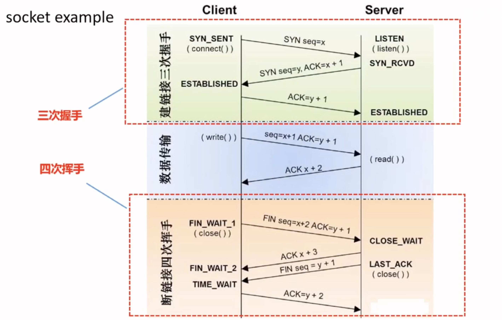
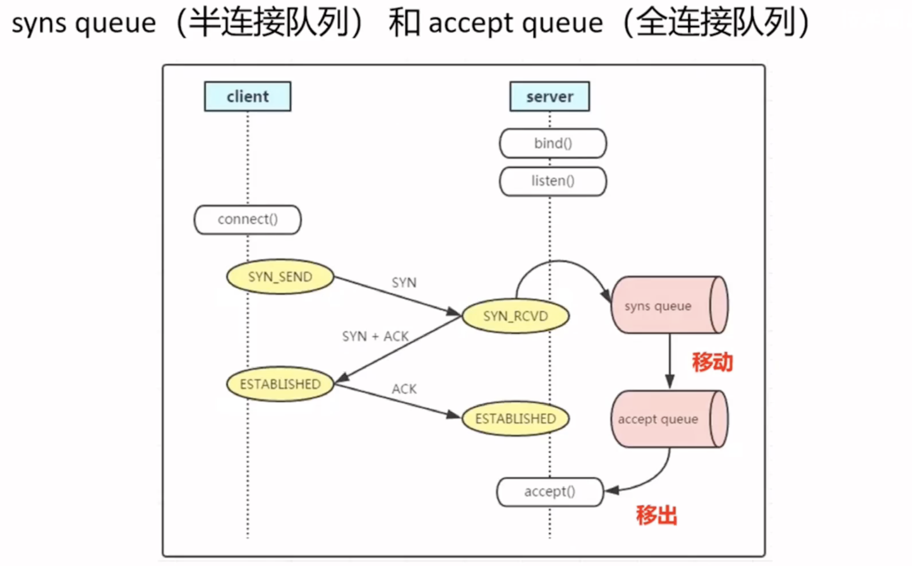
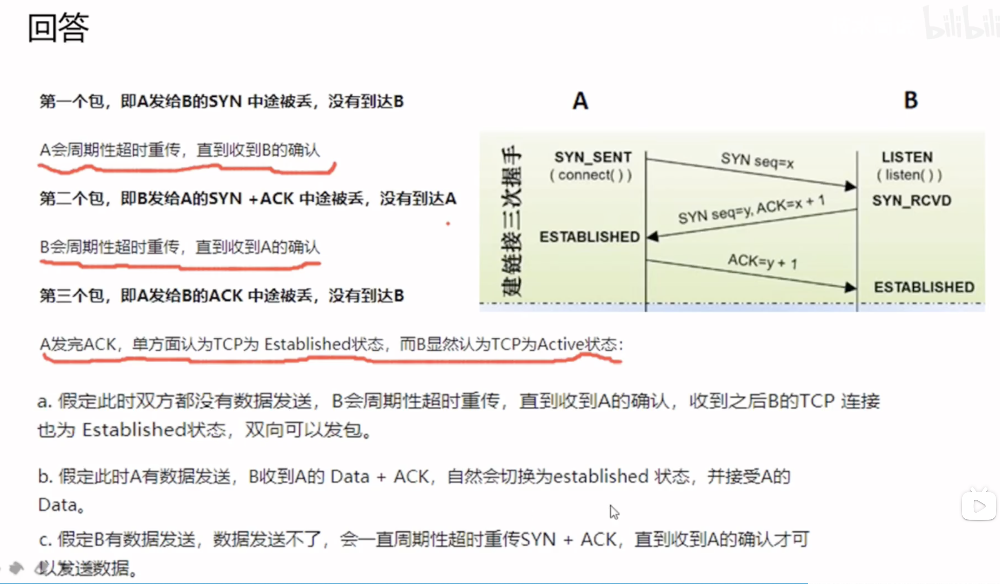
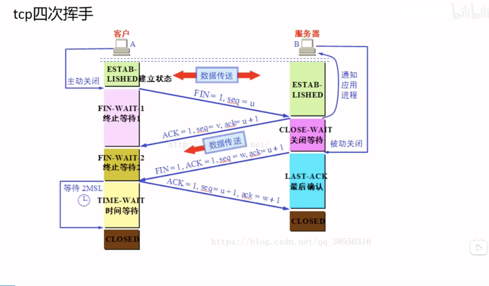

- [半连接队列和全连接队列](#半连接队列和全连接队列)
  - [全连接队列满了之后的协议栈处理](#全连接队列满了之后的协议栈处理)
  - [三次握手](#三次握手)
  - [四次挥手](#四次挥手)
  - 

> **全连接队列, 半连接队列的溢出这种问题很容易被忽视, 但是又很关键, 特别是短连接应用 (Nginx) 更容易爆发.**
>
> **一旦出现溢出, 从 CPU, 线程状态看起来比较正常, 但是压力上不去, 这个时候就可以针对半链接,全连接进行一些优化**
>
> **有时为了证明客户端应用代码的异常更全连接队列满 有关系, 可以将 `tcp_abort_on_overflow` 修改为1, 接着测试  如果客户端异常中可以看到很多 connect reset by peer 的错误, 这样的话就证明客户端错误是这个原因导致的**
>
> 
>
> **服务器可以使用  `netstat -s | egrep "listen|LISTEN"` 来查看是否出现缓冲队列的移除和 丢弃SYN**

# 半连接队列和全连接队列

**syns queue 是半连接队列,  accept queue 是全连接队列**

- syns queue 队列是第一次握手完成时所使用的队列.
  - **syns queue队列的大小 取决于 `max(64, /proc/sys/net/ipv4/tcp_max_syn_backlog)`**
    - **64是标准值,  后面的 tcp_max_syn_backlog 是内核参数,也可以修改这个文件, 让队列更大 来满足高并发需求**
      - ubuntu 默认是 512
- accept queue 队列 是三次握手完成之后  在调用accpet() 之前  所使用的队列.
  - **accept queue 队列大小取决于:  `min(backlog, somaxconn)`**
    - **backlog 由 `listen(int sockfd, int backlog)` 函数的 backlog 参数来决定.**
    - **somaxconn 则是内核参数:  `/proc/sys/net/core/somaxconn` ,  ubuntu默认是4096**
      - ==**可以修改这个文件来提高队列的长度,  `echo 8106 > /proc/sys/net/core/somaxconn`**==
  - **可以通过命令 `ss  -lnt 'sport = 8080'`** 来查看某个服务的全连接队列大小,  8080是某个server应用正在使用的监听端口
    - `Send-Q 是全连接(accept queue) 的最大值, 其值为min(backlog, somaxconn)`
    - `Recv-Q 已建立成功(状态为 ESTABLISHED), 但尚未交付给应用的 tcp连接的数量, 最大值为 Send-Q +1`

## 全连接队列满了之后的协议栈处理

- **内核定义了两种处理方法, 可以查看 `/proc/sys/net/ipv4/tcp_abort_on_overflow` 文件来查看和修改 当前选择了哪种**
  - 为0时: (默认)
    - **当TCP建立连接的三次握手完成之后, 将连接置入 ESTABLISHED 状态   并交付给应用程序的  backlog 队列时, 会检查 backlog 队列是否已满.  若已满通常行为是 将连接还原至 `SYN_ACK` 状态, 以造成三次握手 最后的 ACK包意外丢失假象 -- 这样在客户端等待超时后可重发 ACK  --以再次尝试进入 ESTABLISHED状态,  -- 作为一种  ==修复/重试==  机制**
  - 为1时 : 
    - 如果 tcp_abort_on_overflow为1 , 则在检查到 backlog 队列已满时, 直接发送 `RST包` 给客户端 终止此连接 -- 因此客户端程序会收到  104 Connection reset by peer 错误.  (对等连接重置)
      - **可以将这个状态当作调试选项, 判断客户的收到的 connection reset by peer 错误**

## 三次握手

- 初始化和同步序列号
- 防止旧的重复链接造成混乱,  例如 旧的 syn比新的syn 先到达服务端, 三次握手可以保证
- 有效防止ddos 攻击,  可以通过第三次握手真假额外的验证机制来解决
- 效率高
- 

## 四次挥手

**只有主动关闭的那端才会经历这个状态. 该端点停留在这个状态的持续时间是最长分节生命期(MSL)的两倍, 有时也称为 `2MSL`**

**MSL  是任何IP数据报能够在 因特网种存活的最长时间.**

> **`cat /proc/sys/net/ipv4/tcp_fin_timeout`  读取MSL的值, 也可以使用 `echo` 进行修改, 从而让端口释放的更快**

