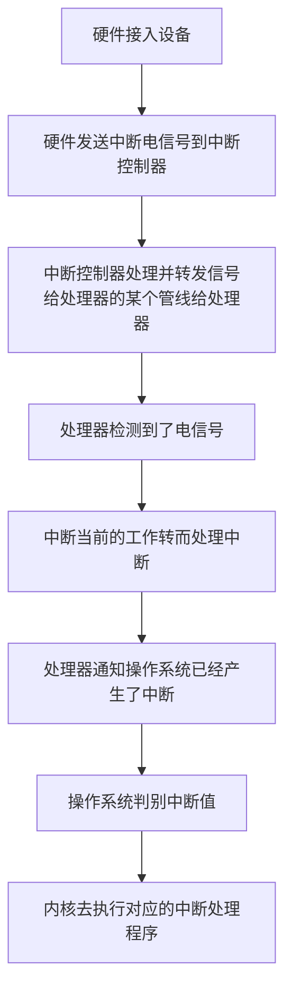
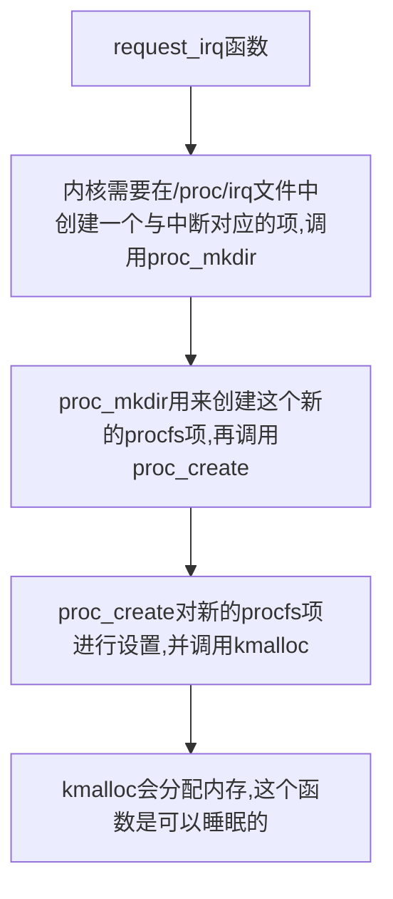
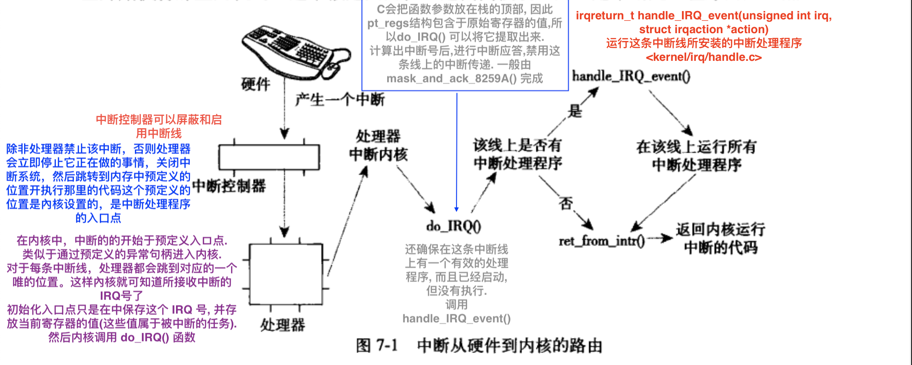
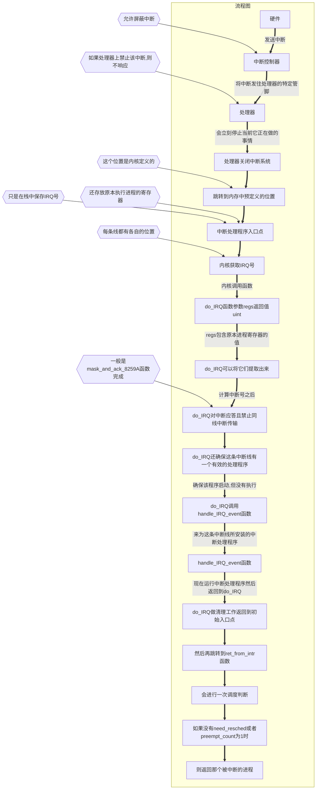
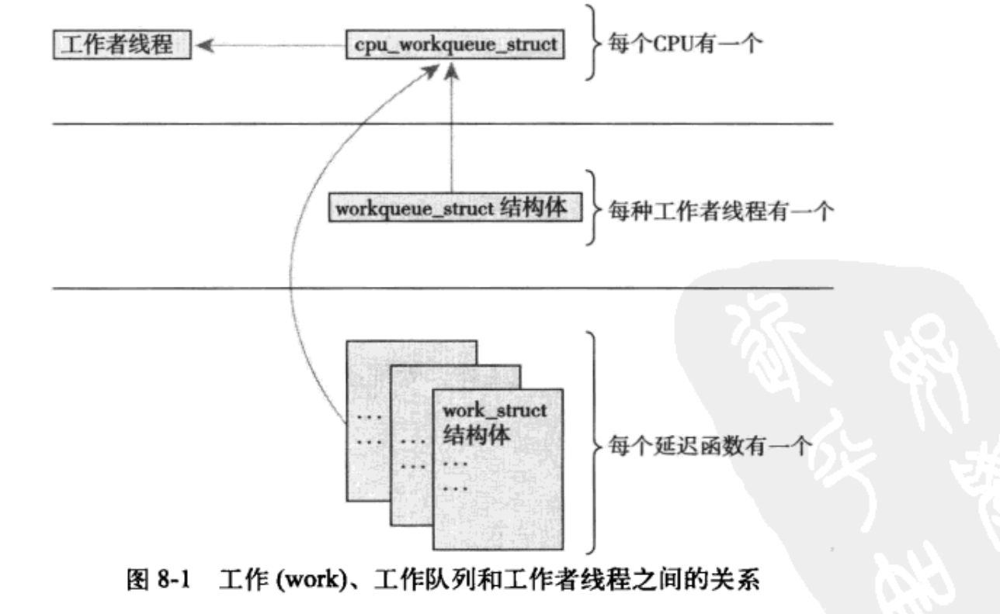

- [中断处理程序的流程图](#中断处理程序的流程图)
  - [中断处理程序](#中断处理程序)
    - [上半部和下半部](#上半部和下半部)
    - [注册中断处理程序](#注册中断处理程序)
      - [request_irq调用流程图](#request_irq调用流程图)
    - [释放中断处理程序](#释放中断处理程序)
    - [中断处理机制的实现](#中断处理机制的实现)
  - [中断控制](#中断控制)
    - [禁止和激活中断](#禁止和激活中断)
    - [禁止指定中断线](#禁止指定中断线)
    - [中断系统的状态](#中断系统的状态)
- [下半部](#下半部)
  - [软中断](#软中断)
  - [tasklet](#tasklet)
  - [工作队列](#工作队列)
    - [工作队列实现机制的总结](#工作队列实现机制的总结)
    - [工作队列使用](#工作队列使用)
  - [在下半部加锁](#在下半部加锁)
  - [禁止下半部](#禁止下半部)


> **中断不考虑时钟, 是随机出现的, 所以是异步**
>
> **异常是同步的, 是软中断, 依靠内核来处理 `(例如 除0)`**
>
> ==**两者的区别是   中断是又硬件引起的,  而异常是软件引起的**==

**任何操作系统内核的任务, 都包含对连接到计算机上的硬件设备进行有效管理. `(想要管理这些设备,就必须要互相通信才行)`**

**处理器的速度 往往比外围硬件要快**

**让硬件在需要的时候向内核`(其实收到的是处理器)`发送信号,这就是中断机制**

- **中断使得硬件得发送通知给处理器. `(中断本质上是一种特殊的电信号)`**
  - **由硬件发向处理器**
    - **处理器收到中断后会立马向操作系统反映此信号的到来**
      - **然后操作系统负责处理新到来的数据,也就是运行中断处理程序**


> **中断是一种电信号, 由硬件生成, 送入中断控制器`(简单的物理芯片)`, 中断控制器会发送给处理器一个电信号, 处理器一经检测到此信号, 便中断自己的当前工作转而处理中断, 此后 处理器会通知操作系统 已经产生中断,   操作系统会去对这个中断去进行处理**

**不同设备对应的中断不同, 每个中断都通过一个 唯一的数字标识. 对中断进行区分**

- **IRQ : 中断请求线`(硬件)`,每个IRQ线都会被关联一个数值量, 而且可以动态分配, 中断总是与特定的设备相关联**
  - IRQ（中断请求）值是指定的位置，当特定设备向计算机发送有关其操作的信号时，计算机可以在该位置中断它。例如，当打印机完成打印时，它会向计算机发送一个中断信号。
- **ISR: 中断处理程序, 在响应一个特定中断时, 内核会执行一个函数, 这个函数就是中断处理程序**


> **中断，它是一种由设备使用的硬件资源异步向处理器发信号。实际上，中断就是由硬件来打断操作系统。**
>
> - ==**大多数现代硬件都通过中断与操作系统通信**==
>   - 对给定硬件进行管理的驱动程序注册中断处理程序，是为了响应并处理来自相关硬件的中断。
>   - ==**中断过程所做的工作:**==
>     - 包括  **应答**  并 **重新设置硬件**，**从设备拷贝数据到内存以及反之**，**处理硬件请求**，并 **发送新的硬件请求**。
>       - ==**中断必须做到 快速, 异步, 简单的机制 负责对硬件做出迅速响应并完成时间要求严格的操作**==
>       - ==**不可阻塞这点 限制了中断处理程序所做的事情**==
>       - **中断处理程序会锁定当前的中断线**
> - ==**内核提供的接口:**==
>   - 包括 **注册中断处理程序**  和 **注销中断处理程序**、**禁止中断**、**屏蔽中断线** 以及  **检査中断系统的状态**
> - ==**中断会打断其他代码的执行 `因为（进程，内核本身，甚至其他中断处理程序)` 它们必须赶快执行完**==
>   - **但通常是还有很多工作要做。为了在大量的工作与必须快速执行之间求得一种平衡，内核把处理中断的工作分为两半。**
>     - ==**上半部 : 中断处理程序**==
>       - **异步方式执行, 可以中断其他的中断处理程序(需要标志位),  对硬件操作时间一定要短, 中断处理程序无法在进程上下文中运行 所以不能阻塞**
>         - ==**中断必须做到 快速, 异步, 简单的机制 负责对硬件做出迅速响应并完成时间要求严格的操作**==
>         - ==**内核通过对它的异步执行完成对硬件中断的即使响应**==
>     - ==**下半部 : 中断处理流程中 推后执行的那一部分**==
>       - **执行与中断处理密切相关但中断处理程序本身不执行的工作**
>         - ==**对时间要求相对宽松的任务被推后到中断被激活以后再去运行**==
>         - **在系统不太繁忙并且中断恢复后执行就可以了**
>         - ==**下半部执行的之后 允许响应所有中断**==


# 中断处理程序的流程图



# 中断处理程序

**ISR: 中断处理程序, 在响应一个特定中断时, 内核会执行一个函数, 这个函数就是中断处理程序**

==**一个设备的中断处理程序是由它设备驱动程序 `(driver )` 提供的**==

- **中断处理程序函数与其他内核函数的区别:**
  - **中断处理程序函数是被内核调用来响应中断的, 且运行在中断上下文中( 也称原子上下文 ), 而且不可阻塞**

**中断处理程序拥有自己的栈,每个处理器一个大小为1页(32位4KB,64位8KB)**

> **进程上下文是一种内核所处的操作模式, 此时内核代表进程执行, 还可以通过 `current`宏关联当前进程. 而且进程是以进程上下文的形式连接到内核中的, 因此进程上下文可以睡眠,也可以调用调度程序.**
>
> **中断上下文和进程并没有瓜葛, 与 `current`宏 也不相干`(但它会指向被中断的进程)`, 因为没有后备进程, 所以中断上下文不可以睡眠, 而且也没办法重新调度,因此 不可以在中断上下文中使用某些睡眠函数.**


==**中断处理程序可以被其他的中断处理程序 中断**==

**中断处理程序函数必须负责通知硬件设备中断已被接收**

**中断处理程序会被分为 上半部和下半部**

> **Linux中的中断处理程序是无需重入的. 一个给定的中断处理程序正在执行时, 相应的中断线在所有处理器上都会被屏蔽掉, 防止同一个中断线上接收另一个相同的中断**

==**中断处理程序必须  快速,简洁,无循环,占用内存少**==


## 上半部和下半部

- **上半部 : 收到中断后立即执行, 做有严格时限的工作**
- **下半部 : 能够允许稍后完成的工作 会被推迟到下半部去, 会在合适的时机被 开中断执行**


## 注册中断处理程序

**中断处理程序是管理硬件的驱动程序的组成部分, 每一设备都有相关的驱动程序, 如果设备使用中断, 那么相应的驱动程序就注册一个中断处理程序**

==**中断处理程序必须在 设备初始化完成之后 才可以执行**==

**`request_irq()` 函数可能会睡眠, 不能在中断上下文和禁止阻塞的代码中调用该函数**

```c
#include "/include/linux/interrupt.h"  // 在内核的根目录

// 中断处理程序的返回值类型
enum irqreturn {
	IRQ_NONE,          // @IRQ_NONE 中断不是来自这个设备
	IRQ_HANDLED,       // @IRQ_HANDLED 中断由该设备处理
	IRQ_WAKE_THREAD,   // @IRQ_WAKE_THREAD 处理程序请求唤醒处理程序线程
};
typedef enum irqreturn irqreturn_t;  // 中断处理程序的返回值类型
typedef irqreturn_t (*irq_handler_t)(int irq, void * dev);  // 中断处理程序的函数类型
/*
参数:  irq : 是这个处理程序要响应的中断的中断号(没什么用了,除了打印信息)
		  dev : 一个通用指针,是注册 request_irq() 时传递的dev参数. 用来区分共享同一中断的多个设备, 
		        可以是数据 ,也可以是一种唯一的标识
		 返回值:  正常的话 可以返回 IRQ_HANDLED;
		    可能会返回两个特殊的值:  IRQ_NONE 和 IRQ_HANDLED .
		      通过 IRQ_RETVAL(val) 的返回值可以判断, 非0 则是IRQ_HANDLED 代表成功,  为0代表失败 IRQ_NONE
		    通过这些值,内核可以知道设备发出的是否是一种虚假的(未请求的)中断
*/


//  通过这个函数来注册一个中断处理程序, 并激活给定的中断线
int  request_irq ( unsigned int irq,  irq_handler_t handler, unsigned long flags,   
	                 const char *name,  void *dev);
/* 参数:
         irq :  要分配的中断号 (探测获取,或者编程动态确定的), 必须是没有被注册中断线 或共享的
     handler :  指向处理这个中断的 实际中断处理程序 的指针.(处理函数)
       flags :  可以是0, 也可以是 多个标志的位掩码:
       							 IRQF_DISABLED 运行本程序时 禁用其他中断的运行(应该不设置)
       							 IRQF_SAMPLE_RANDOM  讲设备产生的中断对内核熵池有贡献. (一般不设置)
       							                  <内核熵池: 负责提供从各种随机事件导出的真正随机数>
       							 IRQF_TIMER   专门为系统定时器的中断处理提供的,其他设备不应该使用这个
       							 IRQF_SHARED  表明在多个中断处理程序之间共享中断线,在同一个给定线上注册的每个处理
       							                 程序必须指明这个标志,否则,每条线上只能有一个处理程序.
        name : 与中断相关的设备的ASCII文本表示. (例如键盘对应的中是 keyboard ) 名字会被 /proc/irq 和
                  /proc/interrupts 文件使用, 以便与用户通信.
         dev : 用于共享中断线, 如果不共享 则给 NULL. 每次调用这个处理程序时,都会把这个值传入进去.
                  dev提供一个 唯一的标志信息(cookie), 让内核知道该删除哪个处理程序.
                  
 *  返回值: 成功0, 失败 非0 且指定的中断处理程序不会被注册
           常见错误:  -EBUSY  表示给定的中断线已经在使用了, 或者 flags 没有指定 IRQF_SHARED
 */

// 例子
前面是设备初始化代码;
if(request_irq(irqn, my_interrupt, IRQF_SHREAD, "my_device", my_dev)){
  printk(KERN_ERR "my_device: cannot register IRQ %d\n",  irqn);
  return -EIO;
}
// irqn 是请求的中断线, my_interrupt是中断处理程序, 设置共享, 设备名为 "my_device"
```

### request_irq调用流程图



## 释放中断处理程序

**卸载驱动时, 需要注销相应的中断处理程序, 并释放中断线**

==**必须从进程上下文中调用 `free_irq()`**==

```c
#include "/include/linux/interrupt.h"  // 在内核的根目录

// 根据指定的中断线是否共享,来确定会发生的事情:
//		 非共享, 那么该函数删除处理进程的同时禁用这条中断线.
//     共享  , 则仅删除dev 所对应的处理程序. 而中断线只有在删除了最后一个处理程序时才会被禁用
void free_irq(unsigned int irq, void *dev);
/*
  irq : 分配的中断号
  dev : 必须与要删除的处理程序相匹配
*/
```


# 中断处理机制的实现

- **中断处理系统在 Linux 中的实现是非常依赖于体系结构的。**
  - 实现依赖于:
    - **处理器**
    - **所使用的中断控制器的类型**
    - **体系结构的设计及机器本身**





**`/proc/interrupts` 文件存放的是系统中与中断相关的统计信息**

```c

/**
 * handle_IRQ_event - irq 动作链处理程序
 * @irq: 中断号
 * @action: 这个 irq 的中断动作链
 *
 * 处理 irq 事件的动作链
 */
irqreturn_t handle_IRQ_event(unsigned int irq, struct irqaction *action)
{
	irqreturn_t ret, retval = IRQ_NONE;
	unsigned int status = 0;

	if (!(action->flags & IRQF_DISABLED))
		local_irq_enable_in_hardirq();

	do {
		trace_irq_handler_entry(irq, action);
		ret = action->handler(irq, action->dev_id);
		trace_irq_handler_exit(irq, action, ret);

		switch (ret) {
		case IRQ_WAKE_THREAD:
			/*
       * 将结果设置为已处理，因此不会触发虚假检查。
			 */
			ret = IRQ_HANDLED;

			/*
			 * 捕获返回结果为 WAKE_THREAD 的驱动程序, 但不一定创建一个线程函数
			 */
			if (unlikely(!action->thread_fn)) {
				warn_no_thread(irq, action);
				break;
			}

			/*
			 * 为这次操作唤醒处理线程, 如果线程崩溃并被杀死，我们只是假装我们处理了该中断, 
			 * 上面的 hardirq 处理程序禁用了设备中断，因此杜绝 irq 产生
			 */
			if (likely(!test_bit(IRQTF_DIED,
					     &action->thread_flags))) {
				set_bit(IRQTF_RUNTHREAD, &action->thread_flags);
				wake_up_process(action->thread);
			}

			/* Fall through to add to randomness */
		case IRQ_HANDLED:
			status |= action->flags;
			break;

		default:
			break;
		}

		retval |= ret;
		action = action->next;
	} while (action);

	if (status & IRQF_SAMPLE_RANDOM)
		add_interrupt_randomness(irq);
	local_irq_disable();

	return retval;
}
```


# 中断控制

==**控制中断系统就是为了提供同步**==

**Linux内核提供一组接口用于操作机器上的中断状态**

- 该接口能够禁止当前处理器中断系统  `<arch/x86/include/asm/system.h>`
  - **通过禁止中断可以确保某个中断程序不会抢占当前的代码**
  - **禁止中断还可以禁止内核抢占**
  - **但却不会提供保护机制来防止来自其他处理器的并发访问**
    - **内核代码要获取某种锁, 防止来自其他处理器对共享数据的并发访问.**
      - ==**获取锁的同时也伴随着禁止本地中断**==
        - **锁提供保护机制, 防止来自其他处理器的并发访问, 而禁止中断提供保护机制,则是防止来自其他中断处理程序的并发访问**
- 屏蔽掉整个机器的一条中断线的能力  `<arch/x86/include/asm/irq.h>`


## 禁止和激活中断

**用于禁止当前处理器(仅仅是当前处理器) 上的本地中断, 随后又激活它们的语句:**

```c
#include "/arch/alpha/include/asm/system.h"
// 下面4个 宏定义 可以在中断 中调用, 也可以在 进程上下文中调用.

#define    local_irq_disable()    // 禁止所有中断
#define    local_irq_enable()     // 允许所有中断


#define    local_irq_save(flags)    // 保存本地中断传递的当前状态 然后禁止本地中断传递
#define    local_irq_restore(flags)   // 恢复本地中断传递到给定的状态
unsigned long flags;   // 这个参数包含具体 体系结构的数据,也就是中断系统的状态, 值传递, 而且不能跨函数
                       // 这就说明了  保存中断状态 和 恢复中断状态 函数必须在同一个函数内进行

```

==**所有的中断同步现在必须结合使用中断控制和自旋锁**==


### 禁止指定中断线

**大部分情况下只需要禁止整个系统中的某一条特定的中断线就够了. 也就是 屏蔽掉`(masking out)` 一条中断线.**

==**对于共享中断线的中断处理程序来说, 不应该使用这些接口函数**==

```c
#include "/arch/m68k/kernel/inst.c"

// 下面前三个函数 不会睡眠. 可以嵌套,也可以在中断或进程上下文中执行, 但要小心的在中断上下文中进行调用.


void disable_irq (unsigned int irq); 
/*  禁止给定中断线，并确保该函数返回之前在该中断线上没有处理程序在运行  */
/* 将 disable_irq 的调用次数与  enable_irq 设置为对等,否则会无法激活控制线 */


void disable_irq_nosync (unsigned int irq);
/* 禁止给定中断线 */
/* 将 disable_irq_nosync 的调用次数与  enable_irq 设置为对等,否则会无法激活控制线 */

void enable_irq (unsigned int irq); // 激活指定的 中断线

void synchronize_irq (unsigned int irq);  // 等待一个特定的中断处理程序的退出,然后才会返回
```


### 中断系统的状态

**了解中断系统的状态, (中断禁止 还是激活) 或着当前处在中断上下文的执行状态中**

```c
#include "/arch/alpha/include/asm/system.h"

#define irqs_disable()    //如果本地处理器上的中断系统被禁止, 返回非0, 否则返回0


#include "/include/linux/hardirq.h"
//下面的两个宏用来检查内核的当前上下文的接口

#define in_interrupt()    //如果当前处于中断上下文中, 返回非0, 内核处于进程上下文中或其他状态时 返回 0.
#define in_irq()	  // 如果当前正在执行中断处理程序时,返回非0 , 否则返回0
```

**有的时候要确保自己没在中断上下文中,避免非法调用了睡眠函数**


# 下半部

下半部（bottom half) 是一个操作系统通用词汇，用于指代中断处理流程中推后执行的那一部分，之所以这样命名，是因为它表示中断处理方案一半的第二部分或者下半部。在 Linux 中，这个词目前确实就是这个含义。所有用于实现将工作推后执行的内核机制都被称为“下半部机制”。一些人错误地把所有的下半部机制都叫做“软中断”，真是在自寻烦恼。

- **执行与中断处理密切相关但中断处理程序本身不执行的工作**
  - ==**对时间要求相对宽松的任务被推后到中断被激活以后再去运行**==
  - **在系统不太繁忙并且中断恢复后执行就可以了**
  - ==**下半部执行的之后 允许响应所有中断**==
- **下半部可通过很多种机制实现, 分别由不同的接口和子系统组成**


1. **目前的内核提供三种不同形式的下半部实现机制:**
   1. ==**软中断**==
      1. **是一组静态定义的下半部 ==接口== ,有32个, 可以在所有处理器上同时执行`(即使类型相同也可以)`**
      2. **对性能要求非常高 而且执行频率也很高的可以使用这个, 例如网络**
      3. ==**软中断必须在编译期间就进行静态注册**==
      4. **同一个处理程序可以在不同的处理器上 同时执行, 但 tasklets 却不可以这么做**
      5. **运行在中断上下文**
   2. ==**tasklets**==
      1. **基于软中断实现的灵活性强, 动态创建的下半部 ==实现机制== , 不同类型的tasklet可以同时在不同的处理器上执行**
      2. **大部分下半部使用这个就可以了**
      3. ==**tksklet 可以通过代码进行动态注册**==
      4. **同一个处理程序的多个实例不能在多个处理器上同时运行**
      5. **运行在中断上下文**
   3. ==**工作队列**==
      1. **工作队列可以把工作推后, 交由一个内核线程去执行, 这个下半部分总是会在进程上下文中执行**
      2. **是靠内核线程实现的**
      3. **这个开销最大, 而且涉及进程中断和进程调度**
      4. **运行在进程上下文**
   4. ==**内核定时器**==
      1. **内核定时器会把操作推迟到某个确定的时间段之后执行**
      2. **必须要保证在一个确定的时间段过去以后再运行时, 才应该使用内核定时器**


## 软中断

**实际的下半部实现 软中断**

**软中断是在编译期间静态分配的**

==**软中断不会抢占另一个软中断, 唯有中断处理程序才可以抢占 软中断, 但软中断能在不同的处理器上 同时执行**==

**软中断处理程序执行的时候, 允许响应中断, 但软中断处理程序不能休眠**

**当一个处理程序运行的时候, 当前处理器上的软中断被禁止, 但其他的处理器仍可以执行别的软中断或者是同类型的软中断**

==**软中断的全局共享数据必须严格使用锁保护,  也可以使用单处理器的数据 或 其他技巧来避免显式的加锁 由此来提高性能**==

```c
#include < /kernel/softirq.c >   // 软中断实现
#include < /include/linux/interrupt.h >   // 结构体


/* softirq 掩码和活动字段移动到 asm/hardirq.h 中的 irq_cpustat_t 以获得更好的缓存使用.  KAO  */
// 软中断结构体
struct softirq_action
{
	void	(*action)(struct softirq_action *); // 这个就是软中断处理程序中的函数
};

// 包含 NR_SOFTIRQS= 32 个结构体的数组, 缓存行在 smp 中对齐, 该数组大小不可改变
// 每个被注册的软中断都占据该数组的一项
static struct softirq_action softirq_vec[NR_SOFTIRQS] ;


/* 1.  软中断处理程序:
 * 当内核运行一个软中断处理程序的时候, 它就会执行 softirq_action结构体的 action函数.
 *   其参数就是指向 相应 softirq_action结构体的指针
 */
// 例如:
    struct softirq_action* my_softirq = softirq_vec[1]; //某一项
    my_softirq->action(my_softirq);   //这种方式来调用软中断处理程序中的函数


/* 2. 执行软中断:
 * 一个注册的软中断必须在被标记后才会执行, 这被称作 触发软中断.
 * 通常,中断处理程序会在返回前标记它的软中断, 使其在稍后被执行. 于是,在合适的时刻,该软中断就会执行.
 *   在下面的地方, 待处理的软中断会被执行:
 *     一. 从一个硬件中断代码处返回时.
 *     二. 在 ksoftirqd 内核线程中.
 *     三. 在那些显示检查和执行待处理的软中断代码中, 如网络子系统中.
 *   无论使用什么办法唤起,软中断都要在 do_softirq() 中执行.
 *    如果有待处理的软中断,那么 do_softirq() 会循环遍历每一个,调用它们的处理程序 action()
 */


void do_softirq(void)
{
  u32 pending;   // 位图值
  pending = local_softirq_pending();  // 获得待处理的软中断的32位 位图 (根select的 fd_set很像)
 	if (pending){
    struct softirq_action *h;
    
    // 重设待处理的位图
    set_softirq_pending(0); // 位图被保存在 pending 里面了, 这里就可以清除了
    
    h = softirq_vec; // 获得软中断结构体数据的头部
    do{
      if (pending & 1)  // 查看最低位的位图 是否为1
        h->action(h);   // 运行对应的下半段处理程序
      h++;              // 指向下一个 数组的值
      pending >>= 1;    // 位图也跳到 第二位
    }while(pending);    // 直到 没有下半段待处理
}
```

```c
//使用软中断,
1. 分配索引, 在编译期间, 向下面的 枚举类型中添加新的自定义值,来声明软中断. 0的优先级最高 最先执行, 
     一般会选择插入到 	BLOCK_SOFTIRQ,和	TASKLET_SOFTIRQ,之间
    

  < /include/linux/interrupt.h >
enum
{
	HI_SOFTIRQ=0,    // 优先级高的 tasklets
	TIMER_SOFTIRQ,   // 定时器的下半部
	NET_TX_SOFTIRQ,  // 发送网络数据包
	NET_RX_SOFTIRQ,  // 接收网络数据包
	BLOCK_SOFTIRQ,   //  BLOCK 装置
	BLOCK_IOPOLL_SOFTIRQ,   // 块 IO POLL 软中断
       MY_SOFIRQ,      // 这是我自定义的
       
	TASKLET_SOFTIRQ,    // 正常优先权的 tasklets
	SCHED_SOFTIRQ,     // 调度程度
	HRTIMER_SOFTIRQ,   //  高分辨率定时器
	RCU_SOFTIRQ,	/*   RCU 锁定.   优选的 RCU 应该总是最后一个软中断 */
	NR_SOFTIRQS
};

####################################################################
####################################################################

2. 注册你的处理程序,  在运行时通过调用 open_softirq() 注册软中断处理程序.
  void open_softirq(int nr, void (*action)(struct softirq_action *));
/* 参数:  nr : 软中断的索引号.
 *    action : 是软中断处理函数
 */
    void net_tx_action(struct softirq_action *h) {  } //我自定义的软中断处理程序;
		open_softirq( MY_SOFIRQ, my_action )
      
 例如: 网络子系统是这样注册软中断的 </net/core/dev.c>
    open_softirq(NET_TX_SOFTIRQ, net_tx_action); // 发送网络数据包
  	open_softirq(NET_RX_SOFTIRQ, net_rx_action); // 接收网络数据包


####################################################################
####################################################################

3.触发自定义的软中断
/*  通过在枚举类型的列表中添加新项 以及 调用 open_softirq() 进行注册后, 新的软中断处理程序就能够运行了.
 *  raise_softirq() 函数可以将一个软中断设置为挂起状态, 让它在下次调用 do_softirq() 函数时投入运行.
 *   并且这个函数在触发一个软中断之前要先禁止中断, 触发后再恢复原来的状态, 如果中断本来就已经被禁止了, 那么就
 *    调用另一个函数 raise_softirq_irqoff() , 这会带来一些优化
 */
 void raise_softirq(unsigned int nr);
例子:  网络子系统可能会调用: 
				raise_softirq(NET_TX_SOFTIRQ);
         // 这时会触发 NET_TX_SOFTIRQ 软中断, 它的处理程序 net_tx_action() 就会在内核下次执行软中断
				 // 时投入使用.

/* raise_softirq_irqoff() 触发软中断是最常见的形式.
*  中断处理程序执行硬件设备的相关操作, 然后触发相应的软中断, 最后退出. 内核继续执行玩中断处理程序以后,马上
*  就会调用 do_softirq() 函数,  于是软中断开始执行中断处理程序留给它去完成剩余的任务.
 */
 void raise_softirq_irqoff(unsigned int nr);
 例子:
      raise_softirq_irqoff(MY_SOFIRQ);
    
```


## tasklet

**tasklet是利用软中断实现的一种下半部机制.**

**tasklet与进程没有任何关系.**

**tasklet 接口简单, 保护锁也要求较低.**

**tasklet有 两类软中断代表: HI_SOFTIRQ ,  TASKLET_SOFTIRQ,  前者优先级更高**

**大部分 tksklet 和软中断都是在中断处理程序中被设置成待处理状态,  最近中断返回的时候就是 `do_softirq()` 的最佳时机**

==**因为  TASKLET_SOFTIRQ 和 HI_SOFTIRQ 已经被软中断处理程序触发了，所以 `do_softirq()` 会执行相应的软中断处理程序。而这两个处理程序，tasklet_action()  和 tasklet_hi_action()，就是 tasklet 处理的核心.**==

```c
#include   "/include/linux/interrupt.h"
#include   "/kernel/softirq.c"

/*Tasklets --- BH 的多线程模拟。
   与通用软中断不同的主要特点：tasklet 只同时在一个 CPU 上运行。
   BH 的主要区别在于：不同的 tasklet 可以在不同的 CPU 上同时运行。
   
特性：
   * 如果 tasklet_schedule() 被调用，那么 tasklet 保证在此之后至少在某个 cpu 上执行一次。
   * 如果 tasklet 已经被调度，但是它的执行还没有开始，它只会被执行一次。
   * 如果这个 tasklet 已经在另一个 CPU 上运行（或者从 tasklet 本身调用调度），它会被重新调度以备后用。
   * Tasklet 是严格序列化的 wrt 本身，但不是 wrt 另一个 tasklets。如果客户端需要一些任务间同步，他会使用自旋锁来实现。
 */

// tasklet 结构体
struct tasklet_struct
{
	struct tasklet_struct *next;   // 链表中的下一个 tasklet
	unsigned long state;           /* tasklet的状态, 有下面三种
																	* 0 
                                  * TASKLET_STATE_SCHED , 表明tasklet已调度 准备运行
                                  * TASKLET_STATE_RUN   , 表明tasklet正在运行
                                  */
	atomic_t count;                // 引用计数器, 为0时 才会被激活和挂起 执行, 否则被禁止不可执行
	void (*func)(unsigned long);   // tasklet 处理函数
	unsigned long data;            // 给 tasklet 处理函数 func 的参数
};


/*
 * 已调度的tasklet (相当于被触发的中断 但还没有运行) 存放在两个单处理器数据结构(每个处理器一个) :  
 *  tasklet_vec :普通 TASKLET_SOFTIRQ  和 tasklet_hi_vec : 高优先级 HI_SOFTIRQ .
 * 	  这两个结构体都是由 tasklet_struct 结构体构成的链表,
 *    链表中的每个 tasklet_struct 代表一个不同的 tasklet.
 */
/* tasklet 是由 tasklet_schedule() 和 tasklet_hi_schedule() 函数进行调度的,
 *  参数是 tasklet_struct 结构体的指针.
 */
 void tasklet_schedule (struct tasklet_struct *t); //调度低优先级  tasklet_vec ,TASKLET_SOFTIRQ
 void tasklet_hi_schedule (struct tasklet_struct *t) //调度高优先级 tasklet_hi_vec, HI_SOFTIRQ 
   
   /* tasklet_schedule() 函数的细节 和执行步骤:
    *  1. 检查tasklet 的状态是否为  TASKLET_STATE_SCHED, 是的话 就说明这个已经调度过了
    *  2. 调用 __tasklet_schedule()
    *  3. 保存中断状态, 禁止本地中断 . 保证了处理器上的数据不会乱
    *  4. 把需要调度的 tasklet 加到每个处理器一个的 tasklet_vec 链表或 tasklet_hi_vec 链表的表头上去
    *  5. 唤醒 TASKLET_SOFTIRQ 或 HI_SOFTIRQ 软中断, 在下次调用do_softirq() 时就会执行 tasklet
    *  6. 恢复中断到原状态并返回
    */
   

tasklet_action()  和 tasklet_hi_action()，就是 tasklet 处理的核心.
/* tasklet_action()  和 tasklet_hi_action() 所做的事情:
 *  1. 禁止中断,这里的代码中是作为软中断被调用的,没必要保存状态.再检索tasklet_vec或tasklet_hig_vec链表.
 *  2. 将当前处理器上的链表设置为 NULL, 达到清空的效果.
 *  3. 允许响应中断.
 *  4. 循环遍历获得链表上的每一个待处理的 tasklet.
 *  5. 如果是多处理器系统, 则检查 TASKLET_STATE_RUN 来判断这个 tasklet 正在其他处理器上运行, 如果正在
         运行, 就跳过这个 tasklet (同一时间只有一个同类型的tasklet 执行).
 *  6. 如果当前这个tasklet 没有执行, 将其状态设置为 TASKLET_STATE_RUN, 这样别的处理器就不会再去执行它了.
 *  7. 检查 count 值是否为0, 确保 tasklet 没有被禁止. 如果为非0 则跳到下一个挂起的 tasklet 去.
 *  8. count为0值时, 执行 tasklet 程序.
 *  9. tasklet 运行完毕, 清除tasklet 的 state 域的 TASKLET_STATE_RUN 状态标志.
 * 10. 重复执行下一个 tasklet, 直到没有剩余的 等待处理的 tasklet.
 */
```

```c
使用 tasklet
一. 声明自定义的 tasklet
  
  静态创建(直接引用) 和动态创建(间接引用) tasklet
    1. 静态创建,  两个宏函数 < /include/linux/interrupt.h >
 
		#define DECLARE_TASKLET(name, func, data) \
			          struct tasklet_struct name = { NULL, 0, ATOMIC_INIT(0), func, data }
     // 会将 count 计数器设置为0, 表示激活状态
  
		#define DECLARE_TASKLET_DISABLED(name, func, data) \
								struct tasklet_struct name = { NULL, 0, ATOMIC_INIT(1), func, data }
     // 会将 count 计数器设置为1, 表示禁止状态
  
    调用例子:  
        DECLARE_TASKLET(my_tasklet, my_tasklet_handler, dev);  // my_tasklet tasklet名

   2. 动态创建 ,通过间接引用(一个指针) 赋给一个动态创建的 tasklet结构体的方式来初始化一个 tasklet_init()
        void tasklet_init(struct tasklet_struct *t,
			                   void (*func)(unsigned long), unsigned long data);
	 调用例子:  
        struct tasklet_struct *t = kmalloc(sizeof(struct tasklet_struct));  // 内核堆
        tasklet_init(t, tasklet_tasklet_handler, dev);  // my_tasklet tasklet名


二. 编写 tasklet 处理程序
     tasklet 必须符合函数类型:
         void  tasklet_handler (unsigned long data); 
        // 依靠软中断运行, 不可以出现睡眠函数, 代表不能使用 信号量或其他阻塞函数, 准备应付中断的工作
        // 注意和其他不同类型的 tasklet处理程序 的全局数据的访问, 有可能需要上锁


三. 调度 自定义的 tasklet
   通过调用  tasklet_schedule() 函数, 并传递相应的 tasklet_struct指针
       void tasklet_schedule(struct tasklet_struct *t);  
      
   禁止和开启 某个指定的 tasklet  ,包括动态和静态创建的
        void tasklet_disable(struct tasklet_struct *t);  // 禁止指定的 tasklet 
        void tasklet_enable(struct tasklet_struct *t);  // 激活指定的 tasklet

   从挂起的队列中 去掉一个 tasklet ,  可能会造成休眠, 在中断上下文中 禁止使用
        void tasklet_kill(struct tasklet_struct *t);


四. ksoftirqd ,每个处理器都有一组辅助 处理软中断(和tasklet) 的内核线程.出现大量软中断的时候,会辅助处理它们
       所有线程的名字都叫做  ksoftirqd/n  区别在于n , 它对应的是处理器的编号. 双核就两个, 四核就四个.
  
 /* 软中断执行的时候可以让自己重复触发 来获得再次执行的机会,但却会占用更多的时间, 那么在负载很高的时候,
 *  会造成用户进程的饥饿, 那么 内核就 选择 不会立即处理重新触发的软中断, 而是将这些软中断交给  
 *   ksoftirqd/n 去执行, 每个处理器都有这样的内核进程, 在空闲的时候运行. 而且优先级最低 nice=19
 */
  
  一旦 ksoftirqd/n 线程被初始化, 它就会执行下面的死循环.
     for(;;){
        //如果没有待处理的软中断,就进行调度 ,如果有待处理的软中断,就跳到下面调用 do_softirq() 去处理
       if (!softirq_pending(cpu))  
           schedule();
       set_current_state( TASK_RUNNING);
       while(softirq_pending(cpu)){
          do_softirq();    // 触发 软中断内核线程, 让它去处理 待处理的软中断
          if(need_resched())
              schedule();
       }
       
       // 所有 需要执行的操作都完成以后, 内核线程将自己标记为 可中断(睡眠)状态, 进行调度
       set_current_state(TASK_INTERRUPTIBLE); 
     }      
```


## 工作队列

**工作队列可以把工作推后, 交给一个内核线程去执行, 也就是在进程上下文中执行, 并且工作队列允许重新调度和睡眠**


工作队列子系统是一个用于 **创建内核线程** 的接口, 通过它创建的进程负责执行由内核其他部分排到队列里的任务。它创建的这些内核线程称作 **工作者线程**（worker thread）。

**工作队列可以让你的驱动程序创建一个专门的工作者线程来处理需要推后的工作.**

**工作队列子系统提供了一个缺省的工作者线程来处理这些工作。因此，工作队列最基本的表现形式，就转变成了一个把需要推后执行的任务交给特定的 ==通用线程== 的这样一种接口。**

- **缺省的工作者线程叫做 `events/n`,  这个n 是处理器编号; 每个处理器对应一个线程**
  - 缺省的工作者线程会从多个地方得到被推后的工作。
  - 许多内核驱动程序都把它们的下半部交给缺省的工作者线程去做。
  - 除非一个动程序或者子系统必须建立一个属于它自己的内核线程，否则最好使用缺省线程。
- ==**每一个处理器对应一个工作者线程, 每个工作者线程 每个处理器 对应一个  `cpu_workqueue_struct` 结构体**==
  - **工作者线程 用 `struct workqueue_struct` 结构体表示**
    - 注意，每个工作者线程类型关联一个自己的 `workqueue_struct`
  - **该结构内是一个由 `struct cpu_workqueue_struct` 结构体组成的数组**
    - 在结构体  `struct workqueue_struct` 里面，给每个线程分配一个 `cpu_workqueue_ struct`，因而也就是给每个处理器分配一个，因为每个处理器都有个该类型的工作者线程。
  - 所有的工作者线程都是用普通的内核线程实现的，它们都要执行 `worker_thread()` 函数。
    - 在它初始化完以后，这个函数执行一个死循环并开始休眠。
      - 当有操作被插入到队列里的时候，线程就会被唤醒，以便执行这些操作。当没有剩余的操作时，它又会继续休眠。

```c
#include </kernel/workqueue.c>
/*
 * 外部可见的工作队列抽象是 由每个 CPU 的工作队列组成的数组：
 */
struct workqueue_struct {   // 工作者线程 用这个结构体表示
	struct cpu_workqueue_struct *cpu_wq; // 对应的是数组,每一项对应系统中的一个处理器. 也就是说每个处理
                                       // 器 每个工作者线程都对应着一个cpu_workqueue_struct结构体
	struct list_head list;
	const char *name;
	int singlethread;
	int freezeable;		/* 在挂起期间冻结线程 */
	int rt;
};


/*
 * per-CPU 工作队列（如果是单线程，我们总是使用第一个可能的 cpu）。
 */
struct cpu_workqueue_struct {
	spinlock_t lock;       // 锁保护 这种结构体
	struct list_head worklist;   // 工作列表
	wait_queue_head_t more_work;  
	struct work_struct *current_work; // 具体工作者线程要执行的工作内容, 里面是一个链表
  
	struct workqueue_struct *wq;   //关联工作队列结构
	struct task_struct *thread;    // 关联线程
} ;


####################################################################
####################################################################
2.表示工作的数据结构


#include < /include/linux/workqueue.h >
/*
 * 表示工作的数据结构,  工作用
 */
struct work_struct {
	atomic_long_t data;   //func 函数的参数
	struct list_head entry;
	work_func_t func;     // 实际执行 发配给 工作函数  的任务
#define WORK_STRUCT_PENDING 0		/* T 如果工作项挂起执行 */
#define WORK_STRUCT_STATIC  1		/* 静态初始值设定项（调试对象）*/
#define WORK_STRUCT_FLAG_MASK (3UL)
#define WORK_STRUCT_WQ_DATA_MASK (~WORK_STRUCT_FLAG_MASK)
};


//  worker_thread()  函数的核心流程
int worker_thread(void *__cwq)
{
	struct cpu_workqueue_struct *cwq = __cwq;
	for (;;) {  // 死循环
    // 线程将直接设置为休眠状态,(state被设置) . 并把自己加入到等到队列中
		prepare_to_wait(&cwq->more_work, &wait, TASK_INTERRUPTIBLE);
    
    // 如果工作脸链表是空的, 就调用 schedule() 进入睡眠
		if (list_empty(&cwq->worklist))
			schedule();
    
    // 如果工作队列非空, 有对象, 线程不会睡眠, 则会把自己设置为 TASK_RUNNING 脱离等待队列
		finish_wait(&cwq->more_work, &wait);
    
    // 链表为非空, 执行被推后的工作 , 该函数的实现  在下面
		run_workqueue(cwq);
	}
	return 0;
}

// 该函数循环遍历链表上每个待处理的工作 , 执行链表每个节点上的 workqueue_struct 中的 func成员函数
void run_workqueue(struct cpu_workqueue_struct *cwq)
{
	spin_lock_irq(&cwq->lock);  // 锁
	while (!list_empty(&cwq->worklist)) {   //链表不为空时, 选取下一个成员对象
		// 获取希望执行的函数 func 及其参数 data
    struct work_struct *work = list_entry(cwq->worklist.next,struct work_struct, entry);
		work_func_t f = work->func;
    
    // 把该节点从链表上解下来
		list_del_init(cwq->worklist.next);
    
    // 将带处理标志位 pending 清零
		spin_unlock_irq(&cwq->lock);

    //调用函数
		f(work);
}

```



### 工作队列实现机制的总结

- 系统允许有多种类型的工作者线程存在.
  - 对于指定的类型, 系统的每个CPU上都有一个该类的工作者线程
  - 内核中有些部分可以根据需要来创建工作者线程，而在默认情况下内核只有 event 这一种类型的工作者线程。
    - 每个工作者线程都由一个 **cpu_workequeue_struct**：结构体表示。而 **workqueue_struct** 结构体则表示给定类型的所有工作者线程。
      - 例如，除系统默认的通用 events 工作者类型之外，我自己还加入了一种 falcon 工作者类型。井且使用的是一个拥有四个处理器的计算机。那么，系统中现在有四个 event 类型的线程（因而也就有四个 cpu workqueue struct 结构体）和四个 falcon 类型的线程（因而会有另外四个 cpu_workqueue_struct 结构体）。同时，每个工作者线程有一个对应 event 类型的 workqueue_struct 和一个对应 falcon 类型的 workqueue_struct


## 工作队列使用

```c
#include </include/linux/workqueue.h>
#include </kernel/workqueue.c>

使用工作线程,缺省的 events 任务队列
	1. 创建推后的工作
     通过 DECLARE_WORK() 在编译时 静态的建立一个工作
       DECLARE_WORK (work, void(*func)(void*) , void* data); // 但是与内核的有区别
         // work: work_struct结构体名.  func:处理函数.   data: 参数为data的work_struct 结构体
         // 初始化了一个 struct work_struct work; 结构体
     通过 INIT_WORK() 在运行时 通过一个指针 动态的 初始化 一个工作
			 INIT_WORK(struct work_struct *work, void (*func)(void*), void* data);
       // 这会动态的初始化一由 work指向的工作(已分配内存), 处理函数位 func, 参数为 data

	2. 工作队列处理函数 
      这个函数会由工作者线程 events 执行, 运行在进程上下文, 默认响应中断,可以不持有锁, 无法访问用户空间
       工作队列的处理函数原型是:  void work_handler(void* data);

  3. 对工作进行调度 , 针对的是 缺省 events 线程
       工作已经被创建, 可以进行调度了, 把给定工作的处理函数提交给缺省的events 工作线程.
         schedule_work(&work);   // 一旦其所在的 处理器上的 工作线程被唤醒, 会立即进行调度 
         schedule_delayed_work(&work, delay);   // 延迟调度, delay是延迟的时钟节拍 (时钟中断间隔)

  4. 刷新操作
    刷新任务队列, 卸载模块前的准备, 确保不再有待处理的工作, 防止出现竞争条件
      void flush_scheduled_work(void);
        // 会一直等待进入休眠, 直到队列中所有对象工作都被执行之后 才返回,只能在进程上下文中使用, 
      void cancel_delayed_work(struct work_struct* work);
        // 取消延迟执行的工作 , schedule_delayed_work(), 也即是任何与 work_struct 相关的挂起工作

  5. 创建新的工作队列
      创建一个新的工作队列和与之相应的工作者线程,每个处理器都上都会创建一个工作者线程,并且不考虑工作队列类型
        创建一个新的任务队列和与之相关的工作者线程, 调用函数 create_workqueue(), 并做好准备工作
        struct workqueue_struct * create_workqueue(const char *name )	;
          // name参数用于该内核线程的命名.   
         例如:  缺省的 events 队列的创建就是调用: 
                 struct workqueue_struct* keventd_wq;
                 keventd_wq = create_workqueue("events");
       
       对工作进行调度 ,针对的是 创建的新进程,但是与 schedule_work() 和 schedule_delayed_work()类似
          int queue_work(struct workqueue_struct *wq, struct work_struct *work);
				  int queue_delayed_work(struct workqueue_struct *wq, 
                                  struct delayed_work *work, unsigned long delay);
       
      最后 刷新一次指定的工作队列
          void flush_workqueue(struct workqueue_struct *wq);
```


## 在下半部加锁

**在使用下半部机制的时候, 即使在单核处理器的系统上, 避免共享数据被同时访问也很重要, 在必要的时候必须上锁**.

- tasklet 提供序列化保障 :  同一个处理程序的多个实例不能在多个处理器上同时运行
  - **不同类型的 tasklet 共享数据  需要进行锁机制保护**
- **进程上下文和一个下半部共享数据**
  - 在访问这些数据之前，需要先得到 **锁的使用权** 然后再 **禁止中断**。做这些是为了本地和 SMP 的保护并且防止死锁的出现。
- **中断上下文和一个下半部共享数据**
  - 在访向数据之前，需要先得到 **锁的使用权** 然后再 **禁止中断**。所做的这些也是为了本地和 SMP 的保护并且防止死锁的出现。


## 禁止下半部

- **禁止下半部是为了保证共享数据的安全**
  - 一般是 先得到 **锁的使用权** 然后再 **禁止中断**
- 工作队列是在进程上下文中运行的，不会涉及异步执行的问题，所以也就没有必要禁止它们执行
- 由于软中断和 tasklet 是异步发生的（就是说，在中断处理返回的时候），所以，内核代码必须禁止它们

```c
#include </include/linux/bottom_half.h>
#include </ketnel/softirq.c >

// 下面函数有迭代效应, 调用的次数要对等
void local_bh_disable(void);  //禁止本地处理器的软中断和tasklet的处理, 禁止所有软中断
void local_bh_enable(void);   //激活本地处理器的软中断和tasklet的处理, 允许所有软中断
                              // 执行之后,还会检查所有现存的待处理的下半部 并执行它们
这些函数通过  preempt_count() 为每个进程维护一个计数器(每个任务都有一个),当计数器为0时,下半部才能够被处理
  这些函数并不能禁止工作队列的执行。
// 通过 增加 preempt_count 禁止本地下半部
  void local_bh_disable(void){
  		struct thread_info *t = current_thread_info();  // 进程控制块
      t->preempt_count += SOFTIRQ_OFFSET;
  }

  /* 减少 preempt_count 如果该返回值为 0, 将导致自动激活下半部 执行挂起的下半部 */
void  local_bh_enable(void){
	struct thread_info *t = current_thread_info();
  t->preempt_count -= SOFTIRQ_OFFSET;
   /*  preempt_count 是否为 0, 另外是否有挂起的下半部，如果都满足，则执行待执行的下半部 */
  if(unlikely( !t->preempt_count && softirq_pending (smp_processor_id() ) ))
     do_softirq();
}
```


