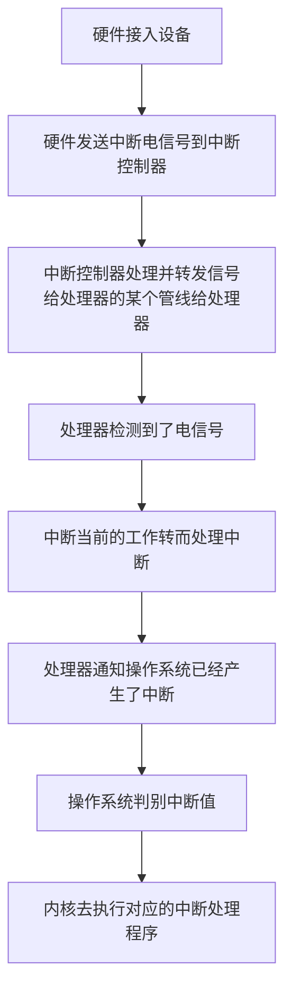
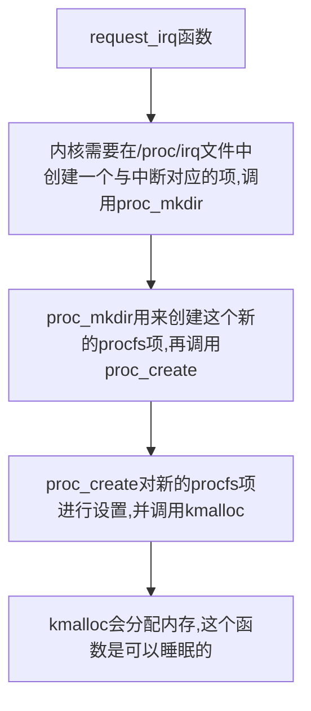
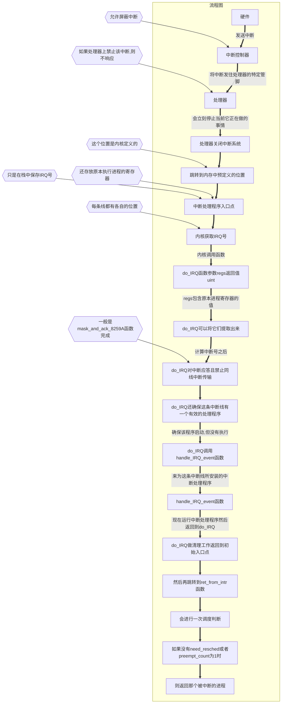

- [中断处理程序的流程图](#中断处理程序的流程图)
  - [中断处理程序](#中断处理程序)
    - [上半部和下半部](#上半部和下半部)
    - [注册中断处理程序](#注册中断处理程序)
      - [request_irq调用流程图](#request_irq调用流程图)
    - [释放中断处理程序](#释放中断处理程序)
    - [中断处理机制的实现](#中断处理机制的实现)
  - [中断控制](#中断控制)
    - [禁止和激活中断](#禁止和激活中断)
    - [禁止指定中断线](#禁止指定中断线)
    - [中断系统的状态](#中断系统的状态)
- [下半部](#下半部)
- 


> **中断不考虑时钟, 是随机出现的, 所以是异步**
>
> **异常是同步的, 是软中断, 依靠内核来处理 `(例如 除0)`**
>
> ==**两者的区别是   中断是又硬件引起的,  而异常是软件引起的**==

**任何操作系统内核的任务, 都包含对连接到计算机上的硬件设备进行有效管理. `(想要管理这些设备,就必须要互相通信才行)`**

**处理器的速度 往往比外围硬件要快**

**让硬件在需要的时候向内核`(其实收到的是处理器)`发送信号,这就是中断机制**

- **中断使得硬件得发送通知给处理器. `(中断本质上是一种特殊的电信号)`**
  - **由硬件发向处理器**
    - **处理器收到中断后会立马向操作系统反映此信号的到来**
      - **然后操作系统负责处理新到来的数据,也就是运行中断处理程序**


> **中断是一种电信号, 由硬件生成, 送入中断控制器`(简单的物理芯片)`, 中断控制器会发送给处理器一个电信号, 处理器一经检测到此信号, 便中断自己的当前工作转而处理中断, 此后 处理器会通知操作系统 已经产生中断,   操作系统会去对这个中断去进行处理**

**不同设备对应的中断不同, 每个中断都通过一个 唯一的数字标识. 对中断进行区分**

- **IRQ : 中断请求线`(硬件)`,每个IRQ线都会被关联一个数值量, 而且可以动态分配, 中断总是与特定的设备相关联**
- **ISR: 中断处理程序, 在响应一个特定中断时, 内核会执行一个函数, 这个函数就是中断处理程序**


> **中断，它是一种由设备使用的硬件资源异步向处理器发信号。实际上，中断就是由硬件来打断操作系统。**
>
> - ==**大多数现代硬件都通过中断与操作系统通信**==
>   - 对给定硬件进行管理的驱动程序注册中断处理程序，是为了响应并处理来自相关硬件的中断。
>   - ==**中断过程所做的工作:**==
>     - 包括  **应答**  并 **重新设置硬件**，**从设备拷贝数据到内存以及反之**，**处理硬件请求**，并 **发送新的硬件请求**。
>       - ==**中断必须做到 快速, 异步, 简单的机制 负责对硬件做出迅速响应并完成时间要求严格的操作**==
>       - ==**不可阻塞这点 限制了中断处理程序所做的事情**==
>       - **中断处理程序会锁定当前的中断线**
> - ==**内核提供的接口:**==
>   - 包括 **注册中断处理程序**  和 **注销中断处理程序**、**禁止中断**、**屏蔽中断线** 以及  **检査中断系统的状态**
> - ==**中断会打断其他代码的执行 `因为（进程，内核本身，甚至其他中断处理程序)` 它们必须赶快执行完**==
>   - **但通常是还有很多工作要做。为了在大量的工作与必须快速执行之间求得一种平衡，内核把处理中断的工作分为两半。**
>     - ==**上半部 : 中断处理程序**==
>       - **异步方式执行, 可以中断其他的中断处理程序(需要标志位),  对硬件操作时间一定要短, 中断处理程序无法在进程上下文中运行 所以不能阻塞**
>         - ==**中断必须做到 快速, 异步, 简单的机制 负责对硬件做出迅速响应并完成时间要求严格的操作**==
>         - ==**内核通过对它的异步执行完成对硬件中断的即使响应**==
>     - ==**下半部 : 中断处理流程中 推后执行的那一部分**==
>       - **执行与中断处理密切相关但中断处理程序本身不执行的工作**
>         - ==**对时间要求相对宽松的任务被推后到中断被激活以后再去运行**==
>         - **在系统不太繁忙并且中断恢复后执行就可以了**
>         - ==**下半部执行的之后 允许响应所有中断**==


# 中断处理程序的流程图



# 中断处理程序

**ISR: 中断处理程序, 在响应一个特定中断时, 内核会执行一个函数, 这个函数就是中断处理程序**

==**一个设备的中断处理程序是由它设备驱动程序 `(driver )` 提供的**==

- **中断处理程序函数与其他内核函数的区别:**
  - **中断处理程序函数是被内核调用来响应中断的, 且运行在中断上下文中( 也称原子上下文 ), 而且不可阻塞**

**中断处理程序拥有自己的栈,每个处理器一个大小为1页(32位4KB,64位8KB)**

> **进程上下文是一种内核所处的操作模式, 此时内核代表进程执行, 还可以通过 `current`宏关联当前进程. 而且进程是以进程上下文的形式连接到内核中的, 因此进程上下文可以睡眠,也可以调用调度程序.**
>
> **中断上下文和进程并没有瓜葛, 与 `current`宏 也不相干`(但它会指向被中断的进程)`, 因为没有后备进程, 所以中断上下文不可以睡眠, 而且也没办法重新调度,因此 不可以在中断上下文中使用某些睡眠函数.**


==**中断处理程序可以被其他的中断处理程序 中断**==

**中断处理程序函数必须负责通知硬件设备中断已被接收**

**中断处理程序会被分为 上半部和下半部**

> **Linux中的中断处理程序是无需重入的. 一个给定的中断处理程序正在执行时, 相应的中断线在所有处理器上都会被屏蔽掉, 防止同一个中断线上接收另一个相同的中断**

==**中断处理程序必须  快速,简洁,无循环,占用内存少**==


## 上半部和下半部

- **上半部 : 收到中断后立即执行, 做有严格时限的工作**
- **下半部 : 能够允许稍后完成的工作 会被推迟到下半部去, 会在合适的时机被 开中断执行**


## 注册中断处理程序

**中断处理程序是管理硬件的驱动程序的组成部分, 每一设备都有相关的驱动程序, 如果设备使用中断, 那么相应的驱动程序就注册一个中断处理程序**

==**中断处理程序必须在 设备初始化完成之后 才可以执行**==

**`request_irq()` 函数可能会睡眠, 不能在中断上下文和禁止阻塞的代码中调用该函数**

```c
#include "/include/linux/interrupt.h"  // 在内核的根目录

// 中断处理程序的返回值类型
enum irqreturn {
	IRQ_NONE,          // @IRQ_NONE 中断不是来自这个设备
	IRQ_HANDLED,       // @IRQ_HANDLED 中断由该设备处理
	IRQ_WAKE_THREAD,   // @IRQ_WAKE_THREAD 处理程序请求唤醒处理程序线程
};
typedef enum irqreturn irqreturn_t;  // 中断处理程序的返回值类型
typedef irqreturn_t (*irq_handler_t)(int irq, void * dev);  // 中断处理程序的函数类型
/*
参数:  irq : 是这个处理程序要响应的中断的中断号(没什么用了,除了打印信息)
		  dev : 一个通用指针,是注册 request_irq() 时传递的dev参数. 用来区分共享同一中断的多个设备, 
		        可以是数据 ,也可以是一种唯一的标识
		 返回值:  正常的话 可以返回 IRQ_HANDLED;
		    可能会返回两个特殊的值:  IRQ_NONE 和 IRQ_HANDLED .
		      通过 IRQ_RETVAL(val) 的返回值可以判断, 非0 则是IRQ_HANDLED 代表成功,  为0代表失败 IRQ_NONE
		    通过这些值,内核可以知道设备发出的是否是一种虚假的(未请求的)中断
*/


//  通过这个函数来注册一个中断处理程序, 并激活给定的中断线
int  request_irq ( unsigned int irq,  irq_handler_t handler, unsigned long flags,   
	                 const char *name,  void *dev);
/* 参数:
         irq :  要分配的中断号 (探测获取,或者编程动态确定的), 必须是没有被注册中断线 或共享的
     handler :  指向处理这个中断的 实际中断处理程序 的指针.(处理函数)
       flags :  可以是0, 也可以是 多个标志的位掩码:
       							 IRQF_DISABLED 运行本程序时 禁用其他中断的运行(应该不设置)
       							 IRQF_SAMPLE_RANDOM  讲设备产生的中断对内核熵池有贡献. (一般不设置)
       							                  <内核熵池: 负责提供从各种随机事件导出的真正随机数>
       							 IRQF_TIMER   专门为系统定时器的中断处理提供的,其他设备不应该使用这个
       							 IRQF_SHARED  表明在多个中断处理程序之间共享中断线,在同一个给定线上注册的每个处理
       							                 程序必须指明这个标志,否则,每条线上只能有一个处理程序.
        name : 与中断相关的设备的ASCII文本表示. (例如键盘对应的中是 keyboard ) 名字会被 /proc/irq 和
                  /proc/interrupts 文件使用, 以便与用户通信.
         dev : 用于共享中断线, 如果不共享 则给 NULL. 每次调用这个处理程序时,都会把这个值传入进去.
                  dev提供一个 唯一的标志信息(cookie), 让内核知道该删除哪个处理程序.
                  
 *  返回值: 成功0, 失败 非0 且指定的中断处理程序不会被注册
           常见错误:  -EBUSY  表示给定的中断线已经在使用了, 或者 flags 没有指定 IRQF_SHARED
 */

// 例子
前面是设备初始化代码;
if(request_irq(irqn, my_interrupt, IRQF_SHREAD, "my_device", my_dev)){
  printk(KERN_ERR "my_device: cannot register IRQ %d\n",  irqn);
  return -EIO;
}
// irqn 是请求的中断线, my_interrupt是中断处理程序, 设置共享, 设备名为 "my_device"
```

### request_irq调用流程图



## 释放中断处理程序

**卸载驱动时, 需要注销相应的中断处理程序, 并释放中断线**

==**必须从进程上下文中调用 `free_irq()`**==

```c
#include "/include/linux/interrupt.h"  // 在内核的根目录

// 根据指定的中断线是否共享,来确定会发生的事情:
//		 非共享, 那么该函数删除处理进程的同时禁用这条中断线.
//     共享  , 则仅删除dev 所对应的处理程序. 而中断线只有在删除了最后一个处理程序时才会被禁用
void free_irq(unsigned int irq, void *dev);
/*
  irq : 分配的中断号
  dev : 必须与要删除的处理程序相匹配
*/
```


# 中断处理机制的实现

- **中断处理系统在 Linux 中的实现是非常依赖于体系结构的。**
  - 实现依赖于:
    - **处理器**
    - **所使用的中断控制器的类型**
    - **体系结构的设计及机器本身**




**`/proc/interrupts` 文件存放的是系统中与中断相关的统计信息**

# 中断控制

==**控制中断系统就是为了提供同步**==

**Linux内核提供一组接口用于操作机器上的中断状态**

- 该接口能够禁止当前处理器中断系统  `<arch/x86/include/asm/system.h>`
  - **通过禁止中断可以确保某个中断程序不会抢占当前的代码**
  - **禁止中断还可以禁止内核抢占**
  - **但却不会提供保护机制来防止来自其他处理器的并发访问**
    - **内核代码要获取某种锁, 防止来自其他处理器对共享数据的并发访问.**
      - ==**获取锁的同时也伴随着禁止本地中断**==
        - **锁提供保护机制, 防止来自其他处理器的并发访问, 而禁止中断提供保护机制,则是防止来自其他中断处理程序的并发访问**
- 屏蔽掉整个机器的一条中断线的能力  `<arch/x86/include/asm/irq.h>`


## 禁止和激活中断

**用于禁止当前处理器(仅仅是当前处理器) 上的本地中断, 随后又激活它们的语句:**

```c
#include "/arch/alpha/include/asm/system.h"
// 下面4个 宏定义 可以在中断 中调用, 也可以在 进程上下文中调用.

#define    local_irq_disable()    // 禁止所有中断
#define    local_irq_enable()     // 允许所有中断


#define    local_irq_save(flags)    // 保存本地中断传递的当前状态 然后禁止本地中断传递
#define    local_irq_restore(flags)   // 恢复本地中断传递到给定的状态
unsigned long flags;   // 这个参数包含具体 体系结构的数据,也就是中断系统的状态, 值传递, 而且不能跨函数
                       // 这就说明了  保存中断状态 和 恢复中断状态 函数必须在同一个函数内进行

```

==**所有的中断同步现在必须结合使用中断控制和自旋锁**==


### 禁止指定中断线

**大部分情况下只需要禁止整个系统中的某一条特定的中断线就够了. 也就是 屏蔽掉`(masking out)` 一条中断线.**

==**对于共享中断线的中断处理程序来说, 不应该使用这些接口函数**==

```c
#include "/arch/m68k/kernel/inst.c"

// 下面前三个函数 不会睡眠. 可以嵌套,也可以在中断或进程上下文中执行, 但要小心的在中断上下文中进行调用.


void disable_irq (unsigned int irq); 
/*  禁止给定中断线，并确保该函数返回之前在该中断线上没有处理程序在运行  */
/* 将 disable_irq 的调用次数与  enable_irq 设置为对等,否则会无法激活控制线 */


void disable_irq_nosync (unsigned int irq);
/* 禁止给定中断线 */
/* 将 disable_irq_nosync 的调用次数与  enable_irq 设置为对等,否则会无法激活控制线 */

void enable_irq (unsigned int irq); // 激活指定的 中断线

void synchronize_irq (unsigned int irq);  // 等待一个特定的中断处理程序的退出,然后才会返回
```


### 中断系统的状态

**了解中断系统的状态, (中断禁止 还是激活) 或着当前处在中断上下文的执行状态中**

```c
#include "/arch/alpha/include/asm/system.h"

#define irqs_disable()    //如果本地处理器上的中断系统被禁止, 返回非0, 否则返回0


#include "/include/linux/hardirq.h"
//下面的两个宏用来检查内核的当前上下文的接口

#define in_interrupt()    //如果当前处于中断上下文中, 返回非0, 内核处于进程上下文中或其他状态时 返回 0.
#define in_irq()	  // 如果当前正在执行中断处理程序时,返回非0 , 否则返回0
```

**有的时候要确保自己没在中断上下文中,避免非法调用了睡眠函数**


# 下半部

下半部（bottom half) 是一个操作系统通用词汇，用于指代中断处理流程中推后执行的那一部分，之所以这样命名，是因为它表示中断处理方案一半的第二部分或者下半部。在 Linux 中，这个词目前确实就是这个含义。所有用于实现将工作推后执行的内核机制都被称为“下半部机制”。一些人错误地把所有的下半部机制都叫做“软中断”，真是在自寻烦恼。

- **执行与中断处理密切相关但中断处理程序本身不执行的工作**
  - ==**对时间要求相对宽松的任务被推后到中断被激活以后再去运行**==
  - **在系统不太繁忙并且中断恢复后执行就可以了**
  - ==**下半部执行的之后 允许响应所有中断**==
- **下半部可通过很多种机制实现, 分别由不同的接口和子系统组成**


1. **目前的内核提供三种不同形式的下半部实现机制:**
   1. ==**软中断**==
      1. **是一组静态定义的下半部 ==接口== ,有32个, 可以在所有处理器上同时执行`(即使类型相同也可以)`**
      2. **对性能要求非常高的可以使用这个, 例如网络**
      3. ==**软中断必须在编译期间就进行静态注册**==
   2. ==**tasklets**==
      1. **基于软中断实现的灵活性强, 动态创建的下半部 ==实现机制== , 不同类型的tasklet可以同时在不同的处理器上执行**
      2. **大部分下半部使用这个就可以了**
      3. ==**tksklet 可以通过代码进行动态注册**==
   3. ==**工作队列**==
      1. **工作队列可以把工作推后, 交由一个内核线程去执行, 这个下半部分总是会在进程上下文中执行**
   4. ==**内核定时器**==
      1. **内核定时器会把操作推迟到某个确定的时间段之后执行**
      2. **必须要保证在一个确定的时间段过去以后再运行时, 才应该使用内核定时器**

