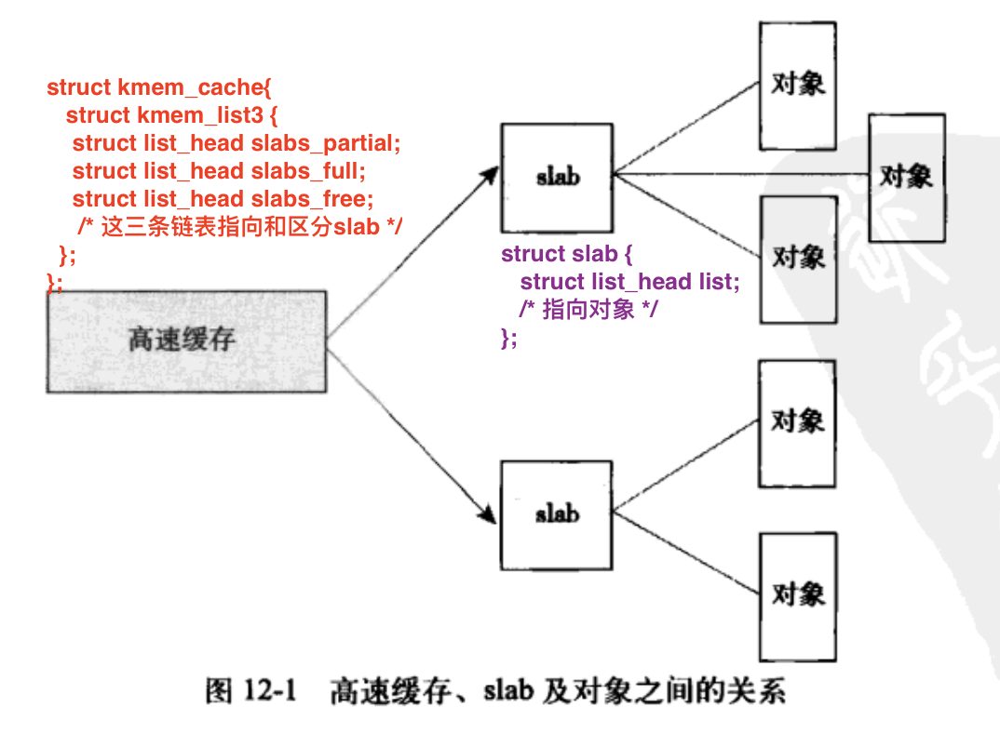

**主要说明的是 在内核之中获取内存的方法.**

- [分配函数的选择](#分配函数的选择)
- [页](#页)
- [区](#区)
- [获得页和释放页操作](#获得页和释放页操作)
- [kmalloc和kzalloc](#kmalloc和kzalloc)
- [gfp_mask标志](#gfp_mask标志)
- [slab层](#slab层)
  - [slab分配器接口](#slab分配器接口)
    - [slab分配器使用实例](#slab分配器使用实例)
- [在栈上的静态分配](#在栈上的静态分配)
- [高端内存映射](#高端内存映射)
  - [永久映射](#永久映射)
  - [临时映射](#临时映射)
- [每个CPU的分配](#每个CPU的分配)
- [新的每个CPU接口](#新的每个CPU接口)
- 


==**内核栈小而固定, 用户空间能够奢侈的负担起非常大的栈**==

**每个进程的内核栈大小既依赖体系结构，也与编译时的选项有关。每个进程都有两个页的内核栈。因为 32 位和 64 位体系结构的页面大小分别是 4KB 和 8KB，所以通常它们的内核栈的大小分别是 8KB 和 16KB。**


# 分配函数的选择

- **需要连续的物理页**
  - 可使用低级页分配器 `kmalloc()`, 内核常用, 分为 GFP_ATOMIC和 GFP_KERNEL
- **从高端内存进行分配**
  - 使用 `alloc_pages()` , 然后再调用 `kmap()` 获得真正的指针 , 然后才可以操作
- **不需要物理上连续的页,仅仅需要虚拟地址上连续的页**
  - 使用 `vmalloc()` , 这个保证虚拟地址是连续, 而物理地址却不一定是连续的. 有性能损失
- **需要频繁的创建和撤销很大的数据结构**
  - 应该建立 slab高速缓存, slab层会给每个处理器维持一个对象高速缓存


# 页

下面会把 KB当作 1024个字节来换算, 但是普遍的叫法是 KiB才是1024字节 ,而KB则是1000字节(苹果文件管理方案)

- **内核把物理页作为内存管理的基本单位,  处理器的最小寻址单位是字节**
  - **内存管理单元 MMU 管理内存 并把虚拟地址转换成物理地址的硬件**
    - ==**内存管理单元 MMU 通常以页为单位进行处理**==
      - ==**MMU 以页为`(page)`大小为单位来管理系统中的页表**==
      - ==**从虚拟内存的角度来看,  页就是最小单位**==
      - **体系结构不同,  支持的页大小也不尽相同**
        - 32位体系结构支持4KB的页, 64位体系结构支持8KB的页
          - 在32位支持4BK页大小 并有1GB 物理内存的机器上, 物理内存会划分为 262144 个页
            - $1*1024*1024*1024 / (4*1024)=262144$
  - ==**页空闲 就代表这个页没有被分配**==
  - ==**内核使用 `struct page`  结构体来表示系统中的每个物理页, 也就是说 系统中每个物理页都要分配一个这样的结构体**==
    - **page结构与物理页相关, 而并非与虚拟页相关.**
      - **该结构对页的描述只是短暂的**
    - **内核使用这种数据结构来描述相关联的物理页面。**
      - **数据结构的目标是来描述物理内存，而不是其中包含的数据。**
    - 一个页可以有以下使用方式:
      - **由页缓存使用** , mapping 成员指向和这个页关联的 address_space 对象
      - **私有数据**, 由private 指向
      - **进程页表中的映射使用**
  - **内核用这个结构来管理系统中所有的页, 内核需要知道一个页是否处于空闲状态(未分配状态)**
    - **如果页已被分配, 那么内核还需要知道 谁拥有这个页**
      - ==**页的拥有者可以分为:**==
        - 用户空间进程
        - 动态分配的内核数据
        - 静态内核代码
        - 页高速缓存

```c
#include < include/linux/mm_types.h >

// 内核使用的 用来表示系统中每个 物理页的结构体
struct page {
	unsigned long  flags;	
   /*flages 用来存放 页的状态, 是否是脏页或锁定内存, 每个位都是一个状态, 至少32种 ,定义在 include/linux/page-flages.h 中*/
  
	atomic_t       _count;		
 /* 当前页的引用计数, 该值为-1时 代表当前内核并没有引用这一页. 
  * 内核应该调用 page_count() 函数进行检查, 返回0表示页空闲, 返回正整数表示页在使用.
  */
  
	atomic_t       _mapcount;
  /*以 mms 为单位映射的 pte 计数，以显示何时映射页面并限制反向映射搜索。 */  
  
  unsigned long  private;		
  /* 当前页如果作为私有数据, 那么会由这个值指向 */
  
  struct address_space  *mapping;
  /*如果低位清零，则指向 inode address_space，或 NULL。如果页面映射为匿名*内存，则设置低位，并指向 anon_vma 对象：请参阅下面的 PAGE_MAPPING_ANON。	 */
  
  pgoff_t           index;		/* 我们在映射中的偏移量。 */
  
	struct list_head  lru;		/*分页列表，例如。 active_list 受 zone->lru_lock 保护！		 */
  
	void             *virtual; 
  /*页的虚拟地址, 也就是页在虚拟内存中的地址（如果没有 kmapped 则为 NULL，即 highmem）
   *有些内存（即所谓的高端内存）并不永久地映射到内核地址空间上。在这种情况下，这个域的值为 NULL，需要的时候，必须动态地映射这些页.
  */
 
};

```


# 区

- ==**区的划分没有任何物理意义, 只是内核为了管理页而采取的一种逻辑上的分组**==
- **区用 `struct zone` 结构体表示 `< include/linux/mmzone.h>`**
  - **系统中只有三区, 也就是说 只要有3个 zone 结构体就可以了**
- **由于硬件的限制，内核并不能对所有的页一视同仁。**
  - **有些页位于内存中特定的物理地址上所以不能将其用于些特定的任务。**
  - ==**内核把页划分为不同的区（zone）内核使用区对具有相似特性的页进行分组, 而且还形成了不同的内存池**==
    - ==**Linux 必须处理如下两种由于硬件存在缺陷而引起的 内存寻址问题:**==
      - 一些硬件只能用某些特定的内存地址来执行 DMA（直接内存访向）。
      - 一些体系结构的内存的物理寻址范围比虚拟寻址范围大得多。这样，就有一些内存不能永久地映射到内核空间上。
    - ==**Linux 使用了四种区:   定义在`< include/linux/mmzone.h >`**==
      - **ZONE_DMA** 这个区包含的页能用来执行 DMA 操作。
        - x86下 就是0到 小于16MB 的内存 (  实模式 )
      - **ZONE_DMA32**   和 ZOME DMA 类似，该区包含的页面可用来执行 DMA 操作；而和  ZONE_DMA 不同之处在于，这些页面只能被 32 位设备访问。在某些体系结构中，该区将比 ZONE DMA 更大。
      - **ZONE_NORMAL** 这个区包含的都是能 **正常映射** 的页。
        - x86下 就是 16MB 到 896MB 的内存
      - **ZONE_HIGHEN** 这个区包含“**高端内存**”，其中的 **页并不能永久地映射到内核地址空间。**, 除此之外 全都是 低端内存
        - x86下 就是 大于 896MB 的所有内存
- **区的实际使用和分布是与体系结构相关的**
  - x86-64 体系结构可以映射和处理64为的内存空间, 所有的物理内存都处于  ZONE_DMA 和 ZONE_NORMAL区
- ==**内核优先从 ZONE_NORMAL 开始分配内存**==


- ==**Linux 把系统的页划分为区，形成不同的内存池，这样就可以根据用途进行分配**==
  - ==**区的划分没有任何物理意义, 只是内核为了管理页而采取的一种逻辑上的分组**==
    - ZONE_DMA 内存池让内核有能力为 DMA 分配所需的内存。如果需要这样的内存，那么，内核就可以从 ZONE_DMA 中按照请求的数目取出页。
      - **内核一般不会同时从两个区分配,因为分配不能跨区界限的,`(真的没有可用内存的情况除外)`**
- 

```c
#include < include/linux/mmzone.h>
// 系统中只有三区, 也就是说 只要有3个 zone 结构体就可以了
// 区用 struct zone 结构体表示 
struct zone {
	/* 页面分配器通常访问的字段 */
  
	/* 持有 该区最小值, 最低和最高水位值, 内核使用水位为每个内存区设置合适的内存消耗基准,随空闲内存的多少而变化
   * 使用 *_wmark_pages(zone) 宏访问 */
	unsigned long watermark[NR_WMARK];

	/*
* 我们不知道我们要分配的内存是否可以释放或/并且最终会被释放，所以为了避免完全浪费几 GB 的内存，我们必须保留一些较低的区域内存（否则我们会冒险尽管在较高区域有大量可释放的内存，但在较低区域运行 OOM）。如果 sysctl_lowmem_reserve_ratio sysctl 更改，则在运行时重新计算此数组。
	 */
	unsigned long		lowmem_reserve[MAX_NR_ZONES];
  
  
	struct per_cpu_pageset __percpu pageset[NR_CPUS];

  /* 自旋锁, 只保护结构, 不保护驻留在这个区中的所有页, 也没有特定的锁来保护单个页, 但部分内核可以锁住在页中驻留的数据 */
	spinlock_t		lock;
  
	int            all_unreclaimable; /* 所有页面已固定 */

	struct free_area	free_area[MAX_ORDER];

	/* 页面回收扫描器通常访问的字段 */
	spinlock_t		lru_lock;	
  
	struct zone_lru {
		struct list_head list;
	} lru[NR_LRU_LISTS];

  
	struct zone_reclaim_stat reclaim_stat;

	unsigned long		pages_scanned;	   /* 自上次回收以来 */
	unsigned long		flags;		   /* 区域标志 */

	/* 区域统计 */
	atomic_long_t		vm_stat[NR_VM_ZONE_STAT_ITEMS];

	/*
* prev_priority 持有该区域的扫描优先级。它被定义为我们在之前的 try_to_free_pages() 或 balance_pgdat() 调用中实现回收目标的扫描优先级。
* 我们使用 prev_priority 作为衡量页面回收压力程度的衡量标准 - 它推动了 swappiness 决定：是否取消映射映射的页面。
* 即使在单处理器上访问这两个领域也非常活跃。但预计平均还可以。
	 */
	int prev_priority;

	/*
   * 此区域的 LRU 上 ACTIVE_ANON 与 INACTIVE_ANON 页的目标比率。由分页代码维护。
	 */
	unsigned int inactive_ratio;

	/*
	 * wait_table		-- 保存哈希表的数组
	 * wait_table_hash_nr_entries	-- 哈希表数组的大小
	 * wait_table_bits	-- wait_table_size == (1 << wait_table_bits)
	 *
	 * 所有这些的目的是跟踪等待页面可用的人，并在可能的情况下使他们再次运行。问题是这会消耗大量空间，特别是当在给定时间等待页面的东西很少时。因此，我们不使用每页等待队列，而是使用等待队列哈希表。
	 *
	 * 存储桶规则是在碰撞时在同一个队列中休眠，并在删除时唤醒该等待队列中的所有内容。当某物苏醒时，它必须检查以确保其页面确实可用，如雷鸣般的羊群。碰撞的代价很大，但考虑到桌子的预期负载，它们应该非常罕见，以至于被节省空间的好处所抵消。
	 *
	 * mm/filemap.c 中的__wait_on_page_locked() 和unlock_page() 是这些字段的主要用户，而在mm/page_alloc.c 中free_area_init_core() 执行它们的初始化。
	 */
	wait_queue_head_t	* wait_table;
	unsigned long		wait_table_hash_nr_entries;
	unsigned long		wait_table_bits;

	/* Discontig 内存支持字段。	 */
	struct pglist_data	*zone_pgdat;
	
  /* zone_start_pfn == zone_start_paddr >> PAGE_SHIFT */
	unsigned long		zone_start_pfn;

	/*
* zone_start_pfn、spanned_pages 和present_pages 都受span_seqlock 保护。它是一个 seqlock，因为它必须在 zone->lock 之外读取，并且在主分配器路径中完成。但是，它很少被写入。
	 * 该锁与 zone->lock 一起声明，因为它经常在 zone->lock 附近被读取。给他们一个机会在同一个缓存线中是很好的。
	 */
	unsigned long		spanned_pages;	/* 总尺寸，包括孔 */
	unsigned long		present_pages;	/* 内存量（不包括孔） */

	/* 以NULL结束的字符串 表示这个区的名字, 由内核启动期间初始化,初始化代码位于 < /mm/page_alloc.c > 中 
   * 三个区的名字为 : DMA, Normal , HighMem
   */
	const char		*name;
} ____cacheline_internodealigned_in_smp;
```


# 获得页和释放页操作

内核提供请求内存的底层机制, 也就是对页的, **分配 , 释放, 访问** 接口,  `(以页为单位)`

```c
#include <include/linux/gfp.h>

// 分配页
	struct page* alloc_pages( gfp_t  gfp_mask,  unsigned int order);
	 /* 分配多个连续的物理页, 并返回一个页指针
  	* gfp_mask : 是分配器标志, 指示内存分配器的行为
	  *    order : 分配页的个数,以2为底的指数值 , ( order=3 时 ,分配 2^(3) = 8 个页 )
	  * 返回值: 返回一个指针, 指向第一个页的 page 结构体,  出错返回NULL
  	*/
 
	struct page* alloc_page( gfp_t  gfp_mask );
	 /* 分配一个物理页, 并返回一个页指针
  	* gfp_mask : 是分配器标志, 指示内存分配器的行为
	  * 返回值: 返回一个指针, 指向第一个页的 page 结构体,  出错返回NULL
  	*/

unsigned long  __get_free_pages( gfp_t  gfp_mask, unsigned int order );
	 /* 分配多个连续的物理页,并返回指向该页的逻辑地址的指针
  	* gfp_mask : 是分配器标志, 指示内存分配器的行为
	  *    order : 分配页的个数,以2为底的指数值 , ( order=3 时 ,分配 2^(3) = 8 个页 )
	  * 返回值: 返回一个被强转为 unsigned long的 指针, 指向第一个页的逻辑地址,  出错返回 0
  	*/

unsigned long  __get_free_page( gfp_t  gfp_mask);
	 /* 分配一个物理页, 并返回指向该页的逻辑地址的指针
  	* gfp_mask : 是分配器标志, 指示内存分配器的行为
	  * 返回值: 返回一个被强转为 unsigned long的 指针, 指向第一个页的逻辑地址,  出错返回0
  	*/

unsigned long get_zeroed_page(gfp_t gfp_mask);
 	 /* 分配一个物理页, 并返回指向该页的逻辑地址的指针, 而且将该页全部置为0, 更安全
  	* gfp_mask : 是分配器标志, 指示内存分配器的行为
	  * 返回值: 返回一个被强转为 unsigned long的 指针, 指向第一个页的逻辑地址,  出错返回0
  	*/


// 将页转换成逻辑地址
void* page_address( struct page* page);
  /* 将给定的页转换成它的逻辑地址 
   * page : 页指针
   * 返回值: 成功 得到它的逻辑地址 ,失败返回NULL
   */


// 释放页, 切不可释放错误.
void __free_pages(struct page* page, unsigned long order); // page 头指针和指数
void free_pages( unsigned long  addr, unsigned long order); //逻辑地址和指数
void free_page( unsigned long  addr); // 逻辑地址 , 只释放一个

```

```c
范例:
// 申请
unsigned long page;
page = __get_free_pages(GFP_KERNEL,3);
if( !page){
  /* 没有足够的内存, 分配失败  错误处理 */
  return _ENOMEM;
}
/* page现在指向 8个连续页中的第一个页的地址 */

// 释放
free_pages(page, 3);  // 页已经释放, 不应该再访问 存放在 page 中的地址了 */
```


# kmalloc和kzalloc

- ==**`kmalloc()` 以字节为单位分配获得一块内核内存, 并且 物理内存地址是连续的**==
  - **`kmalloc()` 函数接口建立在 slab层 之上,  使用了一组通用高速缓存**
- ==**`vmalloc()` 分配的 内存虚拟地址是连续的, 而物理地址则无需连续, 这个就是用户空间分配函数的工作方式**==
  - **为了把物理上不连续的页 转换为虚拟地址空间上连续的页, 必须建立页表项, 而且是一个一个的进行映射, 但这会导致比直接内存映射大得多的 TLB 抖动**
    - **TLB :**是一个小的 **硬件缓冲区**, 缓存了 虚拟地址和物理地址 的映射关系


```c
#include <include/linux/slab_def.h>  // 在slob 和 slub 也有该定义

// 下面的函数, 申请的内存空间只会比 size 要去的大, 不会小
// 设备驱动 所需要的内存 在物理上应该是连续的
static __always_inline void *kmalloc(size_t size, gfp_t flags);
static inline void*  kzalloc(size_t szie, gfp_t flags); // 申请到的空间置0
/* 在内核或驱动里面 申请内存的常用函数
   返回一个指向内存块的指针, 其内存块大小 至少是size大小, 所分配的内存 在物理上 是连续的.
   flags : 是分配器标志, 指示内存分配器的行为 ,就是 gfp_mask 标志
   返回值:  失败返回 NULL
*/

void kfree(void* kmem);  // 释放  kmalloc() 分配的内存, 调用 kfree(NULL) 是安全的

```

```c
// 该函数 可能会睡眠, 不可以在中断上下文 和 不允许阻塞的 情况下使用
void* vmalloc(unsigned long size);
void* vzalloc(unsigned long size);  // 申请到的空间置0
/* 返回一个指向内存块的指针, 其内存块大小 至少是size大小, 所分配的内存在物理上 无需连续.
  不可用于中断上下文
*/
void vfree(void* vmem);
```


# gfp_mask标志

- 标志可分为三类:
  - **修饰符: ** 表示内核如何分配所需的内存( 中断处理程序会要求不许睡眠 )
  - **区修饰符 :** 表示从哪个区分配内存, ==**内核优先从 ZONE_NORMAL 开始分配内存**==
  - **类型标志 :** 组合行为修饰符和区修饰符, 让各种组合归纳为不同的类型, 简化了标志的使用


```elixir
#行为修饰符
  __GFP_WAIT   分配器可以睡眠  
  __GFP_HGH    分配器可以访问紧急事件缓冲池  
  __GFP_IO     分配器可以启动磁盘 I/O  
  __GFP_FS     分配器可以启动文件系统 I/O
  __GFP_COLD   分配器应该使用高速缓存中快要淘汰出去的页 
  __GFP_NOWARN 分配器将不打印失败警告
  __GFP_REPEAT 分配器在分配失败时重复进行分配，但是这次分配还存在失败的可能
  __GFP_NOFALL 分配器将无限地重复进行分配。分配不能失败
  __GFP_NORETRY  分配器在分配失败时绝不会重新分配
  __GFP_NO_GROW 由 slab 层内部使用  
  __GFP_COMP    添加混合页 元数据，在 hugetlb 的代码内部使用
#说明页分配器（最终调用 all_ pages()) 在分配时可以阻塞、执行 IO，在必要时还可以执行文件系统操作。这就让内核有很大的自由度，以便它尽可能找到空闲的内存来满足分配请求。
#大多数分配都会指定这些修饰符，但一般不是这样直接指定，
```

```elixir
#区修饰符  , 默认从 ZONE_NORMAL区 开始分配
  __GFP_DMA       从 ZONE_DMA 分配
  __GFP_DMA32     只在 ZONE_DMA32 分配
  __GFP_HIGHMEM   从 ZONE_HIGHMEM 或 ZONE_NORMAL 分配, 
                   不能给__get_free_pages()和 kalloc() 指定这个修饰符. 因为没有逻辑地址
```

```elixir
#类型标志
 GFP_ATOMIC   这个标志用在中断处理程序、下半部、持有自旋以及其他不能睡眠的地方
                 ( __GFP_HIGH  )
 GFP_NOWAIT   与 GFP ATOMIC 类似，不同之处在于，调用不会退给紧急内存池。这就增加了内存分配失败的可能性。
                 ( 0 )
 GFP_NOIO     这种分配可以阻塞,但不会启动磁盘I/O。这个标志在不能引发更多磁盘I/O时能阻塞I/O 代码，这可能导
                  致令人不偷快的递归
                 (__GFP_WAIT)
 GFP_NOFS      这种分配在必要时可能阻塞，也可能启动磁盘 O，但是不会启动文件系统操作。这个标志在你不能再启动
									 另一个文件系统的操作时，用在文件系统部分的代码中
									(__GFP_WAIT | __GFP_IO )
 GFP_KERNEL    这是一种常规分配方式，可能会阻塞这个标志在睡展安全时用在进程上下文代码中为了获调用者所需的
                   内存，内核会尽力而为。这个标志应当是首选标志, 进程上下文中
									(__GFP_WAIT | __GFP_IO | __GFP_FS)
 GFP_USER      这是一种常规分配方式，可能会阻塞。这个标志用于为用户空间进程分配内存时
									(__GFP_WAIT | __GFP_IO | __GFP_FS)
 GFP_HIGHUSER  这是从 ZONE HIGHIMEM 进行分配，可能会阻塞。这个标志用于为用户空间进程分配内存
									(__GFP_WAIT | __GFP_IO | __GFP_FS | __GFP_HIGHMEM )
 GFP_DMA       这是从 ZONE_DAM 进行分配。需要 DMA 内存的设备驱动程序中,使用这个标志通常与以上
                   的 GFP_KERNEL 标志组合在一起使用
									( __GFP_DMA )
									

#标志使用时机建议
进程上下文，可以睡眠     使用 GFP_KERNEL
进程上下文，不可以睡眠    使用 GFP_ATOMIC，在你睡眠之前或之后以 GFP_KERNEL 执行内存分配
中断处理程序            使用 GFP_ATOMIC 
软中断                 使用 GFP_ATOMIC
tasklet               使用 GFP_ATOMIC 
需要用于 DMA 的内存，可以睡眠      使用（GFP_DMA | GFP_KERNEL)
需要用于 DMA 的内存，不可以睡眠     使用（GFP_DMA | GFP_ATOMIC），或在你睡眼之前执行内存分配
```


# slab层

**分配和释放数据结构是所有内核中最普遍的操作之一**

==**slab 分配器扮演了通用数据结构缓存层的角色**==

==**slab 层负责内存紧缺情况下所有底层的对齐、着色、分配、释放和回收等**==

- **slab设计和实现 参考了下面的原则:**

  - 频使用的数据结构也会频分配和释放，因此应当缓存它们

  - 频繁分配和回收必然会导致内存碎片（难以找到大块连续的可用内存）。为了避免这种现象，空链表的缓存会连续地存放。因为已释放的数据结构又会放回空闲链表，因此不会导致碎片。

  - 回收的对象可以立即投入下一次分配，因此，对于频繁的分配和释放，空闲链表能够提高其性能。

  - 如果分配器知道对象大小、页大小和总的高速缓存的大小这样的概念，它会做出更明智的决策。

  - 如果让部分缓存专属于单个处理器（对系统上的每个处理器独立而唯一），那么，分配和释放就可以在不加 SMP 锁的情况下进行。

  - 如果分配器是与 NUMA 相关的，它就可以从相同的内存节点为请求者进行分配。

  - 对存放的对象进行着色（color），以防止多个对象映射到相同的高速缓存行（cache line）。

    


- **slab层的设计**
  - ==slab层 把不同的对象划分为所谓的  **高速缓存(cache)组,** 其中每个高速缓存都存放不同类型的对象;==
    - **每种对象类型对应 一个高速缓存(cache)**
      - 例如: 一个高速缓存 存放task_struct结构体, 而另一个高速缓存 存放 struct inode 结构体
    - **这些高速缓存组 又被划分为 slab.**
      - **slab由一个或者多个物理上连续的页组成,  也就是借助伙伴算法**
  - **`kmalloc()` 函数接口建立在 slab层 之上,  使用了一组通用高速缓存**
  - **每个高速缓存都使用 `kmem_cache` 结构来表示, 而且包含三个链表, `slabs_full满, slabs_partial部分 , slabs_empyt空` 均放在 `kmem_list3`  结构内, 这个链表包含高速缓存中的所有 slab.**   
    - **slab 描述符 `struct slab` 用来描述每个 slab**
      - slab 描述符, 要么在slab之外另行分配,  要么就放在 slab 自身开始的地方.
      - **slab 分配器 可以创建 新的 slab, 通过 `__get_free_pages()` 低级内核页分配器进行的**
  - 高速缓存通过以下函数创建, 使用该函数建立一个的高速缓存,  但是需要另外的函数来进行使用这块高速缓存`struct kmem_cache*  kmem_cache_create()`



```c
#include <mm/slab.c >

struct kmem_list3 {
	struct list_head slabs_partial;	/* partial list first, better asm code */
	struct list_head slabs_full;
	struct list_head slabs_free;
	unsigned long free_objects;
	unsigned int free_limit;
	unsigned int colour_next;	/* Per-node cache coloring */
	spinlock_t list_lock;
	struct array_cache *shared;	/* shared per node */
	struct array_cache **alien;	/* on other nodes */
	unsigned long next_reap;	/* updated without locking */
	int free_touched;		/* updated without locking */
};


struct kmem_cache {
/* 1) per-cpu data, touched during every alloc/free */
	struct array_cache *array[NR_CPUS];
/* 2) Cache tunables. Protected by cache_chain_mutex */
	unsigned int batchcount;
	unsigned int limit;
	unsigned int shared;

	unsigned int buffer_size;
	u32 reciprocal_buffer_size;
/* 3) touched by every alloc & free from the backend */

	unsigned int flags;		/* constant flags */
	unsigned int num;		/* # of objs per slab */

/* 4) cache_grow/shrink */
	/* order of pgs per slab (2^n) */
	unsigned int gfporder;

	/* force GFP flags, e.g. GFP_DMA */
	gfp_t gfpflags;

	size_t colour;			/* cache colouring range */
	unsigned int colour_off;	/* colour offset */
	struct kmem_cache *slabp_cache;
	unsigned int slab_size;
	unsigned int dflags;		/* dynamic flags */

	/* constructor func */
	void (*ctor)(void *obj);

/* 5) cache creation/removal */
	const char *name;
	struct list_head next;

/* 6) statistics */
#ifdef CONFIG_DEBUG_SLAB
	unsigned long num_active;
	unsigned long num_allocations;
	unsigned long high_mark;
	unsigned long grown;
	unsigned long reaped;
	unsigned long errors;
	unsigned long max_freeable;
	unsigned long node_allocs;
	unsigned long node_frees;
	unsigned long node_overflow;
	atomic_t allochit;
	atomic_t allocmiss;
	atomic_t freehit;
	atomic_t freemiss;

	/*
	 * If debugging is enabled, then the allocator can add additional
	 * fields and/or padding to every object. buffer_size contains the total
	 * object size including these internal fields, the following two
	 * variables contain the offset to the user object and its size.
	 */
	int obj_offset;
	int obj_size;
#endif /* CONFIG_DEBUG_SLAB */

	/*
	 * We put nodelists[] at the end of kmem_cache, because we want to size
	 * this array to nr_node_ids slots instead of MAX_NUMNODES
	 * (see kmem_cache_init())
	 * We still use [MAX_NUMNODES] and not [1] or [0] because cache_cache
	 * is statically defined, so we reserve the max number of nodes.
	 */
	struct kmem_list3 *nodelists[MAX_NUMNODES];
	/*
	 * Do not add fields after nodelists[]
	 */
};

*/ ）/

// slab 描述符, 要么在slab之外另行分配,  要么就放在 slab 自身开始的地方.
struct slab {
	struct list_head list;      /* 满、部分满或空链表 */
	unsigned long colouroff;    /* slab 着色的偏移量 */
	void *s_mem;		            /* 在 slab 中的第一个对象 */
	unsigned int inuse;	        /* slab 中已分配的对象数 */
	kmem_bufctl_t free;         /* 第一个空闲对象（如果有的话) */
  unsigned short nodeid;
};

```


```c
#include <mm/slab.c >

// slab 分配器 可以创建 新的 slab, 通过 __get_free_pages() 低级内核页分配器进行的
//  @cachep: 指向需要很多页的特定高速缓存.
//  @flags : 传递给 __get_free_apges()的标志
//  @nodeid: 非负数时,NUMA试图从相同的内存节点给发出的请求进行分配
// 下面的函数 表示 获取新的页
static void *kmem_getpages(struct kmem_cache *cachep, gfp_t flags, int nodeid)
{
	struct page *page;
	void* addr;
	int i;

	flags |= cachep->gfpflags;
	if(likely(nodeid == -1)){
    addr = (void*) __get_free_pages(flags, cachep->gfporder);
    if (!addr)
      return NULL;
    page = virt_to_page(addr);
  } else {
    page = alloc_gages_node(nodeid, flags, cachep->gfporder);
    if (!page)
      return NULL;
    addr = page_address(page);
  }
  
  i = ( 1 << cachep->gfporder);
  if (cachep->flags & SLAB_RECLAIM_ACCOUNT)
		atomic_add(i, &slab_reclaim_pages);
  add_page_state(nr_slab, i);
  while( i-- ){
		SetPageSlab(page);
    page++;
  }
  
	return addr;
}
```


## slab分配器接口


```c
#include  <mm/slab.c>
// 高速缓存通过以下函数创建, 该函数会睡眠, 不可用于中断上下文
// 使用该函数建立一个的高速缓存, 并交给slab管理层处理, 但是需要另外的函数来进行使用这块高速缓存
struct kmem_cache*  kmem_cache_create(const char* name, size_t size, size_t align,
                                      unsigned long flags, void (*ctor)(void*) );
/*  参数:
		   name:  高速缓存的名字
		   size:  高速缓存中每个元素的大小
		   align: 对齐大小 ,也是slab内第一个对象的偏移,  0,1024,4096
		   flags: 可选的设置项, 用来控制高速缓存的行为, 可以为0 代表没有特殊行为,也不要胡乱设置
		           SLAB_HWCACHE_ALIGN 高速缓存行对齐, SLAB_POISON 用 0xa5a5 的值填充slab,
		           SLAB_RED_ZONE 通过插入警戒区探测缓存越界, 
		           SLAB_PANIC 分配失败时通知slab层 并调用 panic()函数  且无需检查返回值,
               SLAB_CACHE_DMA 命令slab层使用可以执行DMA的内存给每个slab分配空间
		   ctor:  该参数已抛弃给 NULL即可, 高速缓存的构造函数,只有新的页追加到高速缓存时,构造函数才会被调用
			返回值:  成功返回指向高速缓存的指针, 失败NULL
*/


//撤销从 kmem_cache_create() 函数申请的高速缓存内存, 通常是模块的注销代码中调用
// 但是必须保证 高速缓存中的所有 slab 都必须为空, 否则失败
int kmem_cache_destriy(struct kmem_cache* s);
/* 
  参数: s: kmem_cache_create() 函数返回值
  返回值: 成功返回0, 失败返回1
*/


//高速缓存 -> slab管理 -> 对象


// 从高速缓存中的 slab 去获取申请所需要 对象的内存
// 从给定的 cachep 中返回一个指向对象的指针
void* kmem_cache_alloc(struct kmem_cache* cachep, gfp_t flags)l
  /*  参数:
         cachep: 由kmem_cache_create()返回的高速缓存结构体
         flags:  内核中不同 内存申请的场景, 上面 GFP_KERNEL 或 GFP_ATOMIC 之类的
      返回值: 返回申请到的 内存的地址指针
  */
// 实际 kmem_cache_alloc() 函数内部就是调用的 slab_alloc() 函数来实现的.
//  如果高速缓存的所有slab中都没有空闲的对象, 那么slab层必须通过 kmem_getpages() 获取新的页
// static __always_inline void*  slab_alloc(struct keme_cache* cache, gfp_t flags,
//                                         unsigned long caller);


// 从高速缓存中 释放已申请 对象的内存, 并把它放回给原先的slab
  // 就是把 cachep 中的对象 objp 标记为空闲
void kmem_cache_free(struct kmem_cache *chachep, void *objp);
```


### slab分配器使用实例

```c
// 首先，内核用一个全局变量存放指向 task struct 高速缓存的指针：
static struct kmem_cache *task_struct_cachep;

task_struct_cachep = kmem_cache_create("task_struct", sizeof(struct task_struct), 
                                       ARCH_MIN_TASKALIGN, SLAB_PANIC | SLAB_NOTRACK, NULL);
struct task_struct *tsk = kmem_cache_alloc(task_sturct_cachep, GFP_KERNEL);
if(tsk == NULL){
  return NULL;
}
```


# 在栈上的静态分配

==**内核栈小而固定, 用户空间能够奢侈的负担起非常大的栈**==

**每个进程的内核栈大小既依赖体系结构，也与编译时的选项有关。每个进程都有两个页的内核栈。因为 32 位和 64 位体系结构的页面大小分别是 4KB 和 8KB，所以通常它们的内核栈的大小分别是 8KB 和 16KB。**

**中断栈。中断堆栈提供用于中断处理程序的单个每处理器堆栈。使用此选项，中断处理程序不再共享被中断进程的内核堆栈。相反，它们使用自己的堆栈。每个处理器只消耗一个页。**

- 内核栈可以是 1 页，也可以是 2 页，这取决于编译时配置选项。大小因此在 4~16KB 的范围内。
  - **当 2 页的选项激活时, 中断处理程序和被中断进程共享一个栈。**
  - **当 1 页的选项激活时中断处理程序获得了自己的栈。**
- 在任何情况下，无限制的递归和 alloca0 显然是不被允许的。

**在分配大内存时, 应该使用 动态分配**


# 高端内存映射

**在高端内存中的页不能永久地映射到内核地址空间上。**

**通过 alloc_pages0 函数以 __GFP_HIIGHMEM 标志获得的页不可能有逻辑地址.**

在 x86 体系结构上，高于 896MB 的所有物理内存的范围大都是高端内存，它并不会永久地或自动地映射到内核地址空间，尽管 x86 处理器能够寻址物理 RAM 的范围达到 4GB（启用 PAEO 可以寻址到 64GB）。一旦这些页被分配，就必须映射到内核的逻辑地址空间上。在 x86 上，高端内存中的页被映射到 3GB~4GB 标记之间的某个位置.


## 永久映射

**要映射一个给定的 page 结构到内核地址空间**

**这个函数可以睡眠，因此 kmap 只能用在进程上下文中。**

```c
#include <include/linux/highmem.h>
void *kmap(struct page *page);
  /* 映射一个给定的 page结构到内核地址空间.这个函数在高低端内存都可以使用
   *   如果 page 结构对应的是低端内存中的一页，函数只会单纯地返回该页的虚拟地址。
   *   如果页位于高端内存，则会建立一个永久映射，再返回地址。
   * 这个函数可以睡眠，因此 kmap 只能用在进程上下文中。
   * 允许永久映射的数量是有限的,  在不使用时 应该解除映射
   */
  
void kunmap(struct page *page);
/* 解除映射 */
```


## 临时映射

当必须创建一个映射而当前的上下文又不能睡眠时，内核提供了临时映射（也就是所谓的原子映射）。

有一组保留的映射，它们可以存放新创建的临时映射。内核可以原子地把高端内存中的一个页映射到某个保留的映射中。

**因此，临时映射可以用在不能睡眠的地方，比如中断处理程序中，因为获取映射时绝不会阻塞。**

```c
#include <include/linux/highmem.h>
void *kmap_atomic(struct page *page, enum km_type idx)
  /* 映射一个给定的 page结构到内核地址空间.这个函数在高低端内存都可以使用
   * 这个函数不允许睡眠，因此 kmap_atomic 可以用在中断上下文或其他不能重新调度的地方, 它也禁止内核抢占
   *  映射对于每个处理器都是唯一的
   *  下一个原子映射将自动覆盖掉前一个映射
   *  idx : 这个枚举类型描述了临时映射的目的,  参数在下面
   */

void kunmap_atomic(struct page *page);
/* 解除映射 */


#include <include/asm-generic/kmap_types.h>
idx 参数
enum km_type {
KMAP_D(0)	KM_BOUNCE_READ,
KMAP_D(1)	KM_SKB_SUNRPC_DATA,
KMAP_D(2)	KM_SKB_DATA_SOFTIRQ,
KMAP_D(3)	KM_USER0,
KMAP_D(4)	KM_USER1,
KMAP_D(5)	KM_BIO_SRC_IRQ,
KMAP_D(6)	KM_BIO_DST_IRQ,
KMAP_D(7)	KM_PTE0,
KMAP_D(8)	KM_PTE1,
KMAP_D(9)	KM_IRQ0,
KMAP_D(10)	KM_IRQ1,
KMAP_D(11)	KM_SOFTIRQ0,
KMAP_D(12)	KM_SOFTIRQ1,
KMAP_D(13)	KM_SYNC_ICACHE,
KMAP_D(14)	KM_SYNC_DCACHE,
/* UML specific, for copy_*_user - used in do_op_one_page */
KMAP_D(15)	KM_UML_USERCOPY,
KMAP_D(16)	KM_IRQ_PTE,
KMAP_D(17)	KM_NMI,
KMAP_D(18)	KM_NMI_PTE,
KMAP_D(19)	KM_TYPE_NR
};

```


# 每个CPU的分配

支持 SMP 的现代操作系统使用每个 CPU 上的数据，对于给定的处理器其数据是唯一的。

- 每个 CPU 的数据存放在一个数组中。
  - 数组中的一项对应着系统上个存在的处理器。
    - 按当前处理器号确定这个数组的当前元素.

```c
unsigned long  my_percpu[NR_CPUS];   // 存放CPU 数据的 数组


// 访问, 而且数据安全会被保护, 不会有竞争条件
int cpu;
cpu = get_cpu();   // 获得当前处理器, 并禁止内核抢占
my_percpu[cpu]++;   // 随便操作一下
printk("my_percpu on cpu=%d is %lu \n", cpu, my_percpu[cpu]);  
put_cpu();   // 激活内核抢占
```


# 新的每个CPU接口

为了方便创建和操作每个 CPU 数据，而引进了新的操作接口，称作 percpu。该接口归纳了前面所述的操作行为，简化了创建和操作每个 CPU 的数据。

大型对称多处理器计算机要求对每个 CPU 数据操作更简单，功能更强大，正是在这种背景下，新接口应运而生。

```c
#include <include/linux/percpu.h >
#include <include/linux/percpu-defs.h >

1. 静态创建
		// 编译时定义, 但是无法在模块内使用, (需要动态创建才可以)
		DEFINE_PER_CPU(type ,name);  // 编译时定义每个CPU变量, 也就是实例
		DECLARE_PER_CPU(type,name);  // 编译时定义每个CPU变量, 防范编译时警告, 可以在别的地方声明变量


2. 动态创建
    // 为每个处理器创建所需内存的实例
   void* alloc_percpu(type);  //给系统中的每个处理器分配一个指定类型对象的实例. 单字节对齐
   void* __alloc_percpu(size_t size, size_t align);
     /* size分配字节数, align分配时要按多少字节对齐 
      * __alignof__(val) 是gcc 功能, 获取架构的对齐字节数, 类似于 sizeof(), 但是只给出对齐方式
      * 返回的是 kzalloc() 申请的内存地址
      */

   void  free_percpu(const void* ); // 释放掉所有处理器上指定的每个CPU数据

  
3.操作
		get_cpu_var(name); //返回当前处理器上的指定变量,同时禁止抢占,返回的值是指针转变量,类似引用
		put_cpu_var(name); // 激活内核抢占
  例子: 
       get_cpu_var(name)++;  /*增加处理器上name变量的值 */ 
       put_cpu_var(name);    //激活内核抢占

   void *perrcpu_ptr= NULL;
   unsigned long* foo = NULL;
   percpu_ptr = alloc_percpu(unsigned long);   // 申请8字节的内存空间, 将指针传给 percpu_ptr
   if(! percpu_ptr){  /* 错误判断和处理 */  }
   foo = get_cpu_var(percpu_ptr); // foo 得到了内存的地址, 并禁止内核抢占
   *foo = 1;   // 就是在往内存里写数据
   put_cpu_var(percpu_ptr);  // 激活内核抢占
```


