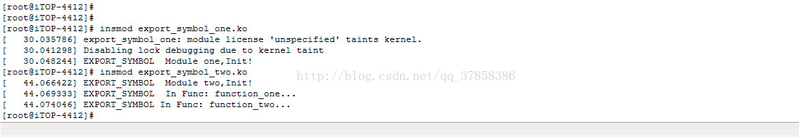

那么EXPORT_SYMBOL的作用是什么？
           EXPORT_SYMBOL标签内定义的函数或者符号对全部内核代码公开，不用修改内核代码就可以在您的内核模块中直接调用，即使用EXPORT_SYMBOL可以将一个函数以符号的方式导出给其他模块使用。


## 使用方法

​         1、在模块函数定义之后使用“EXPORT_SYMBOL（函数名）”来声明。
​         2、在调用该函数的另外一个模块中使用extern对之声明。
​         3、先加载定义该函数的模块，然后再加载调用该函数的模块，请注意这个先后顺序。


## 实例测试

​      1、测试思路：在模块export_symbol_one中定义一个函数function_one(void)；在另外一个模块export_symbol_two中定义一个函数function_two(void)，function_two(void)里面会调用function_one(void)。

​      2、测试代码：

## export_symbol_one.c

```c
// export_symbol_one.c


#include<linux/init.h>
#include<linux/module.h>
#include<linux/kernel.h>
 
static int function_one(void)
{
        printk("EXPORT_SYMBOL  In Func: %s...\n",__func__);
        return 0;
}
 
EXPORT_SYMBOL(function_one);
 
static int __init export_symbol_init(void)
{
        printk("EXPORT_SYMBOL  Module one,Init!\n");
        return 0;
}
 
static void __exit export_symbol_exit(void)
{
        printk("EXPORT_SYMBOL  Module one,Exit!\n");
}
 
module_init(export_symbol_init);
```


## Makefile:

```makefile
obj-m += export_symbol_one.o 
 
KDIR := /home/weifanghai/Android_4.4_git/xunwei/kernel/iTop4412_Kernel_3.0
PWD ?= $(shell pwd)
 
 
all:
	make -C $(KDIR) M=$(PWD) modules
		
clean:
	rm -rf *.o
```


## export_symbol_two.c

```c
#include<linux/init.h>
#include<linux/kernel.h>
#include<linux/module.h>
 
static int function_two(void)
{
        extern int function_one(void);
        function_one();
        printk("EXPORT_SYMBOL In Func: %s...\n",__func__);
        return 0;
}
 
static int __init export_symbol_init(void)
{
        printk("EXPORT_SYMBOL  Module two,Init!\n");
        function_two();
        return 0;
}
 
static void __exit export_symbol_exit(void)
{
        printk("EXPORT_SYMBOL  Module two,Exit!\n");
}
 
module_init(export_symbol_init);
module_exit(export_symbol_exit);
```

## Makefile:

```makefile
obj-m += export_symbol_two.o 
 
KDIR := /home/weifanghai/Android_4.4_git/xunwei/kernel/iTop4412_Kernel_3.0
PWD ?= $(shell pwd)
 
 
all:
	make -C $(KDIR) M=$(PWD) modules
		
clean:
	rm -rf *.o
```


 3、依次加载两个模块： 

​     **[root@iTOP-4412]# insmod export_symbol_one.ko** 

​     **[root@iTOP-4412]# insmod export_symbol_two.ko**


 4、运行结果效果图：

**
**

   5、小结：从上面的打印信息看，模块export_symbol_two.ko里面的函数function_two(void)可以调用模块export_symbol_one.ko里面的函数function_one(void)。


