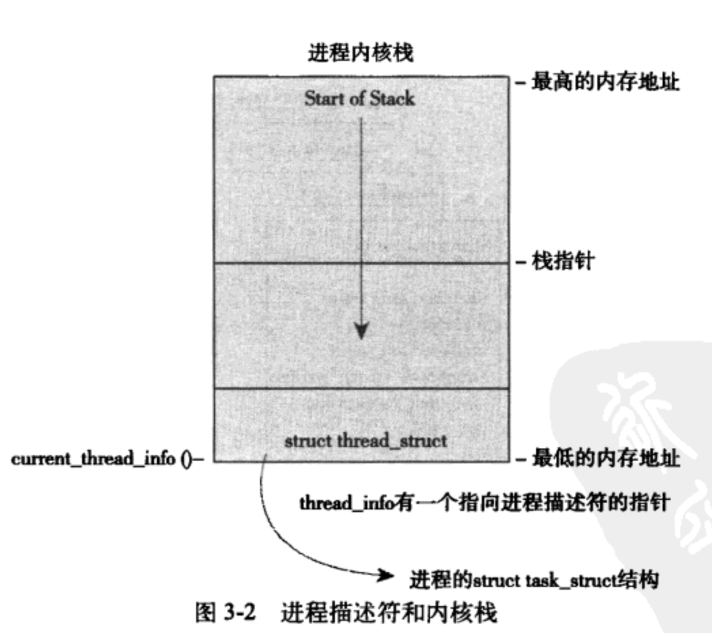
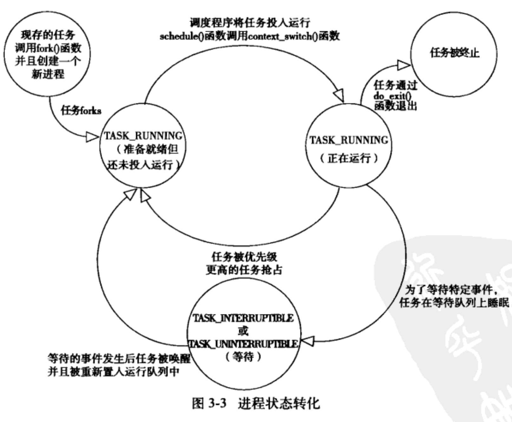

内核 2.6.34

- [进程](#进程)
  - [进程描述符及任务结构](#进程描述符及任务结构)
    - [分配进程描述符](#分配进程描述符)
      - [获得链表中的下一个进程或任意进程](#获得链表中的下一个进程或任意进程)
    - [进程状态转化](#进程状态转化)
    - [进程上下文](#进程上下文)
    - [进程创建](#进程创建)
    - 


进程是 Unix 操作系统抽象概念中最基本的一种.

操作系统就是为了运行用户程序，因此，进程管理就是所有操作系统的心脏所在.

==**通过 `current` 宏可以查找当前正在运行进程的进程描述符**==


# 进程

进程就是处于执行期的程序（目标码存放在某种存储介质上）。

- 线程（thread )   , 是在进程中活动的对象
  - 每个线程都拥有
    - 一个独立的程序计数器
    - 进程栈
    - 一组进程寄存器
- 内核调度的对象是线程，而不是进程。
- Linux 系统的线程实现非常特别：它对线程和进程并不特别区分。对 Linux 而言，线程只不过是一种特殊的进程罢了。


1. 进程提供两种虚拟机制：
   1. **虚拟处理器**
   2. **虚拟内存**
2. 虽然实际上可能是许多进程在分享一个处理器, 但虚拟处理器给进程一种假象, 让这些进程觉得自己在独享处理器

**程序本身并不是进程，进程是处于执行期的程序以及相关的资源的总称。**

**进程在创建它的时刻开始存活**

- **所有进程都是 PID为1  init 进程的后代**

  - ==**内核在启动的最后阶段启动init进程**==

    - 并读取系统的初始化脚本( initscript ), 完成系统的启动

    - init 的进程描述符是作为 `init_task`  静态分配的

      - ```c
        struct  task_struct *task; 
        for(task = current; task != init_task; task = task->parent)
          ;
        // 退出循环后,  task 就指向 init 的进程描述符
        // current 是当前进程描述符的指针
        // parent 是当前进程的父进程描述符指针
        ```

      - 


> ==**进程上下文是一种内核所处的操作模式, 此时内核代表进程执行, 还可以通过 `current`宏关联当前进程. 而且进程是以进程上下文的形式连接到内核中的, 因此进程上下文可以睡眠,也可以调用调度程序.**==
>
> **内核栈的大小是两页, 在32位体系结构上是8KB, 64位体系结构上是 16BK**
>
> **每个进程都需要一个 两页 连续且不可换出的内核内存, 一页大小是4或8KB**


## 进程描述符及任务结构

==**内核把进程的列表存放在叫做任务队列（task list）的双向循环链表中。**==

链表中的每一项都是类型为 task struct、称为进程描述符（process descriptor）的结构，该结构定义在内核  `< /include/linux/sched.h >`  文件中。

==**进程描述符  `struct task_struct`  中包含一个具体进程的所有信息。**==

- 进程描述符中包含的数据能完整地描述一个正在执行的程序：

  - 它打开的文件，
  - 进程的地址空间，
  - 挂起的信号，
  - 进程的状态，
  - 还有其他更多信息

  

```c
struct task_struct {
	volatile long state;	/* -1 unrunnable, 0 runnable, >0 stopped */
/*  state 描述了当前进程的状态, 每个进程必处于五种状态之一: 
  TASK_RUNING  可运行或正在运行,或在运行队列中等待执行,是在用户空间中执行的唯一可能的状态(内核也是如此)
  TASK_INTERRUPTIBLE 可中断 ,进程正在睡眠(阻塞), 等待条件唤醒(或被信号提前), 并设置为可运行
  TASK_UNINTERRUPTIBLE 不可中断,对信号不做任何响应(包括KILL), 必须等待一个相应的事件
  TASK_TRACED  被其他进程跟踪的进程, 例如通过 ptrace (或 strace) 对调试器进行跟踪
  TASK_STOPPED 进程停止执行, 进程没有投入运行也不能投入运行 (例如收到信号时)
  
  // 下面有图
 内核经常需要调整某个进程的状态, 这个时候会使用下面的函数, 并做内核屏障强制其他处理器重新排序
     set_task_state(task,state);  等价于 set_current_state(state)
    在 linux/scked.h 中有实现  
*/

	void *stack;    // 指向内核栈
	atomic_t usage;
	unsigned int flags;	/* per process flags, defined below */
	unsigned int ptrace;

	int lock_depth;		/* BKL lock depth */

#ifdef CONFIG_SMP
#ifdef __ARCH_WANT_UNLOCKED_CTXSW
	int oncpu;
#endif
#endif

	int prio,      // nice() 函数调用 内核set_user_nice()函数来设置这个值, 是进程静态优先级(nice值)
      static_prio, 
      normal_prio;
	unsigned int rt_priority;  // 实时优先级, sched_setscheduler() 可修改 get 则获取
	const struct sched_class *sched_class;
	struct sched_entity se;
	struct sched_rt_entity rt;

#ifdef CONFIG_PREEMPT_NOTIFIERS
	/* list of struct preempt_notifier: */
	struct hlist_head preempt_notifiers;
#endif

	/*
	 * fpu_counter contains the number of consecutive context switches
	 * that the FPU is used. If this is over a threshold, the lazy fpu
	 * saving becomes unlazy to save the trap. This is an unsigned char
	 * so that after 256 times the counter wraps and the behavior turns
	 * lazy again; this to deal with bursty apps that only use FPU for
	 * a short time
	 */
	unsigned char fpu_counter;
#ifdef CONFIG_BLK_DEV_IO_TRACE
	unsigned int btrace_seq;
#endif

	unsigned int policy;  // 调度策略, sched_setscheduler() 可修改 get 则获取

  cpumask_t cpus_allowed;   // 指定当前进程可运行在哪个处理器上, 掩码位标志, 每一位都对应一个系统可用的处理器,默认 全设置1.  ,  会被子进程继承

#ifdef CONFIG_TREE_PREEMPT_RCU
	int rcu_read_lock_nesting;
	char rcu_read_unlock_special;
	struct rcu_node *rcu_blocked_node;
	struct list_head rcu_node_entry;
#endif /* #ifdef CONFIG_TREE_PREEMPT_RCU */

#if defined(CONFIG_SCHEDSTATS) || defined(CONFIG_TASK_DELAY_ACCT)
	struct sched_info sched_info;
#endif

	struct list_head tasks;
	struct plist_node pushable_tasks;

	struct mm_struct *mm, *active_mm;
#if defined(SPLIT_RSS_COUNTING)
	struct task_rss_stat	rss_stat;
#endif
/* task state */
	int exit_state;
	int exit_code, exit_signal;
	int pdeath_signal;  /*  The signal sent when the parent dies  */
	/* ??? */
	unsigned int personality;
	unsigned did_exec:1;
	unsigned in_execve:1;	/* Tell the LSMs that the process is doing an
				 * execve */
	unsigned in_iowait:1;


	/* Revert to default priority/policy when forking */
	unsigned sched_reset_on_fork:1;

	pid_t pid;
	pid_t tgid;

#ifdef CONFIG_CC_STACKPROTECTOR
	/* Canary value for the -fstack-protector gcc feature */
	unsigned long stack_canary;
#endif

	/* 
分别指向（原始）父进程，最小的孩子，弟弟妹妹，哥哥姐姐. (p->father 可以替换为 p->real_parent->pid)
 parebt 指向父进程, 可通过 下面的代码获得父进程描述符. 如果是 init_task的话, 需要循环获获取
      struct task_struct *my_parent = current->parent; 
 
 可以按照下面的方式来依次访问子进程:
  struct task_struct *task;  struct list_head *list;
  list_for_each(list, &current->children){  
			  task = list_entry(list, struct task_struct, sibling); // task执行当前某个子进程
   }
 
	 */
	struct task_struct *real_parent; /* real parent process */
	struct task_struct *parent; /* recipient of SIGCHLD, wait4() reports */
	/*
	 * children/sibling forms the list of my natural children
	 */
	struct list_head children;	/* list of my children */
	struct list_head sibling;	/* linkage in my parent's children list */
	struct task_struct *group_leader;	/* threadgroup leader */

	/*
	 * ptraced is the list of tasks this task is using ptrace on.
	 * This includes both natural children and PTRACE_ATTACH targets.
	 * p->ptrace_entry is p's link on the p->parent->ptraced list.
	 */
	struct list_head ptraced;
	struct list_head ptrace_entry;

	/*
	 * This is the tracer handle for the ptrace BTS extension.
	 * This field actually belongs to the ptracer task.
	 */
	struct bts_context *bts;

	/* PID/PID hash table linkage. */
	struct pid_link pids[PIDTYPE_MAX];
	struct list_head thread_group;

	struct completion *vfork_done;		/* for vfork() */
	int __user *set_child_tid;		/* CLONE_CHILD_SETTID */
	int __user *clear_child_tid;		/* CLONE_CHILD_CLEARTID */

	cputime_t utime, stime, utimescaled, stimescaled;
	cputime_t gtime;
#ifndef CONFIG_VIRT_CPU_ACCOUNTING
	cputime_t prev_utime, prev_stime;
#endif
	unsigned long nvcsw, nivcsw; /* context switch counts */
	struct timespec start_time; 		/* monotonic time */
	struct timespec real_start_time;	/* boot based time */
/* mm fault and swap info: this can arguably be seen as either mm-specific or thread-specific */
	unsigned long min_flt, maj_flt;

	struct task_cputime cputime_expires;
	struct list_head cpu_timers[3];

/* process credentials */
	const struct cred *real_cred;	/* objective and real subjective task
					 * credentials (COW) */
	const struct cred *cred;	/* effective (overridable) subjective task
					 * credentials (COW) */
	struct mutex cred_guard_mutex;	/* guard against foreign influences on
					 * credential calculations
					 * (notably. ptrace) */
	struct cred *replacement_session_keyring; /* for KEYCTL_SESSION_TO_PARENT */

	char comm[TASK_COMM_LEN]; /* executable name excluding path
				     - access with [gs]et_task_comm (which lock
				       it with task_lock())
				     - initialized normally by setup_new_exec */
/* file system info */
	int link_count, total_link_count;
#ifdef CONFIG_SYSVIPC
/* ipc stuff */
	struct sysv_sem sysvsem;
#endif
#ifdef CONFIG_DETECT_HUNG_TASK
/* hung task detection */
	unsigned long last_switch_count;
#endif
/* CPU-specific state of this task */
	struct thread_struct thread;
/* filesystem information */
	struct fs_struct *fs;
/* open file information */
	struct files_struct *files;
/* namespaces */
	struct nsproxy *nsproxy;
/* signal handlers */
	struct signal_struct *signal;
	struct sighand_struct *sighand;

	sigset_t blocked, real_blocked;
	sigset_t saved_sigmask;	/* restored if set_restore_sigmask() was used */
	struct sigpending pending;

	unsigned long sas_ss_sp;
	size_t sas_ss_size;
	int (*notifier)(void *priv);
	void *notifier_data;
	sigset_t *notifier_mask;
	struct audit_context *audit_context;
#ifdef CONFIG_AUDITSYSCALL
	uid_t loginuid;
	unsigned int sessionid;
#endif
	seccomp_t seccomp;

/* Thread group tracking */
   	u32 parent_exec_id;
   	u32 self_exec_id;
/* Protection of (de-)allocation: mm, files, fs, tty, keyrings, mems_allowed,
 * mempolicy */
	spinlock_t alloc_lock;

#ifdef CONFIG_GENERIC_HARDIRQS
	/* IRQ handler threads */
	struct irqaction *irqaction;
#endif

	/* Protection of the PI data structures: */
	raw_spinlock_t pi_lock;

#ifdef CONFIG_RT_MUTEXES
	/* PI waiters blocked on a rt_mutex held by this task */
	struct plist_head pi_waiters;
	/* Deadlock detection and priority inheritance handling */
	struct rt_mutex_waiter *pi_blocked_on;
#endif

#ifdef CONFIG_DEBUG_MUTEXES
	/* mutex deadlock detection */
	struct mutex_waiter *blocked_on;
#endif
#ifdef CONFIG_TRACE_IRQFLAGS
	unsigned int irq_events;
	unsigned long hardirq_enable_ip;
	unsigned long hardirq_disable_ip;
	unsigned int hardirq_enable_event;
	unsigned int hardirq_disable_event;
	int hardirqs_enabled;
	int hardirq_context;
	unsigned long softirq_disable_ip;
	unsigned long softirq_enable_ip;
	unsigned int softirq_disable_event;
	unsigned int softirq_enable_event;
	int softirqs_enabled;
	int softirq_context;
#endif
#ifdef CONFIG_LOCKDEP
# define MAX_LOCK_DEPTH 48UL
	u64 curr_chain_key;
	int lockdep_depth;
	unsigned int lockdep_recursion;
	struct held_lock held_locks[MAX_LOCK_DEPTH];
	gfp_t lockdep_reclaim_gfp;
#endif

/* journalling filesystem info */
	void *journal_info;

/* stacked block device info */
	struct bio_list *bio_list;

/* VM state */
	struct reclaim_state *reclaim_state;

	struct backing_dev_info *backing_dev_info;

	struct io_context *io_context;

	unsigned long ptrace_message;
	siginfo_t *last_siginfo; /* For ptrace use.  */
	struct task_io_accounting ioac;
#if defined(CONFIG_TASK_XACCT)
	u64 acct_rss_mem1;	/* accumulated rss usage */
	u64 acct_vm_mem1;	/* accumulated virtual memory usage */
	cputime_t acct_timexpd;	/* stime + utime since last update */
#endif
#ifdef CONFIG_CPUSETS
	nodemask_t mems_allowed;	/* Protected by alloc_lock */
	int cpuset_mem_spread_rotor;
#endif
#ifdef CONFIG_CGROUPS
	/* Control Group info protected by css_set_lock */
	struct css_set *cgroups;
	/* cg_list protected by css_set_lock and tsk->alloc_lock */
	struct list_head cg_list;
#endif
#ifdef CONFIG_FUTEX
	struct robust_list_head __user *robust_list;
#ifdef CONFIG_COMPAT
	struct compat_robust_list_head __user *compat_robust_list;
#endif
	struct list_head pi_state_list;
	struct futex_pi_state *pi_state_cache;
#endif
#ifdef CONFIG_PERF_EVENTS
	struct perf_event_context *perf_event_ctxp;
	struct mutex perf_event_mutex;
	struct list_head perf_event_list;
#endif
#ifdef CONFIG_NUMA
	struct mempolicy *mempolicy;	/* Protected by alloc_lock */
	short il_next;
#endif
	atomic_t fs_excl;	/* holding fs exclusive resources */
	struct rcu_head rcu;

	/*
	 * cache last used pipe for splice
	 */
	struct pipe_inode_info *splice_pipe;
#ifdef	CONFIG_TASK_DELAY_ACCT
	struct task_delay_info *delays;
#endif
#ifdef CONFIG_FAULT_INJECTION
	int make_it_fail;
#endif
	struct prop_local_single dirties;
#ifdef CONFIG_LATENCYTOP
	int latency_record_count;
	struct latency_record latency_record[LT_SAVECOUNT];
#endif
	/*
	 * time slack values; these are used to round up poll() and
	 * select() etc timeout values. These are in nanoseconds.
	 */
	unsigned long timer_slack_ns;
	unsigned long default_timer_slack_ns;

	struct list_head	*scm_work_list;
#ifdef CONFIG_FUNCTION_GRAPH_TRACER
	/* Index of current stored address in ret_stack */
	int curr_ret_stack;
	/* Stack of return addresses for return function tracing */
	struct ftrace_ret_stack	*ret_stack;
	/* time stamp for last schedule */
	unsigned long long ftrace_timestamp;
	/*
	 * Number of functions that haven't been traced
	 * because of depth overrun.
	 */
	atomic_t trace_overrun;
	/* Pause for the tracing */
	atomic_t tracing_graph_pause;
#endif
#ifdef CONFIG_TRACING
	/* state flags for use by tracers */
	unsigned long trace;
	/* bitmask of trace recursion */
	unsigned long trace_recursion;
#endif /* CONFIG_TRACING */
#ifdef CONFIG_CGROUP_MEM_RES_CTLR /* memcg uses this to do batch job */
	struct memcg_batch_info {
		int do_batch;	/* incremented when batch uncharge started */
		struct mem_cgroup *memcg; /* target memcg of uncharge */
		unsigned long bytes; 		/* uncharged usage */
		unsigned long memsw_bytes; /* uncharged mem+swap usage */
	} memcg_batch;
#endif
};
```


#### 获得链表中的下一个进程或任意进程

```c
// 因为 任务队列本来就是一个双向的循环链表

  // 获取下一个进程
list_entry( task->tasks.next, struct task_struct , tasks);
 
 // 获取前一个进程
list_entry( task->tasks.prev, struct task_struct, tasks);

 // 访问整个任务队列的能力
struct task_struct *task;
for_each_process(task){
  // 打印每一个人物的名称和PID
  printk("%s[%d]\n", task->comm, task->pid);
}

//前面两个是通过下面的宏来实现的
next_task(task) ;   prev_task(task);
```


### 分配进程描述符

Linux 通过 slab 分配器 (小内存管理机制) 分配 task struct 结构，这样能达到对象复用和缓存着色（cache  coloring)的目的

在 2.6 以前的内核中，各个进程的 task struct 存放在它们内核栈的尾端。这样做是为了让那些像 x86 那样寄存器较少的硬件体系结构只要通过栈指针就能计算出它的位置，而避免使用额外的寄存器专门记录。由于现在用 slab 分配器动态生成 task  struct，所以只需在栈底（对于向下增长的栈来说）或栈顶（对于向上增长的来说）创建一个新的结构 `struct thread info`



在 x86 上，`struct thread info` 在文件 `< /arch/x86/include/asm/thread_info.h >`中定义如下：

```c
// 每个任务的 thread info 结构在它的内核栈的尾端分配。结构中 task 域中存放的是指向该任务实际 task struct 的指针。
//  进程控制块

struct thread_info {
	struct task_struct	*task;		/* main task structure */
	struct exec_domain	*exec_domain;	/* execution domain */
	__u32			flags;		/* low level flags */
	__u32			status;		/* thread synchronous flags */
	__u32			cpu;		/* current CPU */
	int			preempt_count;	/* 0 => preemptable,
						   <0 => BUG */
	mm_segment_t		addr_limit;
	struct restart_block    restart_block;
	void __user		*sysenter_return;
#ifdef CONFIG_X86_32
	unsigned long           previous_esp;   /* ESP of the previous stack in
						   case of nested (IRQ) stacks
						*/
	__u8			supervisor_stack[0];
#endif
	int			uaccess_err;
};
```


- **内核通过一个唯一的进程标识值或PID来标识每个进程**
  - **pid最大默认值是32768, 这个很重要,但是可以通过 `/proc/sys/kernel/pid_max` 来提高上限**
    - 越小转一圈就越快
- 访问任务通常需要获得指向 `task_struct` 的指针, 而且内核的大部分处理进程的代码都是直接通过 `task_struct` 该结构来进行的
  - ==**通过 `current` 宏可以查找当前正在运行进程的进程描述符**==


### 进程状态转化




### 进程上下文

**可执行程序代码是进程的重要组成部分**

**在用户空间内的进程 调用系统调用或触发一场, 它就会陷入内核空间, 这个时候 内核 就代表进程执行, 并处于  进程上下文中.  退出时程序恢复在用户空间继续执行**

**系统调用和异常处理程序是对内核明确定义的接口, 进程调用后可以陷入内核.**


## 进程创建

- unix通过两个单独的函数去执行进程创建   `fork()  和 exec函数族`
  - fork   实际是通过 `clone()`  实现的
    - 拷贝当前创建一个子进程,  父子进程的区别仅仅是PID不同和 PPID不同 以及某些资源的统计量(挂起的信号, 他没有必要继承)
    - **fork 使用写时拷贝页实现, 可以推迟或者免除拷贝数据的技术,  让子父进程共享同一个拷贝,  只有在写入的时候 数据才会被复制**
    - **fork 的实际开销就是复制父进程的也表以及给子进程创建唯一的进程描述符**
  - exec
    - 负责读取可执行文件并将其载入地址空间开始运行

> - **fork  的详细描述**
>   - Linux是通过 `clone()` 系统调用实现的
>     - 这个系统调用是通过一系列的参数标识标识来指明父子进程需要共享的资源,  `fork(), vfork(), __clone()` 库函数都根据各自需要的参数标标志去调用 `clone()` , 然后由 `clone()` 去调用 `do_fork()`
>       - **`do_fork()`完成了创建中的大部分工作，它的定义在 `kernel/fork.c` 文件中。该函数调用 `copy_processp()` 函数，然后让进程开始运行。**
>         - **`copy_processp()` 函数完成的工作很有意思:**
>           - 1) 调用 `dup_task_struc()` 为新进程创建一个内核栈、thread_info 结构和 task_struct，这些值与当前进程的值相同。此时，子进程和父进程的描述符是完全相同的。
>             2) 检査并确保新创建这个子进程后，当前用户所拥有的进程数目没有超出给它分配的资源的限制。
>             3) 子进程着手使自己与父进程区别开来。进程描述符内的许多成员都要被清 0 或设为初始值。那些不是继承而来的进程描述符成员，主要是统计信息。task struct 中的大多数  数据都依然未被修改
>             4) 子进程的状态被设置为 TASK_UNINTERRUPTIBLE，以保证它不会投入运行。
>             5) copy_processo 调用 copy_flags（以更新 task_struct 的 fags 成员。表明进程是否拥有超级用户权限的 PF_SUPERPRIV 标志被清 0。表明进程还没有调用 exec() 函数的 PF_FORKNOEXEC 标志被设置。
>             6) 调用 alloc_pid() 为新进程分配一个有效的 PID。
>             7) 根据传递给 clone() 的参数标志，copy_processo 拷贝或共享打开的文件、文件系统信息、信号处理函数、进程地址空间和命名空间等。在一般情况下，这些资源会被给定进程的所有线程共享；否则，这些资源对每个进程是不同的，因此被拷贝到这里。
>             8) 最后，copy processo 做扫尾工作并返回一个指向子进程的指针。
>         - 再回到 do_forko 函数，如果 copy_processo 函数成功返回，新创建的子进程被唤醒并让其投入运行。内核有意选择子进程首先执行。因为一般子进程都会马上调用 exec0 函数，这样可以避免写时拷贝的额外开销，如果父进程首先执行的话，有可能会开始向地址空间写入。
>
> ```c
> // 调用结构如下:
> fork(){
>   clone(){
>     do_fork(){
>       copy_processp()
>     }
>   }
> }
> ```
>
> 


