[4.0内核实验源码](https://github.com/figozhang/runninglinuxkernel_4.0)

- [qemu+gdb调试内核](#qemu+gdb调试内核)
- 


**先下载源码之后进入到目录之中**

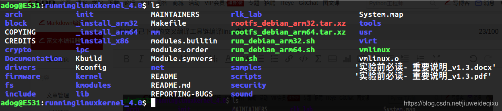


**编译之前的准备工作：安装一些软件**

```bash
sudo apt-get install qemu libncurses5-dev gcc-arm-linux-gnueabi build-essential gdb-arm-none-eabi gcc-aarch64-linux-gnu
```


**然后配置编译选项**

```bash
PATH=${PATH}:/home/ben/gcc-linaro-4.9-2016.02-x86_64_armeb-eabi/bin
export BASEINCLUDE=/home/ben/runninglinuxkernel_4.0
#export CROSS_COMPILE=arm-none-eabi-
export CROSS_COMPILE=armeb-eabi-
export ARCH=arm

#arm-none-eabi-的意思是-后面可以匹配上的所有的命令,如arm-node-eabi-gcc、arm-none-eabi-g++等等
```


**指定一个arm的开发板,vexpress**

```bash
adog@E531:runninglinuxkernel_4.0$  make vexpress_defconfig
```


**然后创建设备结点。最小的文件系统，运行起来需要创建一个设备结点：（之前已经创建好了，这里只是演示）**

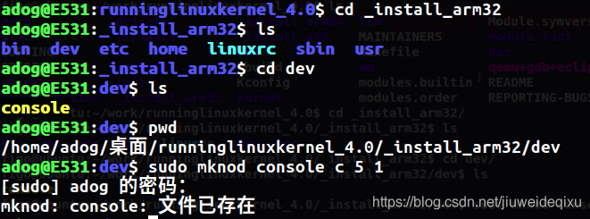


**使用 `make menuconfig` 命令查看内核的配置菜单，这里只进行查看，不进行更改**

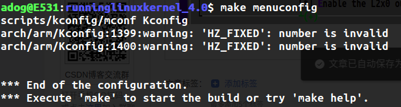

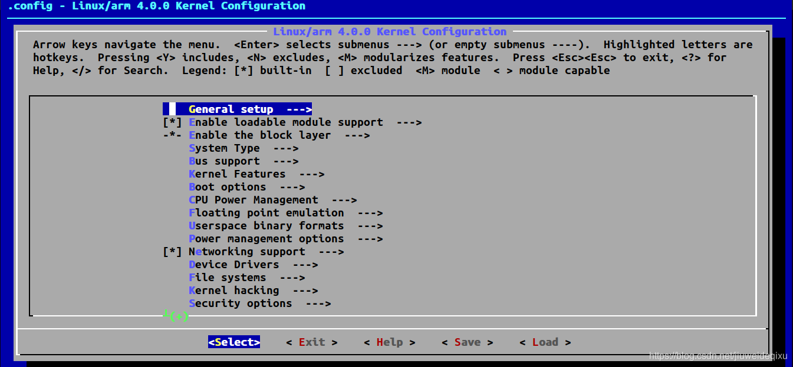

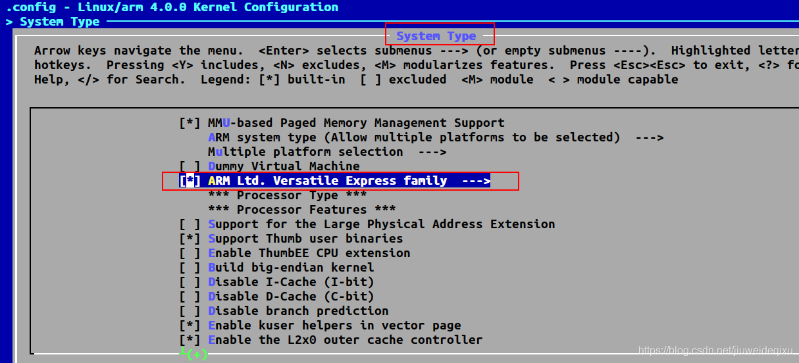


**接下来进行编译，使用命令`make bzImage -j4` 对内核进行编译  //4代表的是编译的时候使用4个cpu核心**

但是报错如下：

```bash
adog@E531:runninglinuxkernel_4.0$ make bzImage -j4
  CHK     include/config/kernel.release
  CHK     include/generated/uapi/linux/version.h
  CHK     include/generated/utsrelease.h
  CC      scripts/mod/devicetable-offsets.s
In file included from include/linux/compiler.h:54:0,
                 from include/uapi/linux/stddef.h:1,
                 from include/linux/stddef.h:4,
                 from ./include/uapi/linux/posix_types.h:4,
                 from include/uapi/linux/types.h:13,
                 from include/linux/types.h:5,
                 from include/linux/mod_devicetable.h:11,
                 from scripts/mod/devicetable-offsets.c:2:
include/linux/compiler-gcc.h:107:30: fatal error: linux/compiler-gcc6.h: No such file or directory
#include gcc_header(__GNUC__)
```


经过在网上查找 [信息](https://blog.csdn.net/baicaiaichibaicai/article/details/60330484) 得知，是因为使用的交叉编译的工具不合适，可能是版本太高了，所以换一个版本低一些的  [交叉编译的工具](https://releases.linaro.org/components/toolchain/binaries/4.9-2016.02/armeb-eabi/)  。交叉编译指的是在一个平台上编译出能够运行在另外一个平台上的程序。如在linux平台上编译出在windows平台上运行的程序。

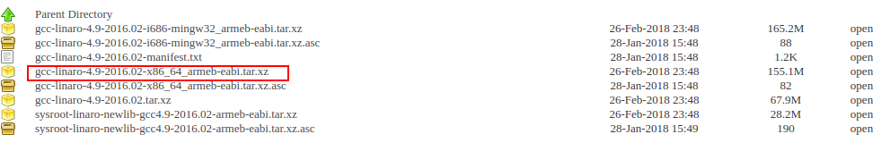

tar.xz格式的压缩包的解压缩需要两个步骤：第一步获取*.tar文件，第二步解压*.tar文件

第一步：xz -d *.tar.xz    命令实现将*.tar.xz 格式的文件解压为 *.tar格式的文件

第二步：tar -xvf *.tar    命令实现对*.tar格式的文件进行解压

然后可以进入到bin目录：

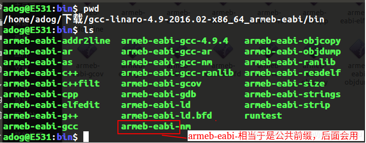

然后为刚刚下载的交叉编译工具链配置环境变量，之所以叫做工具链，说明会用到很多工具，如上图，**用红色矩形框围起来的是这些工具的公共前缀**。这是使用的前提条件。

编辑家目录的隐藏文件 .bashrc 在文件的底部添加两行信息：

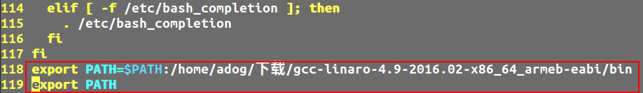


然后 `source ~/.bashrc` 即可

既然新的交叉编译工具链设置好了，那么还需要在编译选项中重新指明使用的交叉编译工具链：

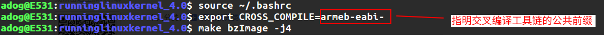


**然后，就进入编译阶段**  `adog@E531:runninglinuxkernel_4.0$ make bzImage -j4`

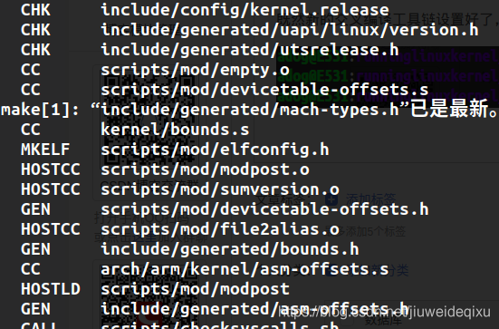

**几分钟之后，编译完成：**

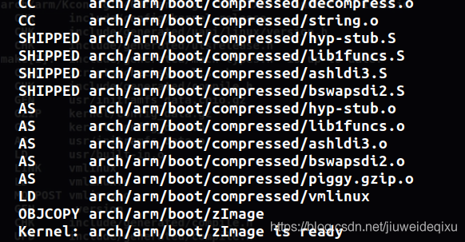

如上图，生成了一个内核的Image，即zImage

**启动的话，还需要一个dtb文件，现在生成它：**

```bash
adog@E531:runninglinuxkernel_4.0$ make dtbs
  CHK     include/config/kernel.release
  CHK     include/generated/uapi/linux/version.h
  CHK     include/generated/utsrelease.h
make[1]: “include/generated/mach-types.h”已是最新。
  CALL    scripts/checksyscalls.sh
  DTC     arch/arm/boot/dts/vexpress-v2p-ca5s.dtb
  DTC     arch/arm/boot/dts/vexpress-v2p-ca9.dtb
  DTC     arch/arm/boot/dts/vexpress-v2p-ca15-tc1.dtb
  DTC     arch/arm/boot/dts/vexpress-v2p-ca15_a7.dtb
adog@E531:runninglinuxkernel_4.0$
```

然后，使用命令启动内核：

```bash
adog@E531:runninglinuxkernel_4.0$ qemu-system-arm -nographic -M vexpress-a9 -m 1024M \
   -kernel arch/arm/boot/zImage -append "rdinit=/linuxrc console=ttyAMA0 loglevel=8" \ 
   -dtb arch/arm/boot/dts/vexpress-v2p-ca9.dtb

#qemu-system-arm   :arm 命令
# -nographic  : 无需Qemu默认的启动图形界面
# -M vexpress-a9  选择机器类型
# -m 1024M   分配1024M内存 给Qemu 虚拟机
# -kernel arch/arm/boot/zImage  要启动的虚拟机的内核镜像
# -append 表示后面是要传给虚拟机内核的参数
   # rdinit=/linuxrc     初始化
   # console=ttyAMA0 
   # loglevel=8  
   # init=/linuxrc rw  告诉内核去哪里找第一个init进程的可执行二进制文件 并设置为可读写文件系统
# -dtb arch/arm/boot/dts/vexpress-v2p-ca9.dtb  设备树, 在系统启动过程中，由bootloader将dtb文件加载到内存，并告知linux内核dtb在内存中的首地址（中途可能会对某些节点进行创建或者修改）。内核在start_kernel中会对dtb文件进行解析，并形成对应的device_node和property结构体；至此，dtb文件便完成任务了。
# -serial file:output.txt   是设置日志输出的位置
```


**可以看到打印出来的启动信息：**

```bash
pulseaudio: set_sink_input_volume() failed
pulseaudio: Reason: Invalid argument
pulseaudio: set_sink_input_mute() failed
pulseaudio: Reason: Invalid argument
[    0.000000] Booting Linux on physical CPU 0x0
[    0.000000] Initializing cgroup subsys cpuset
[    0.000000] Linux version 4.0.0+ (adog@E531) (gcc version 4.9.4 20151028 (prerelease) (Linaro GCC 4.9-2016.02) ) #1 SMP Tue Jul 9 21:36:15 CST 2019
[    0.000000] CPU: ARMv7 Processor [410fc090] revision 0 (ARMv7), cr=10c5387d
[    0.000000] CPU: PIPT / VIPT nonaliasing data cache, VIPT nonaliasing instruction cache
[    0.000000] Machine model: V2P-CA9
[    0.000000] Memory policy: Data cache writeback
[    0.000000] On node 0 totalpages: 262144
[    0.000000] free_area_init_node: node 0, pgdat c10e9f40, node_mem_map eeffa000
[    0.000000]   Normal zone: 1520 pages used for memmap
[    0.000000]   Normal zone: 0 pages reserved
[    0.000000]   Normal zone: 194560 pages, LIFO batch:31
[    0.000000]   HighMem zone: 67584 pages, LIFO batch:15
[    0.000000] CPU: All CPU(s) started in SVC mode.
[    0.000000] PERCPU: Embedded 11 pages/cpu @eefbd000 s16064 r8192 d20800 u45056
[    0.000000] pcpu-alloc: s16064 r8192 d20800 u45056 alloc=11*4096
[    0.000000] pcpu-alloc: [0] 0 [0] 1 [0] 2 [0] 3 
[    0.000000] Built 1 zonelists in Zone order, mobility grouping on.  Total pages: 260624
[    0.000000] Kernel command line: rdinit=/linuxrc console=ttyAMA0 loglevel=8
[    0.000000] log_buf_len individual max cpu contribution: 4096 bytes
[    0.000000] log_buf_len total cpu_extra contributions: 12288 bytes
[    0.000000] log_buf_len min size: 16384 bytes
[    0.000000] log_buf_len: 32768 bytes
[    0.000000] early log buf free: 14884(90%)
[    0.000000] PID hash table entries: 4096 (order: 2, 16384 bytes)
[    0.000000] Dentry cache hash table entries: 131072 (order: 7, 524288 bytes)
[    0.000000] Inode-cache hash table entries: 65536 (order: 6, 262144 bytes)
[    0.000000] Memory: 1021736K/1048576K available (11532K kernel code, 237K rwdata, 1820K rodata, 3716K init, 189K bss, 26840K reserved, 0K cma-reserved, 270336K highmem)
[    0.000000] Virtual kernel memory layout:
[    0.000000]     vector  : 0xffff0000 - 0xffff1000   (   4 kB)
[    0.000000]     fixmap  : 0xffc00000 - 0xfff00000   (3072 kB)
[    0.000000]     vmalloc : 0xf0000000 - 0xff000000   ( 240 MB)
[    0.000000]     lowmem  : 0xc0000000 - 0xef800000   ( 760 MB)
[    0.000000]     pkmap   : 0xbfe00000 - 0xc0000000   (   2 MB)
[    0.000000]     modules : 0xbf000000 - 0xbfe00000   (  14 MB)
[    0.000000]       .text : 0xc0008000 - 0xc0d124a4   (13354 kB)
[    0.000000]       .init : 0xc0d13000 - 0xc10b4000   (3716 kB)
[    0.000000]       .data : 0xc10b4000 - 0xc10ef708   ( 238 kB)
[    0.000000]        .bss : 0xc10ef708 - 0xc111edd0   ( 190 kB)
[    0.000000] SLUB: HWalign=64, Order=0-3, MinObjects=0, CPUs=4, Nodes=1
[    0.000000] Hierarchical RCU implementation.
[    0.000000] 	Additional per-CPU info printed with stalls.
[    0.000000] 	RCU restricting CPUs from NR_CPUS=8 to nr_cpu_ids=4.
[    0.000000] RCU: Adjusting geometry for rcu_fanout_leaf=16, nr_cpu_ids=4
[    0.000000] NR_IRQS:16 nr_irqs:16 16
[    0.000000] GIC CPU mask not found - kernel will fail to boot.
[    0.000000] GIC CPU mask not found - kernel will fail to boot.
[    0.000000] L2C: platform modifies aux control register: 0x02020000 -> 0x02420000
[    0.000000] L2C: device tree omits to specify unified cache
[    0.000000] L2C: DT/platform modifies aux control register: 0x02020000 -> 0x02420000
[    0.000000] L2C-310 enabling early BRESP for Cortex-A9
[    0.000000] L2C-310 full line of zeros enabled for Cortex-A9
[    0.000000] L2C-310 dynamic clock gating disabled, standby mode disabled
[    0.000000] L2C-310 cache controller enabled, 8 ways, 128 kB
[    0.000000] L2C-310: CACHE_ID 0x410000c8, AUX_CTRL 0x46420001
[    0.000409] sched_clock: 32 bits at 24MHz, resolution 41ns, wraps every 178956969942ns
[    0.020233] Console: colour dummy device 80x30
[    0.020638] kmemleak: Kernel memory leak detector disabled
[    0.028339] Calibrating delay loop... 634.88 BogoMIPS (lpj=3174400)
[    0.201170] pid_max: default: 32768 minimum: 301
[    0.205782] Mount-cache hash table entries: 2048 (order: 1, 8192 bytes)
[    0.205869] Mountpoint-cache hash table entries: 2048 (order: 1, 8192 bytes)
[    0.245960] CPU: Testing write buffer coherency: ok
[    0.265272] CPU0: thread -1, cpu 0, socket 0, mpidr 80000000
[    0.267389] Setting up static identity map for 0x60b14670 - 0x60b146c8
[    0.324067] Brought up 1 CPUs
[    0.324273] SMP: Total of 1 processors activated (634.88 BogoMIPS).
[    0.324396] CPU: All CPU(s) started in SVC mode.
[    0.347924] devtmpfs: initialized
[    0.382248] VFP support v0.3: implementor 41 architecture 3 part 30 variant 9 rev 0
[    0.823790] NET: Registered protocol family 16
[    0.832101] DMA: preallocated 256 KiB pool for atomic coherent allocations
[    1.097835] cpuidle: using governor ladder
[    1.098317] cpuidle: using governor menu
[    1.132327] of_amba_device_create(): amba_device_add() failed (-19) for /memory-controller@100e0000
[    1.134206] of_amba_device_create(): amba_device_add() failed (-19) for /memory-controller@100e1000
[    1.135592] of_amba_device_create(): amba_device_add() failed (-19) for /watchdog@100e5000
[    1.204276] of_amba_device_create(): amba_device_add() failed (-19) for /smb/motherboard/iofpga@7,00000000/sysctl@01000
[    1.256169] of_amba_device_create(): amba_device_add() failed (-19) for /smb/motherboard/iofpga@7,00000000/wdt@0f000
[    1.312954] No ATAGs?
[    1.313307] hw-breakpoint: debug architecture 0x4 unsupported.
[    1.313817] Serial: AMBA PL011 UART driver
[    1.320845] 10009000.uart: ttyAMA0 at MMIO 0x10009000 (irq = 38, base_baud = 0) is a PL011 rev1
[    1.356318] console [ttyAMA0] enabled
[    1.501407] 1000a000.uart: ttyAMA1 at MMIO 0x1000a000 (irq = 39, base_baud = 0) is a PL011 rev1
[    1.519958] 1000b000.uart: ttyAMA2 at MMIO 0x1000b000 (irq = 40, base_baud = 0) is a PL011 rev1
[    1.544359] 1000c000.uart: ttyAMA3 at MMIO 0x1000c000 (irq = 41, base_baud = 0) is a PL011 rev1
[    2.342889] SCSI subsystem initialized
[    2.364498] libata version 3.00 loaded.
[    2.383414] usbcore: registered new interface driver usbfs
[    2.387315] usbcore: registered new interface driver hub
[    2.390445] usbcore: registered new device driver usb
[    2.445015] Advanced Linux Sound Architecture Driver Initialized.
[    2.564834] Switched to clocksource arm,sp804
[    3.988045] NET: Registered protocol family 2
[    4.010157] TCP established hash table entries: 8192 (order: 3, 32768 bytes)
[    4.011197] TCP bind hash table entries: 8192 (order: 4, 65536 bytes)
[    4.012267] TCP: Hash tables configured (established 8192 bind 8192)
[    4.016130] TCP: reno registered
[    4.016673] UDP hash table entries: 512 (order: 2, 16384 bytes)
[    4.017425] UDP-Lite hash table entries: 512 (order: 2, 16384 bytes)
[    4.025188] NET: Registered protocol family 1
[    4.047403] RPC: Registered named UNIX socket transport module.
[    4.048028] RPC: Registered udp transport module.
[    4.048434] RPC: Registered tcp transport module.
[    4.049561] RPC: Registered tcp NFSv4.1 backchannel transport module.
[    5.443128] hw perfevents: enabled with armv7_cortex_a9 PMU driver, 1 counters available
[    5.500245] futex hash table entries: 1024 (order: 4, 65536 bytes)
[    7.580826] squashfs: version 4.0 (2009/01/31) Phillip Lougher
[    7.732179] jffs2: version 2.2. (NAND) © 2001-2006 Red Hat, Inc.
[    7.884616] 9p: Installing v9fs 9p2000 file system support
[    8.112376] bounce: pool size: 64 pages
[    8.113057] io scheduler noop registered (default)
[    8.125596] clcd-pl11x 10020000.clcd: PL111 rev2 at 0x10020000
[    8.140347] clcd-pl11x 10020000.clcd: /clcd@10020000 hardware, 1024x768@59 display
[    8.252218] Console: switching to colour frame buffer device 128x48
[    8.277084] clcd-pl11x 1001f000.clcd: PL111 rev2 at 0x1001f000
[    8.279516] clcd-pl11x 1001f000.clcd: /smb/motherboard/iofpga@7,00000000/clcd@1f000 hardware, 640x480@59 display
[    8.825319] 40000000.flash: Found 2 x16 devices at 0x0 in 32-bit bank. Manufacturer ID 0x000000 Chip ID 0x000000
[    8.827079] Intel/Sharp Extended Query Table at 0x0031
[    8.828428] Using buffer write method
[    8.829812] erase region 0: offset=0x0,size=0x40000,blocks=256
[    8.833742] 40000000.flash: Found 2 x16 devices at 0x0 in 32-bit bank. Manufacturer ID 0x000000 Chip ID 0x000000
[    8.834965] Intel/Sharp Extended Query Table at 0x0031
[    8.835929] Using buffer write method
[    8.836484] erase region 0: offset=0x0,size=0x40000,blocks=256
[    8.837082] Concatenating MTD devices:
[    8.837454] (0): "40000000.flash"
[    8.837725] (1): "40000000.flash"
[    8.837983] into device "40000000.flash"
[    9.112860] libphy: smsc911x-mdio: probed
[    9.190701] smsc911x 4e000000.ethernet eth0: attached PHY driver [Generic PHY] (mii_bus:phy_addr=4e000000.etherne:01, irq=-1)
[    9.196985] smsc911x 4e000000.ethernet eth0: MAC Address: 52:54:00:12:34:56
[    9.359781] isp1760 4f000000.usb: bus width: 32, oc: digital
[    9.363073] isp1760 4f000000.usb: NXP ISP1760 USB Host Controller
[    9.364284] isp1760 4f000000.usb: new USB bus registered, assigned bus number 1
[    9.366694] isp1760 4f000000.usb: Scratch test failed.
[    9.367443] isp1760 4f000000.usb: can't setup: -19
[    9.369329] isp1760 4f000000.usb: USB bus 1 deregistered
[    9.393403] usbcore: registered new interface driver usb-storage
[    9.443959] mousedev: PS/2 mouse device common for all mice
[    9.487885] rtc-pl031 10017000.rtc: rtc core: registered pl031 as rtc0
[    9.548449] Driver 'mmcblk' needs updating - please use bus_type methods
[    9.555282] mmci-pl18x 10005000.mmci: Got CD GPIO
[    9.556001] mmci-pl18x 10005000.mmci: Got WP GPIO
[    9.561071] mmci-pl18x 10005000.mmci: No vqmmc regulator found
[    9.566689] mmci-pl18x 10005000.mmci: mmc0: PL181 manf 41 rev0 at 0x10005000 irq 34,35 (pio)
[    9.596164] input: AT Raw Set 2 keyboard as /devices/platform/smb/smb:motherboard/smb:motherboard:iofpga@7,00000000/10006000.kmi/serio0/input/input0
[    9.714163] ledtrig-cpu: registered to indicate activity on CPUs
[    9.790647] usbcore: registered new interface driver usbhid
[    9.791123] usbhid: USB HID core driver
[   10.041422] aaci-pl041 10004000.aaci: ARM AC'97 Interface PL041 rev0 at 0x10004000, irq 33
[   10.042068] aaci-pl041 10004000.aaci: FIFO 512 entries
[   10.052109] oprofile: using arm/armv7-ca9
[   10.056818] TCP: cubic registered
[   10.057409] NET: Registered protocol family 17
[   10.060460] 9pnet: Installing 9P2000 support
[   10.064342] Registering SWP/SWPB emulation handler
[   10.174801] rtc-pl031 10017000.rtc: setting system clock to 2019-07-09 14:40:01 UTC (1562683201)
[   10.201050] ALSA device list:
[   10.201434]   #0: ARM AC'97 Interface PL041 rev0 at 0x10004000, irq 33
[   10.262758] Freeing unused kernel memory: 3716K (c0d13000 - c10b4000)
[   10.282369] input: ImExPS/2 Generic Explorer Mouse as /devices/platform/smb/smb:motherboard/smb:motherboard:iofpga@7,00000000/10007000.kmi/serio1/input/input2
[   12.027667] 9pnet_virtio: no channels available
mount: mounting kmod_mount on /mnt failed: No such file or directory
 
Please press Enter to activate this console. 
/ #   这里就是终端了
```


**查看Cpu信息和memory信息**

```bash
/ # cat /proc/cpuinfo        #这个就是输入的命令 在 qemu内
processor	: 0
model name	: ARMv7 Processor rev 0 (v7l)
BogoMIPS	: 634.88
Features	: half thumb fastmult vfp edsp neon vfpv3 tls vfpd32 
CPU implementer	: 0x41
CPU architecture: 7
CPU variant	: 0x0
CPU part	: 0xc09
CPU revision	: 0
 
Hardware	: ARM-Versatile Express
Revision	: 0000
Serial		: 0000000000000000
/ # 
/ # cat /proc/meminfo
MemTotal:        1025452 kB
MemFree:         1002212 kB
MemAvailable:     999192 kB
Buffers:               0 kB
Cached:             6384 kB
SwapCached:            0 kB
Active:             2228 kB
Inactive:           4260 kB
Active(anon):       2228 kB
Inactive(anon):     4260 kB
Active(file):          0 kB
Inactive(file):        0 kB
Unevictable:           0 kB
Mlocked:               0 kB
HighTotal:        270336 kB
HighFree:         263376 kB
LowTotal:         755116 kB
LowFree:          738836 kB
SwapTotal:             0 kB
SwapFree:              0 kB
Dirty:                 0 kB
Writeback:             0 kB
AnonPages:           104 kB
Mapped:             1300 kB
Shmem:              6384 kB
Slab:              11436 kB
SReclaimable:       4016 kB
SUnreclaim:         7420 kB
KernelStack:         672 kB
PageTables:           24 kB
NFS_Unstable:          0 kB
Bounce:                0 kB
WritebackTmp:          0 kB
CommitLimit:      512724 kB
Committed_AS:       7392 kB
VmallocTotal:     245760 kB
VmallocUsed:      174892 kB
VmallocChunk:      16380 kB
CmaTotal:              0 kB
CmaFree:               0 kB
/ #
```


## qemu+gdb调试内核

**进行调试，只要在启动的时候在后面加上 -S -s即可开启调试模式**

```bash
qemu-system-arm -nographic -M vexpress-a9 -m 1024M -kernel arch/arm/boot/zImage -append "rdinit=/linuxrc console=ttyAMA0 loglevel=8" -dtb arch/arm/boot/dts/vexpress-v2p-ca9.dtb -S -s
```


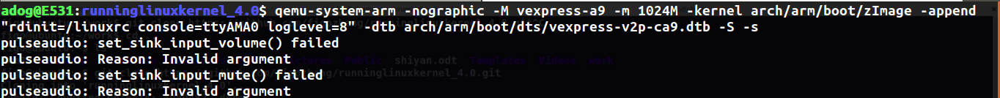


**然后打开另一个terminal，使用命令 `armeb-eabi-gdb --tui vmlinux` 进入到调试界面**

```bash
adog@E531:runninglinuxkernel_4.0$ armeb-eabi-gdb --tui vmlinux
```


**qemu和gdb使用的是tcp/ip进行通信的，需要指明端口号：**

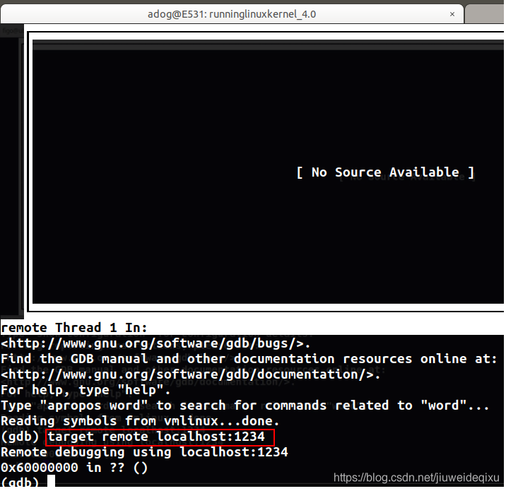

**设置断点**


**并continue**

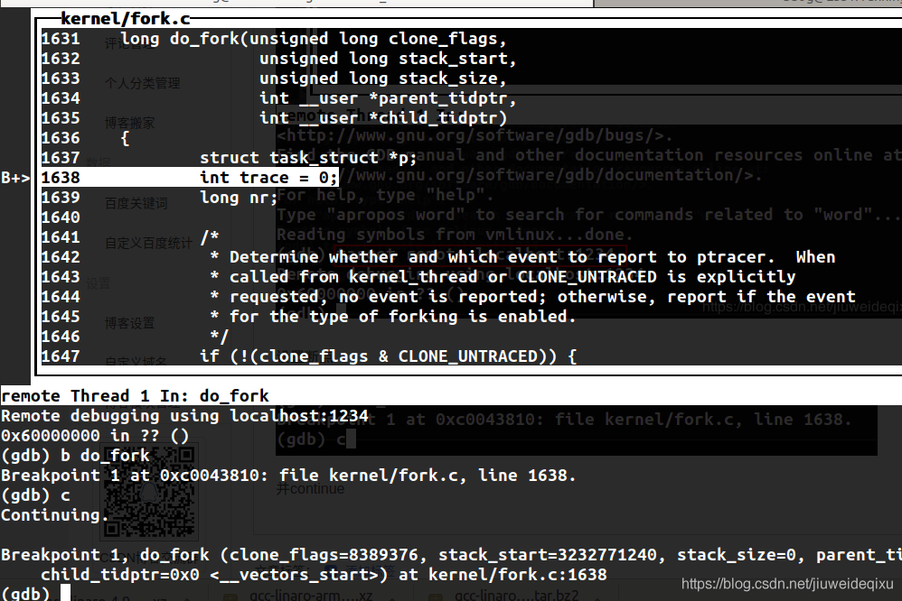

