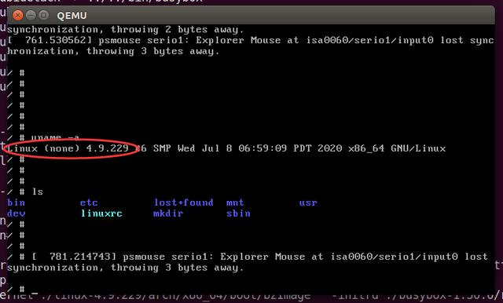

# 带你阅读linux内核源码：下载源码、编译内核并运行一个最小系统

[技术简说](https://space.bilibili.com/646178510)

要学习linux内核，先要能够编译内核，还需要了解内核如何启动根文件系统。这样你才能在修改linux内核代码之后，完成验证的过程。

> **首先是开发环境,  Ubunt 系统, 安装依赖内容和开发工具**
>
> **`sud apt install -y make gcc gdb g++ ncurses-* kernel-common libelf-dev  libssl-dev  net-tools python `**


本文教你完成下列过程：

1. [下载linux并编译linux内核源码](#下载linux并编译linux内核源码)
2. [编译busybox文件系统](#编译busybox文件系统)
3. [制作一个最小的根文件系统](#制作一个最小的根文件系统)
4. [qemu启动你编译好的内核和根文件系统](#通过qemu模拟器启动我们自己编译的内核和文件系统)


## 下载linux并编译linux内核源码

> linux源码下载地址：
>
> https://mirrors.edge.kernel.org/pub/linux/kernel/
>
> 我选择的版本是：4.9.229
>
> https://cdn.kernel.org/pub/linux/kernel/v4.x/linux-4.9.229.tar.xz


**下载到本地，解压，然后进入linux-4.9.229目录:**

1. **指定硬件体系架构。**

   1. 为了减少安装编译器的过程，我在本例中使用的是x86，因为我的开发环境就是x86。如果你要编译arm的内核，则指定ARCH=arm 且需要安装交叉编译器, 命令如下
      1. 如果是x86(也包括x64) 则 `export ARCH=x86`  ,  如果是ARM 则 `export ARCH=arm`

2. **配置board config,此处配置为 x86_64_defconfig。好了，我们点好菜了，菜单就是x86_64_defconfig,  命令如下:**

   1. **来到源码的根目录下执行这个命令 `make  x86_64_defconfig`**

3. **配置内核**

   1. **这一步其实是对第2步的菜单进行微调，我们需要内核支持ramdisk驱动，所以需要选中如下配置：**

      1. ```bash
         #通过下面的命令来进入到 内核配置界面中, 需要在 源代码根目录下执行
         # make menuconfig
         
         #在这个新页面中, 依次选择下面的内容,并回车
         	  General setup  --->
         	   #选择General setup 之后会跳转到一个新的二级页面, 再次选择下面的选项, 星号用空格打上
         	      [*] Initial RAM filesystem and RAM disk (initramfs/initrd) support
         
         #按两次 ESC 回到上一层, 也就是主页面, 再次找到并选择 Device Drivers硬件驱动
             Device Drivers  --->
              #进入二级页面, 再次选择 Blaock devics, 回车 进入进页面
               [*] Block devices  --->
                     #在这个三级页面, 选择 RAM block device support支持
                       <*>   RAM block device support
                        #下面这个设置为16就可以
                        (16)    Default number of RAM disks 
                        #下面的这个设置为 65536,  默认ARM磁盘大小修改为 64MB
                       (65536) Default RAM disk size (kbytes)
         
         #设定完成后 退出的话 选择下面的 EXIT 然后选择 YES保存即可
         ```

4. **编译内核**

   1. 执行这个命令 `make`  去编译内核
      1. **编译成功后的内核位于：`arch/x86_64/boot/bzImage`**
   2. 如果想看更详细的 内核编译信息, 就携带一些参数  `make  V=1` 即可, 会得到内核编译和链接的细节信息


## 编译busybox文件系统

> 下载buysbox源码，下载地址：
>
> https://busybox.net/downloads/
>
> 我使用的版本是busybox-1.30.0

1. **解压buysbox源码**

   1. `tar xvf busybox-1.30.0.tar.bz2`

2. **配置buysbox源码**

   1. **在这里我们把busybox配置为静态编译，这样busybox在运行的时候就不需要额外的动态链接库了**

      1. ```bash
         #root命令
         # make menuconfig
              Settings  --->
              		   #将下面这个选上就好了
                    [*] Build BusyBox as a static binary (no shared libs)
         ```

3. **编译和安装**

   1. `make && make install`

4. **编译完成后的busybox就安装在源码根目录下的  `_install` 目录了，我们进入 `_install` 目录，补充一些必要的文件或目录，相关的shell命令如下:**

   1. ```bash
      #root命令
      
      # mkdir etc dev mnt
      # mkdir -p etc/init.d/
      # vim etc/fstab     #在这个文件 输入如下内容, 挂载配置文件
            proc  /proc proc  defaults 0 0
            tmpfs  /tmp  tmpfs  defaults 0 0
            none  /tmp  ramfs defaults 0 0
            sysfs /sys  sysfs defaults 0 0
      			mdev  /dev  ramfs defaults 0 0
      			
      # vim etc/init.d/rcS       #Linux系统启动后 执行的脚本, 写入如下内容到这个文件
      			#通过这个脚本 创建相应的目录,然后把文件系统挂载起来
      			mkdir -p /proc
      			mkdir -p /tmp
      			mkdir -p /sys
      			mkdir -p /mnt
      			/bin/mount -a
            mkdir -p /dev/pts  
            mount -t devpts devpts /dev/pts    #-t devots 指定挂载的文件系统是 devpts
            echo /sbin/mdev > /proc/sys/kernel/hotplug   #传递一些参数给 hotplug,实现设备热插拔
            mdev -s
            
      # chmod 755 etc/init.d/rcS
      
      # vim etc/inittab     #这个文件是给 init进程 来使用的, 下面一部分是文件内容
          ::sysinit:/etc/init.d/rcS
          ::respawn:-/bin/sh
          ::askfirst:-/bin/sh
          ::cttlaltdel:/bin/umount -a -r
      
      # chmod 755 etc/inittab      #设置权限
      
      			#在 dev目录下创建一个设备文件, Linux启动之后会启动这个 终端设备文件, 这样才能进入到控制台
      # mknod dev/console c 5 1   
      # mknod dev/null c 1 3      #在 dev目录下创建一个设备文件
      # mknod dev/tty1 c 4 1      #在 dev目录下创建一个设备文件
      
      
      #这样一个最小的、完整的可以被内核启动的文件系统就齐活啦。
      ```


## 制作一个最小的根文件系统

**思路:**

1. 先制作一个空的镜像文件；
2. 然后把此镜像文件格式化为ext3格式；
3. 然后把此镜像文件挂载，并把根文件系统复制到挂载目录；
4. 卸载该镜像文件。
5. 打成gzip包。

```bash
#下面的命令应该在 busybox-1.30.0  源码根目录下执行
#!/bin/bash
rm -rf rootfs.ext3
rm -rf fs
#来到 busybox-1.30.0  源码根目录
dd if=/dev/zero of=./rootfs.ext3 bs=1M count=32   #一个32MB的空磁盘
mkfs.ext3 rootfs.ext3   #设置文件系统,格式是 ext3
mkdir fs
mount -o loop rootfs.ext3 ./fs
cp -rf ./_install/* ./fs
umount ./fs
gzip --best -c rootfs.ext3 > rootfs.img.gz

#最终生成的文件系统镜像名字为：rootfs.img.gz
#准备好了内核和文件系统镜像，幸福的一刻马上来临了：
```


## 通过qemu模拟器启动我们自己编译的内核和文件系统

```bash
sudo qemu-system-x86_64 \
		 -kernel ./linux-4.9.229/arch/x86_64/boot/bzImage  \
		 -initrd ./busybox-1.30.0/rootfs.img.gz   \
		 -append "root=/dev/ram init=/linuxrc rw"  \
		 -serial file:output.txt
#使用的是x86_64的体系架构, -kernel 内核镜像地址 , -initrd 文件系统镜像 , -append 传给内核的参数 init告诉内核去哪里找第一个init进程的可执行二进制文件 并设置为可读写文件系统, -serial 是设置日志输出的位置

#这样一个完整的最小linux系统就起来了
```



**好了，经过以上的步骤，你可以自己编译一个内核和文件系统。有了这样的基础，你在之后就可以自由的修改linux内核代码并run起来进行验证啦。**

