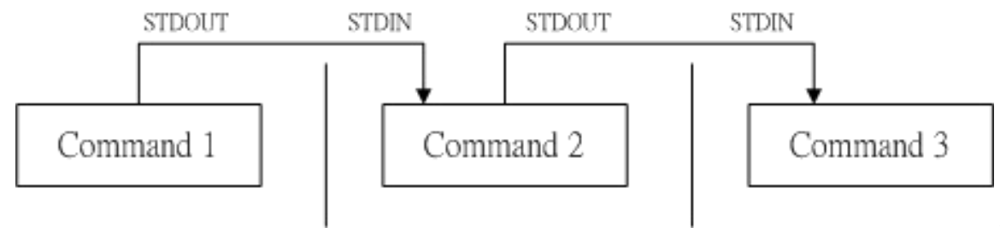

# BASH

**因为** **shell 是应用程序, 在操作系统的最外层, 所以 shell 被称为壳程序.**

**只要能够操作应用程序的接口都能够被称为壳程序.**

**上次登录执行过的指令都保存在  `~/.bash_history` 中, 本次登录执行的指令保存在内存中, 当你下线时才会写入这个文件.**

别名  **`$alisa   别名='命令'`**

### **分辨 指令是来自bash 还是 外部**

```bash
#有的指令是内置在 bash中(cd), 有的指令则不是内置, 需要一个命令来探查出来. type命令也是bash内置的
$type  [-tpa] name
选项和参数:
    :不添加任何参数和选项时, type 会显示出 name 是外部指令还是 shell bash 的内置指令.
-t  :会显示出下面的一些字眼,来表示一些具体意义.
        file    :表示为外部指令;
        alias   :表示该指令为命令别名所设置的名称
        builtin :表示该指令为 bash 内置的指令功能;
-p  :如果后面的 name 为外部指令时, 才会显示完整的文件名;
-a  :会由 PATH 变量定义的路径中,将所有含 name 的指令都列出来, 包括 alias(别名),更加详细.

范例1: 查询 ls 这个是否为 bash 内置.
$type  -a ls 
输出:   ls 是 `ls --color=auto' 的别名            #表示是别名,而不是内置
       ls 是 /usr/bin/ls                        #这一行就表示ls在自文件中的位置

范例2: 查看 cd 是否为 bash 内置.
$type -a cd
输出:  cd 是 shell 内嵌                #表示 cd 是 bash 内嵌指令
      cd 是 /usr/bin/cd               #这个指令在文件中的位置.
```

## Shell 变量功能

**变量: `变量就是以一组文字或符号等，来取 代一些设置或者是一串保留的数据`**

**变量分为 `自定变量` 与 `环境变量` ,两者的差异是 "`该变量是否被子程序所继续引用`"**

* **`自定变量`  不可以被子程序继承**
* **`环境变量`  可以被子进程继承**

#### **变量取用  echo** 

```bash
$echo   ${变量}
$echo   ${PATH}

输出: /usr/lib64/qt-3.3/bin:/usr/local/bin:/usr/bin:/usr/local/sbin:
        /usr/sbin:/home/dmtsai/.local/bin:/home/dmtsai/bin

[dmtsai@study ~]$ echo ${MAIL}
输出:        /var/spool/mail/dmtsai

[dmtsai@study ~]$ echo ${HOME}
输出:        /home/dmtsai
```

### **设置和修改变量**

* **变量设置规则:**
  * **必须用 '=' 号链接 , 而且不可以在 '=‘  号 左右出现空格.**
  * **变量名称只能是英文和数字, 而且开头必须是英文,绝不可以是数字.**
  * **变量内容若有空白字符可使用** _**`双引号""`**_ **或** _**`单引号''`**_ **将变量内核结合起来, 但是:**
    * _**`双引号`**_**的特殊字符如   $  等,可以保有原本的特性, 如下所示:** 
      * **`var="lang is $LANG"` 会变成:   `echo ${var}   ->  lang is zh_CH.utf8`**
    * _**`单引号`**_**内的特殊字符则为一般字符\(纯文本\), 如下所示:**
      * **`var='lang is $LANG`'   会变成 `echo ${var}    ->  lang is $LANG`**
  * 可用 '\' 转义字符将特殊符号 \(如 \[Enter\] ,$ ,\ ,空白字符,等\) ,变成一般字符, 如 
    * **`myname=VBird\ Tsai`   会变成  `echo ${myname}   ->  VBird Tsai`**
  * **若该变量为扩增变量内容时，则可用 `$变量名称`"或 `${变量}` 累加内容，如下所示: `PATH="$PATH":/home/bin`或`PATH=${PATH}:/home/bin`**
    * **若该变量需要在其他子程序执行，则需要以 `export` 来使变量变成环境变量: `$export PATH`**
* **取消变量**
  * **使用命令  `$unset 变量名`    就可以,  如:  `$unset  myname`**

```bash
$echo  ${myname}       #myname 是一个没有设置过的变量, 是一个空值,不会有任何输出
$myname=VBird          #现在 myname 是一个变量了,它代表 VBird 这个字符了
$echo  ${myname}       #这样设置过之后就可以输出了, 但他只是临时的.
输出: VBird

使用 $set   可以查看所有的变量和环境变量.
使用 $unset 变量名    可以取消变量.
```

### 环境变量的功能

**`env`** 命令和  **`export`** 命令 都可以得到环境变量列表.

```bash
#显示目前我shell 环境中的 环境变量
$env             #直接输入这个命令就可以
输出:

HOSTNAME=study.centos.vbird       #这部主机的主机名称
TERM=xterm            #这个终端机使用的环境是什么类型
SHELL=/bin/bash              # 目前这个环境下，使用的 Shell 是哪一个程序?
HISTSIZE=1000           # “记录指令的笔数”在 CentOS 默认可记录 1000 笔
OLDPWD=/home/dmtsai          # 上一个工作目录的所在
LC_ALL=en_US.utf8          # 语系，
USER=dmtsai              #使用者的名称
LS_COLORS=rs=0:di=01;34:ln=01;36:mh=00:pi=40;33:so=01;35:do=01;35:bd=40;33;01:cd=40;33;
             01or=40;31;01:mi=01;05;37;41:su=37;41:sg=30;43:ca=30;41:tw=30;42:ow=34;42:
             st=37;44:ex=01;32
*.tar=01...       # 一些颜色显示
MAIL=/var/spool/mail/dmtsai     # 这个使用者所取用的 mailbox 位置
PATH=/usr/local/bin:/usr/bin:/usr/local/sbin:/usr/sbin:/home/dmtsai/.local/bin:/home/dmts
PWD=/home/dmtsai     #目前使用者所在的工作目录 (利用 pwd 取出!)
LANG=zh_TW.UTF-8       #这个与语系有关，下面会再介绍!
HOME=/home/dmtsai       # 这个使用者的主文件夹啊!
LOGNAME=dmtsai       # 登陆者用来登陆的帐号名称
_=/usr/bin/env    #上一次使用的指令的最后一个参数(或指令本身)
```

```bash
#用在 分享自己的变量设置给后来调用的文件或其他程序 .(就是将自定变量 转换成 环境变量)
$export     变量名称
```

####  $    变量\(关于本 shell 的PID\)

**`$`  是一个变量,本身有意义,表示 目前这个 Shell 的线程ID, 也就是当前shell的PID**    

 **`$echo    $$                 #这样就得到了目前 shell 的PID`**

#### ?   变量\(上个执行指令的返回值\)

**`?` 变量是非常有用的,   可以得到上个执行程序和指令的返回值. 用来查看是否有错误代码.**

**`$echo   $?                 #这样就得到上个程序或进程的返回值了.`**

### 变量 键盘读取, 阵列与宣告 : read, array, declare

```bash
$read  [-pt]  变量名
选项与参数:
-p   :后面可以接提示字符!
-t   :后面可以接等待的 '秒数', 如果达到设定时间,那么就自动略过 (结束)

范例: 提示使用者在30秒之内输入自己的名字,并给出提示, named是个变量,没有赋予任何数值.
$read -p "Please keyin your name: " -t 30 named
输出: Please keyin your name:  ppq
$echo  ${named}
输出: ppq
```
- **变量默认是字符串, 若不指定变量类型,则 1+2 为一个字符串 而不是计算式**
- **bash 环境中的数值运算, 默认最多仅能达到整数形态,  所以 1/3 结果是0.**

```bash
$declare  [-aixr]  变量名
选项与参数:
-a    :将后面的 变量 的变量定义成为 数组(array)类型
        +a    :可以取消上面定义的 数组(array)类型
-i    :将后面的 变量 的变量定义成为 整数数字(integer) 类型
        +i    :可以取消上面定义的 整数数字(integer) 类型
-x    :用法与 export 一样,就是将后面的 自定变量 变成环境变量.
        +x    :可以将 环境变量 修改为  自定变量
-r    :将变量设置称为 readonly(只读) 类型,不可被更改,也不能unset取消, (重新登录即可恢复)
        +r    :将只读变量 修改为 非只读变量
-p    :可列出后面变量的类型.
# declare [tab] [tab]  可以列出所有的变量.

范例: 让变量 sum 进行 100+300+50 的加总结果.
$declare  -i sum=100+300+50
$echo  ${sum}
输出:  450

范例: 将 sum 变成环境变量
$declare  -x sum
$exprot  | grep sum      #exprot会输出环境变量列表. gerp 会进行查询
输出: declare -ix sum="450"        #sum是整数类型, 并且具有 环境变量属性

范例: 将sum 变成 自定变量 ( 取消环境变量)
$declare  +x  sum
$export | grep sum          #什么都不会输出了,因为不是环境变量了.
$echo ${sum}
输出: 450                    #这样就可以输出了
```

#### 设置一个阵列 (就是一个数组)
```bash
$var[1]="on1" ;var[2]="on2" ;var[3]="on3"
$echo ${var[1]} ${var[2]}  ${var[3]}
    输出: on1 on2 on3
$echo ${var[*}}            # *是万用字符,这样写和上面写效果相同,但是会逐个进行遍历,更加方便
    输出: on1 on2 on3
```

#### 变量内容的删除,取代与替换 (Optional)
**修改和取代以及替换都与命令无关, 只是格式化.**
##### 变量内容的删除
- 其实并不是删除,而是进行了格式化输出, 变量本身没有任何变化.
	- **`#`**代表从**前面开始向后面**删除,且删除一个最**短**的字符串
	- **`##`**代表从**前面开始向后面**删除,且删除一个最**长**的字符串
	- **`%`**代表从**后面开始向前面**删除,且删除一个最**短**的字符串
	- **`%%`**代表从**后面开始向前面**删除,且删除一个最**长**的字符串

```bash
$path=${PATH}
$echo ${path}	
输出: /usr/local/bin:/usr/bin:/usr/local/sbin:/usr/sbin:/home/dmtsai/.local/bin:/home/dmtsai/bin

#  从前面开始向后面删除  #  
$echo ${path#/*local/bin:}	#删除最短的 /usr/local/bin: 这一串字符串.只有这个是完全匹配的
				#其实/home/dmtsai/.local/bin: 也匹配,只不过他不是最短的.
输出: 
/usr/bin:/usr/local/sbin:/usr/sbin:/home/dmtsai/.local/bin:/home/dmtsai/bin

$echo  ${path##/*:}     #删除一个最长的字符串 / 开头 :结尾  ,只留下 最后一个. 字符匹配是关键
输出:    
/home/dmtsai/bin	#看整体的字符串, 开头是/ ,这个 /home 之前就是一个 : 符号.


#从后面向前面删除  #
$echo  ${path%*bin}
输出:
/usr/local/bin:/usr/bin:/usr/local/sbin:/usr/sbin:/home/dmtsai/.local/bin:/home/dmtsai/		#仅仅只是少了最后面的一个 bin 字符串

$echo  ${path%%:*}
输出: /usr/local/bin		#只剩下了一个

$echo  ${path%%bin*}	    
输出: /usr/local/bin		#和上面有相同的效果.因为是删除最长的一个,所以他会向前搜寻.

```
##### 变量内容的替换
- **`变量/旧/新`** 表示从前到后进行替换, 只替换一个位置
- **`变量//旧/新`** 表示从前到后进行替换, 会替换字符串中所有的位置. 
```bash
$echo  ${path}
输出:
/usr/local/bin:/usr/bin:/usr/local/sbin:/usr/sbin:/home/dmtsai/.local/bin:/home/dmtsai/bin

$echo  ${path/sbin/SBIN}    #只替换从头开始的一个串 位置
输出:
/usr/local/bin:/usr/bin:/usr/local/SBIN:/usr/sbin:/home/dmtsai/.local/bin:/home/dmtsai/bin

$echo  ${path//bin/BIIN}   #替换串内所有的位置
输出:
/usr/local/BIN:/usr/BIN:/usr/local/sBIN:/usr/sBIN:/home/dmtsai/.local/BIN:/home/dmtsai/BIN

```
##### 变量的测试与内容替换
- **`-`** 如果前面测试的变量为**未设定**(不是空串),则会将 **`-`** 后面的字符串
	- **`$echo ${path-root}`**       #只是测试,而不是赋值,如果path是空值,则会输出root
	- **`$path=${path-root}`**        #测试,并将结果赋值,path如果是空值,则将root赋值给path
- **`:-`** 前面测试的变量为 空串或未设定 ,则会用 -: 后面的字符串来替换.
	- **`$echo  ${path:-root}`**    #只是测试,而不是赋值,如果path是空值或空字符串,则会输出root
	- **`$path=${path:-root}`**     #测试,将结果赋值,path如果是空值或空字符串,则将root赋值给path

# 与文件系统 及 程序的限制关系 : ulimit

**bash 是可以限制使用者的某些资源,包括打开文件的数量, 可以使用的CPU时间, 可以使用的内存总量 等等,  通过 `ulimit`  来进行设置.**

```bash
$ulimit   [-SHacdfltu]  [配额]
选项与参数:
-H    :hard limit, 严格的设置,必定不能超过这个设置的数值
-S    :soft limit, 警告的设置, 可以超过这个设置值,但是若超过则有警告讯息.
	在设置上,通常 soft 会比 hard 小, 举例来说, soft 可设置为80, 而hard 在设置为100,
	那么你可以使用到90, (因为没有超过100), 但介于 80~100 之间时,系统会有警告讯息通知你.
-a    :后面不接任何选项与参数,可列出所有的限制额度;
-c    :当某些程序发生错误时,系统可能会将程序在内存中的信息写成文件(排错用),
	这种文称为核心文件(core file), 此为限制每个核心文件的最大容量.
-f    :此 shell 可以创建的最大文件大小(一般可能设置为 2GB)单位为 KBytes
-d    :程序可使用的最大断裂内存(segment)容量;
-l    :可用于锁定 (lock) 的内存量
-t    :可使用的最大 CPU 时间 (单位为秒)
-u    :单一使用者可以使用的最大程序(process)数量。

范例1: 列出当前身份的所有限制数据值.(一般账号)
$ulimit -a
输出:
core file size          (blocks, -c) 0		  #0表示没有限制
data seg size           (kbytes, -d) unlimited	  #unlimited表示无限
scheduling priority             (-e) 0
file size               (blocks, -f) unlimited	  #可创建的但一文件的大小
pending signals                 (-i) 4314
max locked memory       (kbytes, -l) 64
max memory size         (kbytes, -m) unlimited
open files                      (-n) 1024	  #同时可以打开的文件数量
pipe size            (512 bytes, -p) 8
POSIX message queues     (bytes, -q) 819200
real-time priority              (-r) 0
stack size              (kbytes, -s) 8192
cpu time               (seconds, -t) unlimited
max user processes              (-u) 4096
virtual memory          (kbytes, -v) unlimited
file locks                      (-x) unlimited

范例2: 限制当前使用者仅能创建 10MBytes 以下容量的文件
$ulimit  -f 10240
$ulimit  -a | grep 'file size'
输出:
core file size          (blocks, -c) 0
file size               (blocks, -f) 10240	#最大量值为 10MBbytes

#尝试创建大于 10MB 的文件会失败:
$dd if=/dev/zero of=test.file  bs=1M count=20    #尝试创建一个20MB的文件
输出 :  文件大小超出限制(吐核)			#虽然报了错,但是这个文件还是会出现
$ls -lh test.file
输出: -rw-rw-r--. 1 dmtsai dmtsai 10M 10月 24 11:19 test.file	 #只是10MB
 
#删除这个新创建的文件,并重新登录,即可解开限制. 
#文件限制 只可以越来越小,不可以增大.
#如果是root, 则直接显示: unlimit  无限制.
```


# 命令别名与历史命令
### 别名 alias
```bash
#设置别名
$alias  别名='指令选项'
$alias  lm='ls -la | more'

#直接输入 alias 会列出所有的设置过的别名.

#取消别名
$unalias  别名
$unalias  lm
```

### 历史命令 history
**HISTFILESIZE 这个变量决定了 history 会保存多少条指令.**
**登录主机的时候,系统会主动读取 ~/.bash_history 这个文件,来获得你曾经下过的指令**
**登录主机之后, 你所下达的指令都会在你退出登录之后 ,才会写入 ~/.bash_history 文件中**
```bash
$history  数字
$history  [-c]
$history  [-raw]  histfiles
选项与参数:
数字 :意思是“要列出最近的 多少条 命令列表”的意思.
-c  :将目前的 shell 中的所有 history 内容全部消除
-a  :将目前新增的 history 指令新增入 histfiles 中，若没有加 histfiles(就是指定个文件),
	则默认写入 ~/.bash_history
-r  :将 histfiles 的内容读到目前这个 shell 的 history 记忆中(就是拷贝一份);
-w  :将目前的 history 记忆内容写入 histfiles 中,如果未指定,则默认写入 ~/.bash_hiistory

#执行错误 或者 无法执行的 指令都会进行存储.

范例一:列出目前内存内的所有 history 记忆
$history	
输出   .....    #省略,从1开始
      858  echo  ${path}
      859  echo  ${path:-root}
      860  history

范例二:列出目前最近的 3 笔数据
$history  3
输出:  859  echo  ${path:-root}
      860  history
      861  history  3

范例三:立刻将目前的数据写入 histfile 当中
$ history -w		#在默认的情况下，会将历史纪录写入 ~/.bash_history 当中!

范例四: 清空指令历史
$history -cw      #必须同时使用 -c -w, -c 是清空, -w 是强制更新到文件.

```

#### 执行曾经执行过的指令
```bash
$!数字
	#这个数字表示: 执行第几个指令的意思,(~/.bash_history 文件中的)
$!指令字符串开头
	#在 ~/.bash_history 中寻找与 指令字符串开头相仿的指令,并执行.

$history  5
输出:
  867  vim .bash_history 
  868  history -w aaa
  869  ls
  870  vim aaa
  871  history  5

$!869
输出: 
ls
aaa      Documents  Music     Public     Videos

$!!	  #执行上一条执行过的指令, 就是 $!869  也就是 $ls

$!vim      #会执行 $vim aaa   因为它是最近执行的指令.
```

## Bash Shell 的操作环境

- **指令运行的顺序**
	- **以相对/绝对路径执行指令，例如“/bin/ls”或“./ls”;**
	- **由`alias(别名)`找到该指令来执行;**
	- **由 bash 内置`(builtin)` 指令来执行.**
	- **通过 $PATH 这个变量的顺序搜寻到的第一个指令来执行.**
- **可以通过执行 $type -a 指令  来得到执行顺序.排在前面的就会先执行.**


### bash 的进站与欢迎讯息 : /etc/issue ,  /etc/motd

进站讯息(就是未登陆前提示的讯息),存放在 /etc/issue 文件中.
- /etc/issue.net 是提供给 telnet(提供远程登录的一种IP协议) 使用的,内容应该和issue相同.

```bash
$cat /etc/issue
输出:
\S
Kernel \r on an \m

里面的反斜杠作为变量取用,可以使用 man issue 配合 man agetty  来查询得到结果.

issue 内的各代码意义:
\d 本地端时间的日期 (年-月-日)
\l 显示第几个终端机接口;
\m 显示硬件的等级 (i386/i486/i586/i686...);
\n 显示主机的网络名称;
\O 显示 domain name;
\r 操作系统的版本 (相当于 uname -r)
\t 显示本地端时间的时间 (小时:分)
\S 操作系统的名称;
\v 操作系统的版本。
```

欢迎讯息的内容存放在 /etc/motd 中.
用户登录之后就会显示里面的内容到终端上.

```bash
必须使用root 才可以修改这个文件, 可以把想要大家都知道的信息写在里面.
$vim  /etc/motd     #这个文件 默认是空的.
```

### bash 的环境配置文件

- **login shell(登录 shell)**, 就是取得bash的完整流程,需要账号和密码,(就是远程终端登录)
	- login shell 会读取下面这些配置文件:
		-  /etc/profile :这是系统整体的设置,最好不要修改.
		- **`~/.bash_profile` 或 `~/.bash_login` 或 `~/.profile` :属于使用这个人设置,要改自己的数据,就写入这里.**
- **non-login shell (非登录 shell)**, 取得bash 不需要账号和密码, 就是你已经登录了bash了,然后在开一个bash 界面.也就不需要再次输入账号密码了.
	- non-login shell 会读取下面这些配置文件:
		- ~/.bashrc   
- 两者的区别: 就是读取的配置文件不同, 和是否会需要登录.
```bash
bash 的 login shell 情况下所读取的整体配置文件其实只有 /etc/profile, 但是它还会调用其他配置文件.

login shell 会读取的配置文件: 
/etc/profile	  主要内容:
- PATH:会依据 UID 决定 PATH 变量要不要含有 sbin 的系统指令目录; 
- MAIL:依据帐号设置好使用者的 mailbox 到 /var/spool/mail/帐号名; 
- USER:根据使用者的帐号设置此一变量内容; 
- HOSTNAME:依据主机的 hostname 指令决定此一变量内容; 
- HISTSIZE:历史命令记录笔数。CentOS 7.x 设置为 1000 ; 
- umask:包括 root 默认为 022 而一般用户为 002 等!

profile 还会去调用外部的设置数据, 默认情况下 下面的数据会依序被调用进来.
- /etc/profile.d/*.sh
这个目录下的 *.sh 文件的权限都是 644 所有者是root 所属组是root ,如果想创建新的,那么可以保持这个权限.也可以将这个文件变成私有的. 修改所有者和所属组以及权限 ,(不可去除读权限)
这个目录下的文件规范了 bash 操作接口的颜色, 语系, ll与ls 指令的命令别名, vi的命令别名..等等
如果想要设置所有用户都可以共享的别名时,可以在这个目录下自行创建 .sh 文件.

- /etc/locale.conf
这个文件是由 /etc/profile.d/lang.sh 调用进来的!
这也是我们决定 bash 默认使用何种语系的 重要配置文件! 
文件里最重要的就是 LANG/LC_ALL 这些个变量的设置!

-/usr/share/bash-completion/completions/*
这个目录下的文件是由/etc/profile_completion.sh 文件载入的.
[tab]的命令补齐、文件名补齐，指令的选项参数补齐功能,就是从这个目录里面找到的对应的指令来处理的.


#个人偏好的配置文件
~/.bash_profile (login shell 才会读)
bash 在读完了整体环境设置的 /etc/profile 并借此调用其他配置文件后，接下来则是会读取使 用者的个人配置文件.
所读取的个人偏好配置文件其实主要有三个依序分别是 :  (其实只是读取其中一个)
~/.bash_profile   (这个文件还会再次判断是否有 ~/.bashrc 存在,如果有则使用指令 source 来读取)
~/.bash_login
~/.profile
	(~/.bashrc 还会去读取 /etc/bashrc 这个文件)
	(/etc/profile 与 ~/.bash_profile 都是在取得 login shell 的时候才会读取的配置文件)
当上面其中一个读取完成后, 就可以开始操作 bash 了
```

```bash
最终被读取到的配置文件是 ~/.bashrc   可以将偏好设置写入这个文件,并通过source 刷新.
$source   配置文件的文件名

范例: 将主文件夹内的 ~/.bashrc 的设置读入目前的 bash 环境中.
$source ~/.bashrc
$ .  ~/.bashrc	     #这两个效果相同, 可以使用 . 来替代 source 命令
```

```bash
non-login shell 会读的配置文件  ~/.bashrc
```
#### 其他相关的配置文件
- **`/etc/man_db.conf`**     这个文件的内容规范了 使用man的时候,去哪里寻找帮助文档(很有用)
- **`~/bash_history`**    历史命令记录
- **`~/.bash_login`**    记录了 当我登出bash后系统再帮我做完什么动作后才离开的意思.(相当于一个离线即可执行的脚本)

### 终端机的环境设置:  stty  , set
可以利用  **`stty`** 查阅目前的一些按键内容.
```bash
$stty  [a] 
-a   :将目前素偶有的stty 参数列出来.

范例1 . 列出所有的按键与按键内容
$stty -a
speed 9600 baud; rows 46; columns 80; line = 0;
intr = ^C; quit = ^\; erase = ^?; kill = ^U; eof = ^D; eol = M-^?; eol2 = M-^?;
swtch = <undef>; start = ^Q; stop = ^S; susp = ^Z; rprnt = ^R; werase = ^W;
lnext = ^V; flush = ^O; min = 1; time = 0;
-parenb -parodd -cmspar cs8 -hupcl -cstopb cread -clocal -crtscts
-ignbrk -brkint -ignpar -parmrk -inpck -istrip -inlcr -igncr icrnl ixon -ixoff
-iuclc ixany imaxbel iutf8
opost -olcuc -ocrnl onlcr -onocr -onlret -ofill -ofdel nl0 cr0 tab0 bs0 vt0 ff0
isig icanon iexten echo echoe -echok -echonl -noflsh -xcase -tostop -echoprt
echoctl echoke

意义:
intr : 送出一个 interrupt (中断) 的讯号给目前正在 run 的程序 (就是终止!); 
quit : 送出一个 quit 的讯号给目前正在 run 的程序;
erase : 向后删除字符，
kill : 删除在目前命令行上的所有文字;
eof : End of file 的意思，代表“结束输入”。
start : 在某个程序停止后，重新启动他的 output 
stop : 停止目前屏幕的输出;
susp : 送出一个 terminal stop 的讯号给正在 run 的程序。


范例2 : 将 erase 删除字符, 修改为 ^h 按键.
$stty erase ^h        #修改之后,就要使用 ctrl+h 来进行删除了.
```
```bash
$set    [-uvCHhmBx]      #-是启用, +是不启用
选项和参数:
 -v :默认不启用。若启用后，在讯息被输出前，会先显示讯息的原始内容;
 -x :默认不启用。若启用后，在指令被执行前，会显示指令内容(前面有 ++ 符号)
 -h :默认启用。与历史命令有关;
 -H :默认启用。与历史命令有关;
 -m :默认启用。与工作管理有关;
 -B :默认启用。与方括号 [] 的作用有关;
 -C :默认不启用。若使用 > 等，则若文件存在时，该文件不会被覆盖。
 
范例一:显示目前所有的 set 设置值
$ echo $-	  # $- 变量内容就是 set 的所有设置.
输出:  himBH	  #这些输出内容对应上面的选项, 启用的选项都会写在这里.(并不是单词)


范例二:设置 "若使用未定义变量时，则显示错误讯息", 可以使用+u 来取消这个设置
$ set  -u
$ echo $vbirding
 -bash: vbirding: unbound variable


范例三:执行前，显示该指令内容。
$ set -x
输出: ++ printf '\033]0;%s@%s:%s\007' dmtsai study '~'	#这是提示字符的控制码

$echo  '/home/dmtsai'
输出:
+ echo /home/dmtsai		#要输出的指令都会先打印到屏幕上,前面会多出+号
/home/dmtsai
++ printf '\033]0;%s@%s:%s\007' dmtsai study '~'
```

### 万用字符* 与特殊符号
| 符号 | 意义 |
|-|-|
| * | 代表0个到无穷多个任意字符 |
| ? | 代表“一定有一个”任意字符,两个? 就代表有两个任意字符  |
| [] |同样代表“一定有一个在括号内”的字符(非任意字符),就是集合|
| [-] | 若有减号在中括号内时，代表“在编码顺序内的所有字符”,也是集合 |
| [^] | 若中括号内的第一个字符为指数符号 (^) ，那表示“反向选择”, 补集 |

**特殊符号**
|符号| 内容|
|-|-|
| # | 注解符号 |
| \ | 转义字符:将“特殊字符或万用字符”还原成一般字符 |
| \| | 管道 |
| ; | 连续指令下达分隔符号 |
| ~ | 使用者的主文件夹 |
| $ | 取用变量前置字符:亦即是变量之前需要加的变量取代值|
| & | 工作控制 (job control):将指令变成后台工作|
| ! | 逻辑运算意义上的“非” not 的意思!|
| / | 目录符号:路径分隔的符号|
| >, >> | 数据流重导向:输出导向，分别是“取代”与“累加”|
| <, << | 数据流重导向:输入导向, 分别是“取代”与“累加”|
|' ' | 单引号，不具有变量置换的功能 ($符号 变为纯文本)|
| " " | 具有变量置换的功能! ($符号 可保留相关功能)两个“ ` ”中间为可以先执行的指令,亦可使用 $( )|
| ( ) | 在中间为 子shell 的起始与结束|
| { } | 在中间为命令区块的组合!|

## 数据流重导向  (重定向)
- stdin   <<(结束输入字符)  <(文件输入)    (文件描述符0)
- stdout  >> >    (文件描述符1)
- stderr 2>> 2>   (文件描述符2)

```bash
#将一条命令的 正确输出(stdout) 和错误输出(stderr) 区分开来, 分别放入两个文件.
$find / -name fat  > correct_out  2> err_out
	#err_out 里面会提示权限不足而无法寻找的信息
	#correct_out 里面是找到的正确信息.

#将正确输出保留, 并把错误输出丢弃掉, (/dev/null 是个垃圾桶设备,可以吃掉所有信息)
$find / -name fat 2> /dev/null
	屏幕上还是会输出正确的内容,错误的内容会被丢弃.

#将正确与错误数据统统写入一个文件去.
$find / -name fat > list 2>&1   #两种输出信息都会写入到 list 文件中,而且先写入正确信信息
				#后面的 2>&1  是写入同一个文件的特殊写法.

#将正确的信息写入 错误输出.
$echo "aaaa"  1>&2 

#将正确的信息丢弃, 只留下错误信息,写入echoerr 文件
$echo  "aaa"  2>echoerr  1>&2


#stdin  的 < 与 <<
$cat > catfile		#cat后面没有接文件名,而且它还想要输出内容到 catfile 这个新文件去
			#这个时候,就会要求用户在屏幕上进行输入,然后把输入内容写到文件中去.
			# crtl+d  可以进行结束输入.

$cat > catfile  < ~/.bashrc     #将~/.bashrc  文件内容读取出来,并写入 catfile 文件中.

#通过关键字来结束输入
$cat > catfile << "eof"        #eof是结束字符关键字,作用和 ctrl+d 相同
>这里需要键盘来输入内容
>eof				#结束输入的关键字 eof,并且eof不会存入 catfile 文件.
```

## 命令执行的判断依据  ;   &&  ||
**关联 || && , 非关联  ;**
**若前一个指令执行的结果为正确，在 Linux 下面会 回传一个 **`$? = 0`** 的值.**
- cmd1 && cmd2
	- 1. 若 cmd1 执行完毕且正确执行($?=0)，则开始执行 cmd2。 
	- 2. 若 cmd1 执行完毕且为错误 ($?≠0)，则 cmd2 不执行。
- cmd1 || cmd2
	- 1. 若 cmd1 执行完毕且正确执行($?=0)，则 cmd2 不执行。 
	- 2. 若 cmd1 执 cmd2 行完毕且为错误 ($?≠0)，则开始执行 cmd2。
```bash
范例一:使用 ls 查阅目录 /tmp/abc 是否存在，若存在则用 touch 创建 /tmp/abc/hehe
$ls /tmp/abc && touch /tmp/abc/hehe     #因为tmp没有abc目录,所以不会创建hehe 文件

范例二 :使用ls 查阅目录 /tmp/abc 是否存在,如果不存在则创建这个目录,然后再创建 hehe 文件
$ls /tmp/abc  ||   mkdir /tmp/abc  &&  touch /tmp/abc/hehe     #第一个失败则执行第二个
```

## 管道命令 (pipe)
用途: 管线命令“ | ”仅能处理经由前面一个指令传来的正确信息. (也就是 stdout 信息,对于stderr 没有直接处理能力)


- 管道中常常会使用到前一个指令的 stdout (输出) 作为这条指令的 stdin (输入),某些指令需要用到文件名称 (例如 tar) 来进行处理时，该 stdin 与 stdout 可以利用减号 "-" 来替代， 举例来说:
	- **`$mkdir /tmp/homeback ; tar -cvf - /home | tar -xvf -  -C /tmp/homeback`**
	- 解读: 将 /home 里面的文件全部打包,但打包的数据传送到管道(stdout),经过管道后,将 tar -cvf - /home 传送给后面的 tar -xvf -  ,中间的 -  是非常重要的. 后面的 - 是取前一个指令的stdout, 因此就不需要 文件名了.




**在每个管道后面接的第一个数据必定是“指令”,而且这个指令必须要能够接受 stdin 的数据才行.**
- 管道命令只会处理 **`标准输出`**, 对于 **`错误输出`** 会忽略.
	- 让错误输出被管道命令所用: 让 2>&1 加入指令中,就可以让 2> 变成 1>
		- **`$ls /root 2>&1 | cat`**
- 管道命令必须要能够接受来自前一个指令的数据成为 **`stdin`** 继续处理才行.

### 摘取命令  cut ,grep

**摘取命令就是将一段数据经过分析后，取出我们所想要的**
**`摘取讯息通常是针 对“一行一行”来分析的， 并不是整篇讯息分析的`**

#### cut 是将一行讯息当中,取出某部分 

```bash
$cut  -d '分隔字符'  -f  fields     #用于特定分隔字符
$cut  -c 字符区间		  #用于排列整齐的讯息
选项与参数:
-d   :后面接分隔字符. 与-f一起使用;
-f   :依据 -d 的分隔字符将一段讯息分区成为数段，用 -f 取出第几段的意思;
-c   :以字符 (characters) 的单位取出固定字符区间;


范例一:将 PATH 变量取出，我要找出第五个路径。
$echo ${PATH}		#原本的内容
输出:
/usr/lib64/qt3.3/bin:/usr/local/bin:/usr/bin:/usr/local/sbin:/usr/sbin:/home/dmtsai/.local/bin:/home/dmtsai/bin

$echo ${PATH} | cut  -d ':' -f 5
输出:  /usr/sbin		#以: 作为分隔符,将串分成多个部分, 这个串是第5个.

 
范例二:将 export 输出的讯息，取得第 12 字符以后的所有字串
$export            #原本的输出值:
输出: 
declare -x HISTCONTROL="ignoredups"
declare -x HISTSIZE="1000"
declare -x HOME="/home/dmtsai"
.... 输出省略

$export  |  cut -c 12- 	    #这是个范围值,并且格式化输出,
输出:
HISTCONTROL="ignoredups"	#每一行前面的 declare -x  这12个字符都没了.
HISTSIZE="1000"			#每行的 相同的字符都被删除了
HOME="/home/dmtsai"
.....输出省略

范例三:用 last 将显示的登陆者的信息中，仅留下使用者大名
$last | cut  -d ' ' -f 1
dmtsai
reboot
```

#### grep 则是分析一行讯息, 若当然有我们所需要的信息,就将该行拿出来.
**`grep 可以解析一行文字，取得关键字，若该行有存在关键字，就会整行列出来`**
```bash
$grep  [-acinv] [--color=auto] '搜寻字串'  filename
选项与参数:
-a   :将 binary 文件以 text 文件的方式搜寻数据
-c   :计算找到 '搜寻字串' 的次数
-i   :忽略大小写的不同，所以大小写视为相同
-n   :顺便输出行号
-v   :反向选择，亦即显示出没有 '搜寻字串' 内容的那一行!
--color=auto   :可以将找到的关键字部分加上颜色的显示喔!

范例一:将 last 当中，有出现 root 的那一行就取出来;
$ last | grep 'root'

范例二:与范例一相反，只要没有 root 的就取出!
$ last |grep -v 'root'

范例三:在 last 的输出讯息中，只要有 root 就取出，并且仅取第一栏
$ last | grep 'root' | cut -d ' ' -f1
	# 在取出 root 之后，利用上个指令 cut 的处理，就能够仅取得第一栏啰!
输出:   root

范例四:取出 /etc/man_db.conf 内含 MANPATH 的那几行
$ grep --color=auto 'MANPATH' /etc/man_db.conf
```

###  排序命令:  sort , wc , uniq
##### sort
```bash
$sort [-fbMnrtuk] [file or stdin]
选项与参数:
 -f :忽略大小写的差异，例如 A 与 a 视为编码相同;
 -b :忽略最前面的空白字符部分;
 -M :以月份的名字来排序，例如 JAN, DEC 等等的排序方法;
 -n :使用“纯数字”进行排序(默认是以文字体态来排序的);
 -r :反向排序;
 -u :就是 uniq ，相同的数据中，仅出现一行代表;
 -t :分隔符号，默认是用 [tab] 键来分隔;
 -k :以那个区间 (field) 来进行排序的意思
默认是 "以第一个数据来进行排序的". 而且默认是以文字形态来排序的, 所以由 a 开始排序.

范例一:个人帐号都记录在 /etc/passwd 下，请将帐号进行排序。
$ cat /etc/passwd  | sort
 abrt:x:173:173::/etc/abrt:/sbin/nologin
 adm:x:3:4:adm:/var/adm:/sbin/nologin
 alex:x:1001:1002::/home/alex:/bin/bash

范例二:/etc/passwd 内容是以 : 来分隔的，我想以第三栏来排序，该如何?
$cat /etc/passwd  | sort -t ':'  -k 3 -n
root:x:0:0:root:/root:/bin/bash
bin:x:1:1:bin:/bin:/sbin/nologin
daemon:x:2:2:daemon:/sbin:/sbin/nologin
adm:x:3:4:adm:/var/adm:/sbin/nologin


范例三:利用 last ，将输出的数据仅取帐号，并加以排序
$last | cut -d ' ' -f 1 | sort -u
```

### 双向重导向  tee
tee 会同时将数据流分送到 文件 与 屏幕(screen) ,相当于复制了一份.
```bash
$tee  [-a] file
选项与参数:
-a   :以 累加 的方式,将数据加入到file 中. 默认是替换

范例: 将 last 的输出存一份到 last.list 文件中;
$last | tee last.list	    #屏幕会显示一份, 文件还有一份.
```

### 字符转换命令: tr, col, join, paste, expand

```bash
$tr [-ds] SET1 ...
选项与参数:
 -d :删除讯息当中的 SET1 这个字串;
 -s :取代掉重复的字符!

范例一:将 last 输出的讯息中，所有的小写变成大写字符:
$ last  | tr '[a-z]' '[A-Z]'
# 事实上，没有加上单引号也是可以执行的，如: last | tr [a-z] [A-Z] 

范例二 : 删除 dos 文件 pass 中的 ^M 这个断行符号,使之变成 unix 断行符号.
cat ~/pass | tr -d '\r' > ~/passwd.linux
	#那个 \r 指的是 DOS 的断行字符,关于更多的字符，请参考 man tr
```
```bash
$col   -x
选项与参数:
-x    :将 tab 键转换成对等的空白键
```
```bash
$paste  [-d]  file1  file2		#将两个文件中的同一行贴在一起,用 [tab] 分隔
选项与参数:
 -d :后面可以接分隔字符。默认是以 [tab] 来分隔的!
 - :如果 file 部分写成 - ，表示来自 stdin 的数据的意思。

范例一:用 root 身份，将 /etc/passwd 与 /etc/shadow 同一行贴在一起
$paste /etc/passwd /etc/shadow		#只是输出,并不会修改原文件.
```
```bash
$expand [-t] file
选项与参数:
-t :后面可以接数字。一般来说，一个 tab 按键可以用 8 个空白键取代。
    我们也可以自行定义一个 [tab] 按键代表多少个字符呢!
```


### 文件大小拆分命令  split
可以将单个大文件拆分成多个小文件, 便于存储和拷贝.
```bash
$ split [-bl] file PREFIX
选项与参数:
 -b   :后面可接欲拆分成的文件大小，可加单位，例如 b, k, m 等;
 -l   :以行数来进行拆分。
 PREFIX  :代表前置字符的意思，可作为拆分文件的前导文字。

范例一:我的 /etc/services 有六百多K，若想要分成 300K 一个文件时?
$ cd /tmp; split -b 300k /etc/services services
$ ll -k services*
-rw-rw-r--. 1 dmtsai dmtsai 307200 Jul 9 22:52 servicesaa
-rw-rw-r--. 1 dmtsai dmtsai 307200 Jul 9 22:52 servicesab
-rw-rw-r--. 1 dmtsai dmtsai 55893  Jul 9 22:52 servicesac


范例二:如何将上面的三个小文件合成一个文件，文件名为 servicesback
  [dmtsai@study tmp]$ cat services* >> servicesback
#就用数据流重导向就好, 一定要用添加式的
```

## 小结
- 由于核心在内存中是受保护的区块，因此我们必须要通过“ Shell ”将我们输入的指令与 Kernel 沟通，好让 Kernel 可以控制硬件来正确无误的工作

- 学习 shell 的原因主要有:**命令行的 shell 在各大 distribution 都一样;远端管理时命令行 速度较快; shell 是管理 Linux 系统非常重要的一环，因为 Linux 内很多控制都是以 shell 撰写的。**

- 系统合法的 shell 均写在 /etc/shells 文件中;

- 使用者默认登陆取得的 shell 记录于 /etc/passwd 的最后一个字段;

- bash 的功能主要有:**命令编修能力;命令与文件补全功能;命令别名设置功能;工作控制、前景背景控制;程序化脚本;万用字符**

- **`type`** 可以用来找到执行指令为何种类型，亦可用于与 which 相同的功能; 

- 变量就是以一组文字或符号等，来取代一些设置或者是一串保留的数据 

- 变量主要有环境变量与自订变量，或称为全域变量与区域变量

- 使用 **`env`** 与 **`export`** 可观察环境变量，其中 **`export`** 可以将自订变量转成环境变量;

- **`set`** 可以观察目前 bash 环境下的所有变量;

- **`$?`** 亦为变量，是前一个指令执行完毕后的回传值。在 Linux 回传值为 0 代表执行成功;

- **`locale`** 可用于观察语系数据;

- 可用 **`read`** 让使用者由键盘输入变量的值

- **`ulimit`** 可用以限制使用者使用系统的资源情况

- bash 的配置文件主要分为 `login shell` 与 `non-login shell`。`login shell` 主要读取/etc/profile 与 ~/.bash_profile， non-login shell 则仅读取 ~/.bashrc

- 在使用 vim 时，若不小心按了 [crtl]+s 则画面会被冻结。你可以使用 [ctrl]+q 来解除冻结 

- 万用字符主要有: *, ?, [] 等等

- 数据流重导向通过 >, 2>, < 之类的符号将输出的信息转到其他文件或设备去; 

- 连续命令的下达可通过 ; && || 等符号来处理

- 管线命令的重点是:“**管线命令仅会处理 standard output，对于 standard error output 会 予以忽略**” “**管线命令必须要能够接受来自前一个指令的数据成为 standard input 继续处理 才行**。”

- 管线命令主要有:**`cut, grep, sort, wc, uniq, tee, tr, col, join, paste, expand, split, xargs`** 等。

- **shell 环境下, 用户命令的提示字符 $或 root的# 可以通过修改 PS1 这个变量来进行设置.**

- **在这样的练习中“A=B”且“B=C”，若我下达“unset $A”  ,则取消的是 B. 因为A=B.  所以等于 "unset B"**

- **取消变量 可以使用unset , 取消命令别名 可以使用unalias**

- **将 last 的结果中，独立出帐号，并且印出曾经登陆过的帐号. `$ last | cut -d ' ' -f1 | sort | uniq`**

- **将 /bin 下,以a 开头的文件名打印出来,  `$ls /bin/*a | cut -c 6-`**

  
