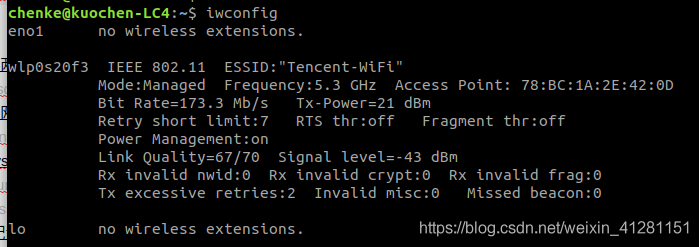
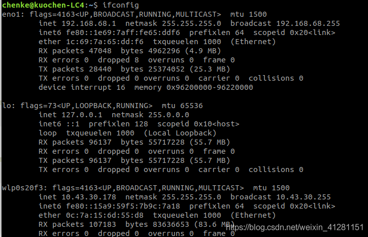

设备：两台ubuntu18.04电脑，A主机通过无线网卡上网，B主机通过以太网口连接A主机的以太网口，实现A主机通过有线共享无线网络给B主机。


## 1.查询当前设备网卡

主机A有两个网卡，一个接外网，一个与主机B相接

```bash
$ iwconfig
```



使用命令iwconfig可以查看主机所有网卡。如上图所示A主机的网卡有：

- wlp0s20f3 ： 无线网卡。
- eno1： 有线网卡，与B主机相连的网卡。

## 2.配置主机A的静态IP

注：主机设置以太网的静态IP：192.168.68.1/24 无网关
为接口eno1配置静态IP地址，执行命令

```bash
$ sudo ifconfig eno1 192.168.68.1/24
```

使用 ifconfig 查看 eno1 ip 配置是否成功，成功的效果图如下所示

```bash
$ ifconfig
```



## 3.配置从机B的静态IP

执行以下指令
注： 从机设置静态IP 为192.168.68.2/24，网关 192.168.68.1
(114.114.114.114是国内移动、电信和联通通用的DNS，解析成功率相对来说更高) enp0s31f6 为从机B的有线网卡

```bash
$ sudo ifconfig enp0s31f6 192.168.68.2/24
$ sudo route add -net 0.0.0.0/0 gw 192.168.68.1
$ sudo chmod +666 /etc/resolv.conf 
$ sudo echo "nameserver 114.114.114.114" > /etc/resolv.conf
```

到现在为止，在B主机上执行命令 ping 192.168.68.1 可以正常ping 通，说明以上工作都正确了。

## 4.配置NAT

这一步是为了B主机能通过A主机访问外网。

在A主机上依次执行

```bash
$ sudo bash -c 'echo 1 > /proc/sys/net/ipv4/ip_forward'   # 打开ip转发
 
$ sudo iptables -F
 
$ sudo iptables -P INPUT ACCEPT
 
$ sudo iptables -P FORWARD ACCEPT
 
$ sudo iptables -t nat -A POSTROUTING -o wlp0s20f3 -j MASQUERADE     #（wlp0s20f3为A主机接外网的网卡）
```

至此，B主机能访问外网，在B主机上执行ping www.baidu.com 能正常ping 能。